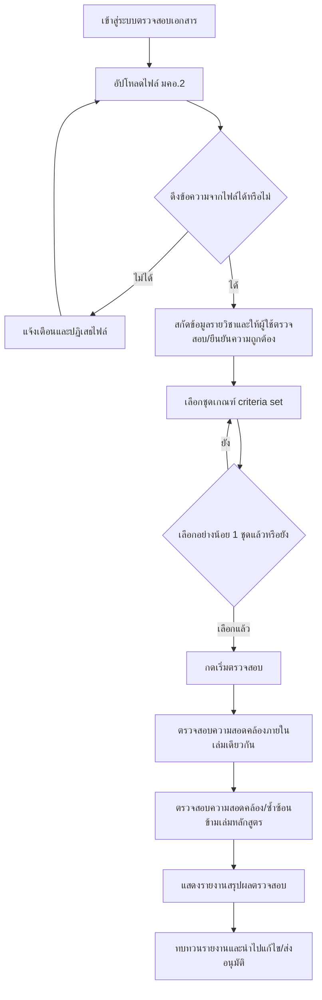

# User Journey: ผู้จัดทำหลักสูตร อัปโหลดและตรวจสอบเอกสาร มคอ.2

## บริบท / Persona

Journey นี้เป็นของ **ผู้จัดทำหลักสูตร (เจ้าหน้าที่/อาจารย์)** ซึ่งเป็นกลุ่มผู้ใช้งานหลักของระบบตรวจสอบเอกสาร ครอบคลุมตั้งแต่การอัปโหลดไฟล์ มคอ.2 การเลือกชุดเกณฑ์มาตรฐานอ้างอิง การตรวจสอบความสอดคล้องทั้งภายในเล่มเดียวกันและข้ามเล่มหลักสูตร ไปจนถึงการดูรายงานสรุปผล

Journey นี้เกี่ยวข้องกับฟีเจอร์ต่อไปนี้ใน [[../../01-requirements/02-plan/feature-list|feature-list]]:

- 01. อัปโหลดและจัดการไฟล์ มคอ.2
- 02. เลือกชุดเกณฑ์มาตรฐานก่อนเริ่มตรวจสอบ/สนทนา
- 03. ตรวจสอบความสอดคล้องภายในเล่มเดียวกัน
- 04. ตรวจสอบความสอดคล้อง/ซ้ำซ้อนข้ามเล่มหลักสูตร (cross-document)
- 05. รายงานผลตรวจสอบ

และอ้างอิง requirement ต้นทางที่ [[../../01-requirements/01-spec/20260812-01-tqf2-consistency-check|ระบบตรวจสอบความสอดคล้องของเอกสารรายละเอียดหลักสูตร (มคอ.2)]] ใน [[../../01-requirements/01-spec/index|01-spec]]

## Diagram

## คำอธิบายขั้นตอน

1. **เข้าสู่ระบบตรวจสอบเอกสาร** — ผู้จัดทำหลักสูตร (เจ้าหน้าที่/อาจารย์) เข้าสู่ระบบเพื่อเริ่มกระบวนการตรวจสอบเอกสาร มคอ.2 ของตน (ไม่มี requirement เฉพาะ — เป็นจุดเริ่มของ flow)
2. **อัปโหลดไฟล์ มคอ.2** — ผู้ใช้อัปโหลดไฟล์ PDF หรือ Word ทีละ 1 ไฟล์ต่อครั้ง (ไม่รองรับ batch upload) เข้าสู่ระบบ (อ้างอิง: [[../../01-requirements/01-spec/20260812-01-tqf2-consistency-check|ระบบตรวจสอบความสอดคล้องของเอกสารรายละเอียดหลักสูตร (มคอ.2)]] FR ข้อ 1)
3. **ดึงข้อความจากไฟล์ได้หรือไม่ (เงื่อนไขแตกแขนง)** — ระบบตรวจสอบว่าสามารถดึงข้อความจากไฟล์ที่อัปโหลดได้หรือไม่ (อ้างอิง: [[../../01-requirements/01-spec/20260812-01-tqf2-consistency-check|ระบบตรวจสอบความสอดคล้องของเอกสารรายละเอียดหลักสูตร (มคอ.2)]] FR ข้อ 1)
   - **ไม่ได้** (เช่น ไฟล์สแกนภาพล้วน) → ไปขั้นตอน "แจ้งเตือนและปฏิเสธไฟล์"
   - **ได้** → ไปขั้นตอน "สกัดข้อมูลรายวิชาและให้ผู้ใช้ตรวจสอบ/ยืนยันความถูกต้อง" หากเป็นการอัปโหลดไฟล์ซ้ำของเล่มเดิม ระบบจะแทนที่ไฟล์เดิมทันที (ไม่เก็บ version history)
4. **แจ้งเตือนและปฏิเสธไฟล์** — ระบบแจ้งเตือนผู้ใช้ทันทีว่าไม่สามารถดึงข้อความจากไฟล์ได้ และปฏิเสธไฟล์นั้นตั้งแต่ขั้นตอนอัปโหลด ไม่ผ่านเข้าสู่ขั้นตอนตรวจสอบ ผู้ใช้ต้องแก้ไขไฟล์หรืออัปโหลดไฟล์ใหม่ (วนกลับไปขั้นตอน "อัปโหลดไฟล์ มคอ.2") (อ้างอิง: [[../../01-requirements/01-spec/20260812-01-tqf2-consistency-check|ระบบตรวจสอบความสอดคล้องของเอกสารรายละเอียดหลักสูตร (มคอ.2)]] FR ข้อ 1)
5. **สกัดข้อมูลรายวิชาและให้ผู้ใช้ตรวจสอบ/ยืนยันความถูกต้อง** — ระบบทำงานแบบกึ่งอัตโนมัติ โดยสกัดข้อมูลรายวิชา (รหัสวิชา ชื่อรายวิชา หน่วยกิต คำอธิบายรายวิชา) จากทุกจุดที่ปรากฏซ้ำในเล่ม แล้วแสดงให้ผู้จัดทำหลักสูตรตรวจสอบ ยืนยัน หรือแก้ไขจุดที่ระบบดึงข้อมูลมาไม่มั่นใจ ก่อนไปขั้นตอนเลือกชุดเกณฑ์ (อ้างอิง: [[../../01-requirements/01-spec/20260812-01-tqf2-consistency-check|ระบบตรวจสอบความสอดคล้องของเอกสารรายละเอียดหลักสูตร (มคอ.2)]] FR ข้อ 2)
6. **เลือกชุดเกณฑ์ criteria set** — ผู้ใช้เลือกชุดเกณฑ์ที่ต้องการอ้างอิงตอนตรวจสอบ เลือกได้มากกว่า 1 ชุดพร้อมกัน (multi-select) จากรายชื่อชุดเกณฑ์ที่มีสถานะ "เปิดใช้งาน (active)" เท่านั้น (อ้างอิง: [[../../01-requirements/01-spec/20260812-01-tqf2-consistency-check|ระบบตรวจสอบความสอดคล้องของเอกสารรายละเอียดหลักสูตร (มคอ.2)]] FR ข้อ 3)
7. **เลือกอย่างน้อย 1 ชุดแล้วหรือยัง (เงื่อนไขแตกแขนง)** — ระบบบังคับตรวจสอบว่าเลือกชุดเกณฑ์อย่างน้อย 1 ชุดแล้วหรือไม่ ปุ่มเริ่มตรวจสอบจะกดไม่ได้ถ้ายังไม่เลือก (อ้างอิง: [[../../01-requirements/01-spec/20260812-01-tqf2-consistency-check|ระบบตรวจสอบความสอดคล้องของเอกสารรายละเอียดหลักสูตร (มคอ.2)]] FR ข้อ 3)
   - **ยัง** → วนกลับไปขั้นตอน "เลือกชุดเกณฑ์ criteria set"
   - **เลือกแล้ว** → ไปขั้นตอน "กดเริ่มตรวจสอบ"
8. **กดเริ่มตรวจสอบ** — ผู้ใช้กดปุ่มเริ่มตรวจสอบเพื่อให้ระบบเริ่มประมวลผลเปรียบเทียบเอกสารกับชุดเกณฑ์ที่เลือกไว้ (อ้างอิง: [[../../01-requirements/01-spec/20260812-01-tqf2-consistency-check|ระบบตรวจสอบความสอดคล้องของเอกสารรายละเอียดหลักสูตร (มคอ.2)]] FR ข้อ 3)
9. **ตรวจสอบความสอดคล้องภายในเล่มเดียวกัน** — ระบบตรวจว่ารหัสวิชา ชื่อวิชา หน่วยกิต และคำอธิบายรายวิชาที่ปรากฏซ้ำในหลายจุดของเล่มเดียวกันตรงกันทุกจุด รวมถึงตรวจการอ้างอิงเกณฑ์มาตรฐานให้ตรงกับชุดเกณฑ์ที่เลือกไว้ (อ้างอิง: [[../../01-requirements/01-spec/20260812-01-tqf2-consistency-check|ระบบตรวจสอบความสอดคล้องของเอกสารรายละเอียดหลักสูตร (มคอ.2)]] FR ข้อ 2 และ FR ข้อ 4 ส่วนภายในเล่ม)
10. **ตรวจสอบความสอดคล้อง/ซ้ำซ้อนข้ามเล่มหลักสูตร** — ระบบเปรียบเทียบรายวิชาระหว่างเล่มหลักสูตรที่อยู่ในระบบ เพื่อตรวจจับรหัสวิชาซ้ำซ้อนโดยไม่ตั้งใจ และวิชาแกนที่น่าจะเป็นวิชาเดียวกันแต่ถูกป้อนรหัส/ชื่อไม่ตรงกันระหว่างเล่ม (อ้างอิง: [[../../01-requirements/01-spec/20260812-01-tqf2-consistency-check|ระบบตรวจสอบความสอดคล้องของเอกสารรายละเอียดหลักสูตร (มคอ.2)]] FR ข้อ 4 ส่วนข้ามเล่ม)
11. **แสดงรายงานสรุปผลตรวจสอบ** — ระบบแสดงรายงานสรุปจุดที่ไม่สอดคล้องกันเป็นรายการ (list) พร้อมระบุตำแหน่ง/หน้าที่พบในเอกสารสำหรับแต่ละจุด (อ้างอิง: [[../../01-requirements/01-spec/20260812-01-tqf2-consistency-check|ระบบตรวจสอบความสอดคล้องของเอกสารรายละเอียดหลักสูตร (มคอ.2)]] FR ข้อ 5)
12. **ทบทวนรายงานและนำไปแก้ไข/ส่งอนุมัติ** — ผู้จัดทำหลักสูตรทบทวนรายงานและนำไปแก้ไขเอกสารก่อนอัปโหลดตรวจสอบซ้ำ หรือส่งเข้าสู่กระบวนการอนุมัติ (ไม่มี requirement เฉพาะ — เป็นจุดจบของ flow)

## Mapping กลับไปยัง Requirement

| ขั้นตอนใน Diagram | Requirement อ้างอิง |
| --- | --- |
| เข้าสู่ระบบตรวจสอบเอกสาร | ไม่มี requirement เฉพาะ — เป็นจุดเริ่มของ flow |
| อัปโหลดไฟล์ มคอ.2 | [[../../01-requirements/01-spec/20260812-01-tqf2-consistency-check\|ระบบตรวจสอบความสอดคล้องของเอกสารรายละเอียดหลักสูตร (มคอ.2)]] (FR ข้อ 1) |
| ดึงข้อความจากไฟล์ได้หรือไม่ | [[../../01-requirements/01-spec/20260812-01-tqf2-consistency-check\|ระบบตรวจสอบความสอดคล้องของเอกสารรายละเอียดหลักสูตร (มคอ.2)]] (FR ข้อ 1) |
| แจ้งเตือนและปฏิเสธไฟล์ | [[../../01-requirements/01-spec/20260812-01-tqf2-consistency-check\|ระบบตรวจสอบความสอดคล้องของเอกสารรายละเอียดหลักสูตร (มคอ.2)]] (FR ข้อ 1) |
| สกัดข้อมูลรายวิชาและให้ผู้ใช้ตรวจสอบ/ยืนยันความถูกต้อง | [[../../01-requirements/01-spec/20260812-01-tqf2-consistency-check\|ระบบตรวจสอบความสอดคล้องของเอกสารรายละเอียดหลักสูตร (มคอ.2)]] (FR ข้อ 2) |
| เลือกชุดเกณฑ์ criteria set | [[../../01-requirements/01-spec/20260812-01-tqf2-consistency-check\|ระบบตรวจสอบความสอดคล้องของเอกสารรายละเอียดหลักสูตร (มคอ.2)]] (FR ข้อ 3) |
| เลือกอย่างน้อย 1 ชุดแล้วหรือยัง | [[../../01-requirements/01-spec/20260812-01-tqf2-consistency-check\|ระบบตรวจสอบความสอดคล้องของเอกสารรายละเอียดหลักสูตร (มคอ.2)]] (FR ข้อ 3) |
| กดเริ่มตรวจสอบ | [[../../01-requirements/01-spec/20260812-01-tqf2-consistency-check\|ระบบตรวจสอบความสอดคล้องของเอกสารรายละเอียดหลักสูตร (มคอ.2)]] (FR ข้อ 3) |
| ตรวจสอบความสอดคล้องภายในเล่มเดียวกัน | [[../../01-requirements/01-spec/20260812-01-tqf2-consistency-check\|ระบบตรวจสอบความสอดคล้องของเอกสารรายละเอียดหลักสูตร (มคอ.2)]] (FR ข้อ 2, FR ข้อ 4 ส่วนภายในเล่ม) |
| ตรวจสอบความสอดคล้อง/ซ้ำซ้อนข้ามเล่มหลักสูตร | [[../../01-requirements/01-spec/20260812-01-tqf2-consistency-check\|ระบบตรวจสอบความสอดคล้องของเอกสารรายละเอียดหลักสูตร (มคอ.2)]] (FR ข้อ 4 ส่วนข้ามเล่ม) |
| แสดงรายงานสรุปผลตรวจสอบ | [[../../01-requirements/01-spec/20260812-01-tqf2-consistency-check\|ระบบตรวจสอบความสอดคล้องของเอกสารรายละเอียดหลักสูตร (มคอ.2)]] (FR ข้อ 5) |
| ทบทวนรายงานและนำไปแก้ไข/ส่งอนุมัติ | ไม่มี requirement เฉพาะ — เป็นจุดจบของ flow |

## สมมติฐาน / คำถามที่เปิดไว้

- Journey นี้ยังไม่ครอบคลุมขั้นตอน "ตรวจสอบเนื้อหาจริงของหลักสูตรเทียบกับเกณฑ์มาตรฐาน" (ฟีเจอร์ 08) และ "แชทบอทให้คำแนะนำ" (ฟีเจอร์ 09) ในฐานะ journey แยก เนื่องจากอินพุตที่ได้รับระบุเฉพาะ flow การอัปโหลดและตรวจสอบเอกสารเต็มเล่มเท่านั้น — หากต้องการ journey ของฟีเจอร์ดังกล่าวควรสร้างเอกสารแยกในภายหลัง
- ยังไม่มีรายละเอียด UI/UX เชิงกราฟิกของหน้าจอเลือกชุดเกณฑ์แบบ multi-select และหน้าจอรายงานผล — เป็นคำถามเปิดที่ส่งต่อให้การออกแบบ mockup โดยละเอียดใน [[index|01-prototypes]] ตัดสินใจต่อ

---
[[index|01-prototypes]] · [[../../01-requirements/02-plan/feature-list|feature-list]] · [[../../01-requirements/01-spec/index|01-spec]]
