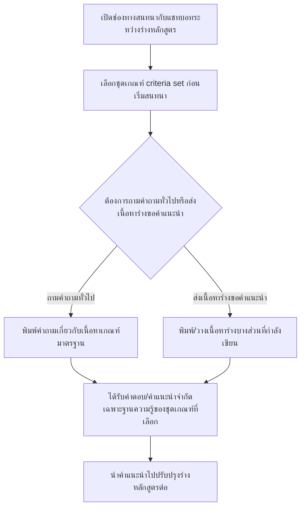

# User Journey: ผู้จัดทำหลักสูตร ขอคำแนะนำระหว่างร่างหลักสูตรผ่านแชทบอท

## บริบท / Persona

Journey นี้เป็นของ **ผู้จัดทำหลักสูตร (เจ้าหน้าที่/อาจารย์)** ผู้ใช้งานกลุ่มเดียวกับที่ใช้ฟีเจอร์อัปโหลดและตรวจสอบเอกสาร มคอ.2 (ดู [[20260823-01-user-journey-course-coordinator-upload|ผู้จัดทำหลักสูตร อัปโหลดและตรวจสอบเอกสาร มคอ.2]]) แต่ journey นี้เกิดขึ้น**ระหว่างกำลังร่างหลักสูตรอยู่** ก่อนที่เอกสารจะเสร็จสมบูรณ์และก่อนเข้าสู่ขั้นตอนอัปโหลดตรวจสอบทั้งเล่ม โดยใช้ช่องทางสนทนากับแชทบอทเพื่อขอคำแนะนำเบื้องต้น

Journey นี้เกี่ยวข้องกับฟีเจอร์ต่อไปนี้ใน [[../../01-requirements/02-plan/feature-list|feature-list]]:

- 02. เลือกชุดเกณฑ์มาตรฐานก่อนเริ่มตรวจสอบ/สนทนา
- 09. แชทบอทให้คำแนะนำระหว่างจัดทำหลักสูตร (รวม Q&A เกณฑ์มาตรฐาน)

และอ้างอิง requirement ต้นทางที่ [[../../01-requirements/01-spec/20260823-03-advisory-chatbot|ระบบแชทบอทให้คำแนะนำระหว่างจัดทำหลักสูตร (Advisory Chatbot)]] ใน [[../../01-requirements/01-spec/index|01-spec]]

## Diagram

## คำอธิบายขั้นตอน

1. **เปิดช่องทางสนทนากับแชทบอทระหว่างร่างหลักสูตร** — ผู้จัดทำหลักสูตร (เจ้าหน้าที่/อาจารย์ กลุ่มเดียวกับที่ใช้ฟีเจอร์ตรวจสอบเอกสารหลัก) เปิดช่องทางสนทนากับแชทบอทในระหว่างที่กำลังร่างหลักสูตรอยู่ ยังไม่ได้จัดทำเอกสารเสร็จสมบูรณ์ (ไม่มี requirement เฉพาะ — เป็นจุดเริ่มของ flow แต่สอดคล้องกับบริบทที่ระบุใน [[../../01-requirements/01-spec/20260823-03-advisory-chatbot|ระบบแชทบอทให้คำแนะนำระหว่างจัดทำหลักสูตร (Advisory Chatbot)]] ว่าเป็นเครื่องมือช่วยระหว่างขั้นตอนร่างเอกสาร)
2. **เลือกชุดเกณฑ์ criteria set ก่อนเริ่มสนทนา** — ผู้ใช้ต้องเลือกชุดเกณฑ์ที่ต้องการอ้างอิงก่อนเริ่มสนทนาเสมอ โดยเลือกได้เฉพาะจากรายชื่อชุดเกณฑ์ที่มีสถานะ "เปิดใช้งาน (active)" เท่านั้น เช่นเดียวกับ flow การเลือกชุดเกณฑ์ในฟีเจอร์ตรวจสอบเอกสารหลัก (อ้างอิง: [[../../01-requirements/01-spec/20260823-03-advisory-chatbot|ระบบแชทบอทให้คำแนะนำระหว่างจัดทำหลักสูตร (Advisory Chatbot)]] FR ข้อ 2)
3. **ต้องการถามคำถามทั่วไปหรือส่งเนื้อหาร่างขอคำแนะนำ (เงื่อนไขแตกแขนง)** — ผู้ใช้เลือกรูปแบบการใช้งานแชทบอทตามความต้องการ ณ ขณะนั้น (อ้างอิง: [[../../01-requirements/01-spec/20260823-03-advisory-chatbot|ระบบแชทบอทให้คำแนะนำระหว่างจัดทำหลักสูตร (Advisory Chatbot)]] FR ข้อ 1)
   - **ถามคำถามทั่วไป** → ไปขั้นตอน "พิมพ์คำถามเกี่ยวกับเนื้อหาเกณฑ์มาตรฐาน"
   - **ส่งเนื้อหาร่างขอคำแนะนำ** → ไปขั้นตอน "พิมพ์/วางเนื้อหาร่างบางส่วนที่กำลังเขียน"
4. **พิมพ์คำถามเกี่ยวกับเนื้อหาเกณฑ์มาตรฐาน** — ผู้ใช้พิมพ์คำถามทั่วไปเกี่ยวกับเนื้อหาเกณฑ์มาตรฐาน เช่น "หลักสูตรปริญญาตรีต้องมีหน่วยกิตรวมขั้นต่ำเท่าไร" แล้ว AI ตอบโดยใช้เฉพาะเนื้อหาในฐานความรู้ของชุดเกณฑ์ที่เลือกไว้ (อ้างอิง: [[../../01-requirements/01-spec/20260823-03-advisory-chatbot|ระบบแชทบอทให้คำแนะนำระหว่างจัดทำหลักสูตร (Advisory Chatbot)]] FR ข้อ 1(ก) และ FR ข้อ 3)
5. **พิมพ์/วางเนื้อหาร่างบางส่วนที่กำลังเขียน** — ผู้ใช้พิมพ์หรือวางเนื้อหาร่างบางส่วนที่กำลังเขียนอยู่ (ยังไม่ใช่ไฟล์เต็มเล่ม) เข้ามาในแชท แล้ว AI ตรวจสอบและให้คำแนะนำแบบทันทีว่าเนื้อหาส่วนนั้นสอดคล้องกับเกณฑ์มาตรฐานหรือไม่ (อ้างอิง: [[../../01-requirements/01-spec/20260823-03-advisory-chatbot|ระบบแชทบอทให้คำแนะนำระหว่างจัดทำหลักสูตร (Advisory Chatbot)]] FR ข้อ 1(ข))
6. **ได้รับคำตอบ/คำแนะนำจำกัดเฉพาะฐานความรู้ของชุดเกณฑ์ที่เลือก** — ไม่ว่าจะมาจากแขนงคำถามทั่วไปหรือแขนงส่งเนื้อหาร่าง ผู้ใช้จะได้รับคำตอบ/คำแนะนำที่จำกัดเฉพาะเนื้อหาในฐานความรู้ของชุดเกณฑ์ที่เลือกไว้เท่านั้น แชทบอทไม่ตอบคำถามหรือให้คำแนะนำที่อยู่นอกขอบเขตนี้ (เช่น ความรู้ทั่วไปที่ไม่เกี่ยวกับเกณฑ์มาตรฐาน หรือเนื้อหาจากชุดเกณฑ์อื่นที่ไม่ได้เลือกไว้) (อ้างอิง: [[../../01-requirements/01-spec/20260823-03-advisory-chatbot|ระบบแชทบอทให้คำแนะนำระหว่างจัดทำหลักสูตร (Advisory Chatbot)]] FR ข้อ 3)
7. **นำคำแนะนำไปปรับปรุงร่างหลักสูตรต่อ** — ผู้ใช้นำคำแนะนำเบื้องต้นที่ได้จากแชทบอทไปปรับปรุงร่างหลักสูตรต่อไป โดยผลลัพธ์จากแชทบอทถือเป็นเพียงคำแนะนำเบื้องต้น **ไม่ใช่**ผลตรวจสอบอย่างเป็นทางการ ผู้จัดทำหลักสูตรยังคงต้องอัปโหลดเล่มเต็มเข้าสู่ขั้นตอนตรวจสอบความสอดคล้องแบบทางการตาม [[20260823-01-user-journey-course-coordinator-upload|ผู้จัดทำหลักสูตร อัปโหลดและตรวจสอบเอกสาร มคอ.2]] (journey แยกต่างหาก) ก่อนส่งเข้าสู่กระบวนการอนุมัติ (อ้างอิง: [[../../01-requirements/01-spec/20260823-03-advisory-chatbot|ระบบแชทบอทให้คำแนะนำระหว่างจัดทำหลักสูตร (Advisory Chatbot)]] FR ข้อ 5)

## Mapping กลับไปยัง Requirement

| ขั้นตอนใน Diagram | Requirement อ้างอิง |
| --- | --- |
| เปิดช่องทางสนทนากับแชทบอทระหว่างร่างหลักสูตร | ไม่มี requirement เฉพาะ — เป็นจุดเริ่มของ flow |
| เลือกชุดเกณฑ์ criteria set ก่อนเริ่มสนทนา | [[../../01-requirements/01-spec/20260823-03-advisory-chatbot\|ระบบแชทบอทให้คำแนะนำระหว่างจัดทำหลักสูตร (Advisory Chatbot)]] (FR ข้อ 2) |
| ต้องการถามคำถามทั่วไปหรือส่งเนื้อหาร่างขอคำแนะนำ | [[../../01-requirements/01-spec/20260823-03-advisory-chatbot\|ระบบแชทบอทให้คำแนะนำระหว่างจัดทำหลักสูตร (Advisory Chatbot)]] (FR ข้อ 1) |
| พิมพ์คำถามเกี่ยวกับเนื้อหาเกณฑ์มาตรฐาน | [[../../01-requirements/01-spec/20260823-03-advisory-chatbot\|ระบบแชทบอทให้คำแนะนำระหว่างจัดทำหลักสูตร (Advisory Chatbot)]] (FR ข้อ 1(ก), FR ข้อ 3) |
| พิมพ์/วางเนื้อหาร่างบางส่วนที่กำลังเขียน | [[../../01-requirements/01-spec/20260823-03-advisory-chatbot\|ระบบแชทบอทให้คำแนะนำระหว่างจัดทำหลักสูตร (Advisory Chatbot)]] (FR ข้อ 1(ข)) |
| ได้รับคำตอบ/คำแนะนำจำกัดเฉพาะฐานความรู้ของชุดเกณฑ์ที่เลือก | [[../../01-requirements/01-spec/20260823-03-advisory-chatbot\|ระบบแชทบอทให้คำแนะนำระหว่างจัดทำหลักสูตร (Advisory Chatbot)]] (FR ข้อ 3) |
| นำคำแนะนำไปปรับปรุงร่างหลักสูตรต่อ | [[../../01-requirements/01-spec/20260823-03-advisory-chatbot\|ระบบแชทบอทให้คำแนะนำระหว่างจัดทำหลักสูตร (Advisory Chatbot)]] (FR ข้อ 5) |

## สมมติฐาน / คำถามที่เปิดไว้

- ยังไม่ได้กำหนดว่าเมื่อคำถามหรือเนื้อหาที่ผู้ใช้ส่งเข้ามาอยู่นอกขอบเขตของฐานความรู้ที่เลือกไว้ AI ควรตอบสนองอย่างไร (สืบเนื่องจากคำถามเปิดในเอกสาร spec ต้นทาง)
- ยังไม่มีรายละเอียด UI/UX เชิงกราฟิกของหน้าจอสนทนา (เช่น การแสดงชุดเกณฑ์ที่เลือกอยู่ระหว่างสนทนา รูปแบบการแสดงผลคำแนะนำ) — เป็นคำถามเปิดที่ส่งต่อให้การออกแบบ mockup โดยละเอียดใน [[index|01-prototypes]] ตัดสินใจต่อ
- ยังไม่ได้กำหนดรูปแบบผลลัพธ์ของคำแนะนำต่อเนื้อหาร่างบางส่วน (freeform หรือมีโครงสร้างเป็นรายการจุดที่ไม่สอดคล้อง)

---
[[index|01-prototypes]] · [[../../01-requirements/02-plan/feature-list|feature-list]] · [[../../01-requirements/01-spec/index|01-spec]]
