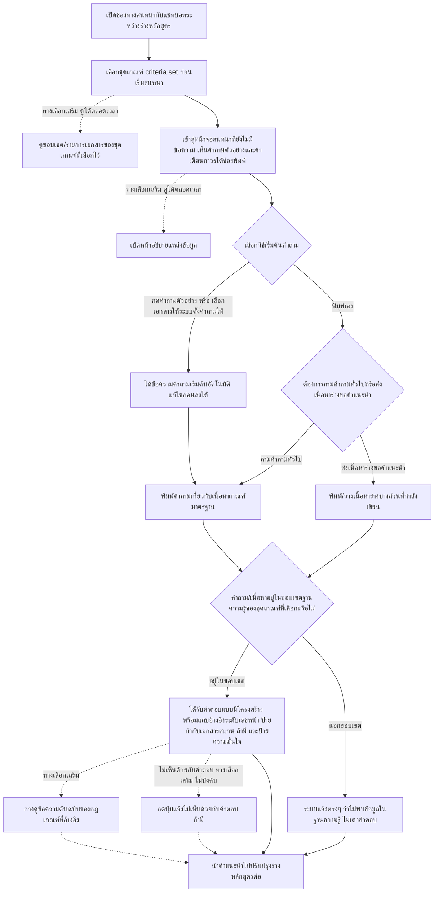
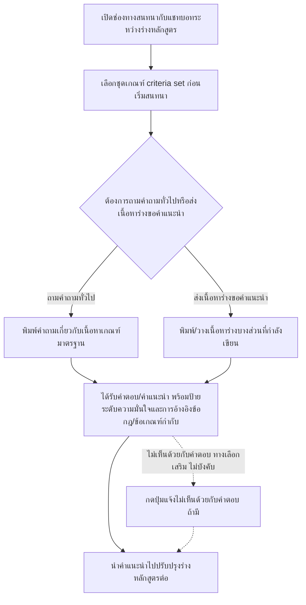

# User Journey: ผู้จัดทำหลักสูตร ขอคำแนะนำระหว่างร่างหลักสูตรผ่านแชทบอท

## บริบท / Persona

Journey นี้เป็นของ **ผู้จัดทำหลักสูตร (เจ้าหน้าที่/อาจารย์)** ผู้ใช้งานกลุ่มเดียวกับที่ใช้ฟีเจอร์อัปโหลดและตรวจสอบเอกสาร มคอ.2 (ดู [[20260823-01-user-journey-course-coordinator-upload|ผู้จัดทำหลักสูตร อัปโหลดและตรวจสอบเอกสาร มคอ.2]]) แต่ journey นี้เกิดขึ้น**ระหว่างกำลังร่างหลักสูตรอยู่** ก่อนที่เอกสารจะเสร็จสมบูรณ์และก่อนเข้าสู่ขั้นตอนอัปโหลดตรวจสอบทั้งเล่ม โดยใช้ช่องทางสนทนากับแชทบอทเพื่อขอคำแนะนำเบื้องต้น

Journey นี้เกี่ยวข้องกับฟีเจอร์ต่อไปนี้ใน [[../../01-requirements/02-plan/feature-list|feature-list]]:

- 02. เลือกชุดเกณฑ์มาตรฐานก่อนเริ่มตรวจสอบ/สนทนา
- 09. แชทบอทให้คำแนะนำระหว่างจัดทำหลักสูตร (รวม Q&A เกณฑ์มาตรฐาน)
- **(เพิ่ม 2026-09-13)** 15. ผู้ใช้งานทั่วไป ดูฐานความรู้แบบอ่านอย่างเดียว — feature-list ระบุว่าใช้ journey ของฟีเจอร์ 02 และ 09 แทนการสร้าง journey แยก ความสามารถ "ดูขอบเขต/รายการเอกสารของชุดเกณฑ์ที่เลือกไว้" ในหัวข้อ Diagram ด้านล่าง (โหนด B1) จึงเป็นส่วนที่ครอบคลุมฟีเจอร์ 15 ภายใน journey นี้

และอ้างอิง requirement ต้นทางที่ [[../../01-requirements/01-spec/20260823-03-advisory-chatbot|ระบบแชทบอทให้คำแนะนำระหว่างจัดทำหลักสูตร (Advisory Chatbot)]] ใน [[../../01-requirements/01-spec/index|01-spec]] **(อัปเดต 2026-09-13)** ซึ่งได้รับการปรับปรุง FR ข้อ 7 และเพิ่ม FR ใหม่ข้อ 9-16 รวมถึงอ้างอิง FR ข้อ 12 ของ [[../../01-requirements/01-spec/20260823-02-criteria-knowledge-base|ระบบจัดการฐานความรู้เกณฑ์มาตรฐานหลักสูตร (Knowledge Base) สำหรับแอดมิน]] สำหรับความสามารถดูรายการเอกสาร/กฎเกณฑ์แบบอ่านอย่างเดียว

## Diagram

### เวอร์ชันเดิม (เลิกใช้แล้วตั้งแต่ 2026-09-13)

Diagram เดิมด้านล่างนี้ยังไม่มีโหนดใดรองรับ: หน้าจอเริ่มต้นที่มีคำถามตัวอย่าง, การเริ่มต้นจากเอกสาร, การดูขอบเขตของชุดเกณฑ์ที่เลือกไว้, หน้าอธิบายแหล่งข้อมูล/คำเตือนถาวร, การอ้างอิงระดับเลขหน้า, ปุ่มดูข้อความต้นฉบับ, ป้ายกำกับเอกสารสแกน, พฤติกรรมเมื่อคำถามอยู่นอกขอบเขต และรูปแบบผลลัพธ์แบบมีโครงสร้าง เก็บไว้ที่นี่เพื่อรักษาประวัติการตัดสินใจตามธรรมเนียมของ vault ไม่ใช่ flow ที่ใช้งานจริงอีกต่อไป — ดูเหตุผลเต็มใน [[../../01-requirements/01-spec/20260823-03-advisory-chatbot|ระบบแชทบอทให้คำแนะนำระหว่างจัดทำหลักสูตร (Advisory Chatbot)]] (อัปเดต 2026-09-13):

## คำอธิบายขั้นตอน

เรียงลำดับตาม diagram เวอร์ชันปัจจุบันด้านบน:

1. **เปิดช่องทางสนทนากับแชทบอทระหว่างร่างหลักสูตร** — ผู้จัดทำหลักสูตร (เจ้าหน้าที่/อาจารย์ กลุ่มเดียวกับที่ใช้ฟีเจอร์ตรวจสอบเอกสารหลัก) เปิดช่องทางสนทนากับแชทบอทในระหว่างที่กำลังร่างหลักสูตรอยู่ ยังไม่ได้จัดทำเอกสารเสร็จสมบูรณ์ (ไม่มี requirement เฉพาะ — เป็นจุดเริ่มของ flow แต่สอดคล้องกับบริบทที่ระบุใน [[../../01-requirements/01-spec/20260823-03-advisory-chatbot|ระบบแชทบอทให้คำแนะนำระหว่างจัดทำหลักสูตร (Advisory Chatbot)]] ว่าเป็นเครื่องมือช่วยระหว่างขั้นตอนร่างเอกสาร)
2. **เลือกชุดเกณฑ์ criteria set ก่อนเริ่มสนทนา** — ผู้ใช้ต้องเลือกชุดเกณฑ์ที่ต้องการอ้างอิงก่อนเริ่มสนทนาเสมอ โดยเลือกได้เฉพาะจากรายชื่อชุดเกณฑ์ที่มีสถานะ "เปิดใช้งาน (active)" เท่านั้น เช่นเดียวกับ flow การเลือกชุดเกณฑ์ในฟีเจอร์ตรวจสอบเอกสารหลัก (อ้างอิง: [[../../01-requirements/01-spec/20260823-03-advisory-chatbot|ระบบแชทบอทให้คำแนะนำระหว่างจัดทำหลักสูตร (Advisory Chatbot)]] FR ข้อ 2)
3. **(ใหม่ 2026-09-13) ดูขอบเขต/รายการเอกสารของชุดเกณฑ์ที่เลือกไว้ (ทางเลือกเสริม)** — ผู้ใช้เปิดดูได้ตลอดเวลาระหว่างสนทนาว่าชุดเกณฑ์ที่ตนเลือกครอบคลุมเอกสาร/กฎเกณฑ์อะไรบ้าง แสดงอย่างน้อย: ชื่อเอกสาร ประเภทเอกสาร ช่วงหน้า และป้ายกำกับกรณีเป็นเอกสารที่แปลงมาจากภาพสแกน (OCR) เหตุผลที่ต้องมีขั้นตอนนี้คือ FR ข้อ 3 (ขอบเขตคำตอบจำกัดเฉพาะฐานความรู้ของชุดเกณฑ์ที่เลือก) ทำให้ผู้ใช้ต้องรู้ล่วงหน้าว่าชุดที่ตนเลือกครอบคลุมอะไรบ้าง แทนที่จะรู้ตัวก็ต่อเมื่อถูกปฏิเสธคำตอบไปแล้ว (อ้างอิง: [[../../01-requirements/01-spec/20260823-03-advisory-chatbot|ระบบแชทบอทให้คำแนะนำระหว่างจัดทำหลักสูตร (Advisory Chatbot)]] FR ข้อ 11, [[../../01-requirements/01-spec/20260823-02-criteria-knowledge-base|ระบบจัดการฐานความรู้เกณฑ์มาตรฐานหลักสูตร (Knowledge Base) สำหรับแอดมิน]] FR ข้อ 12) — ครอบคลุมฟีเจอร์ 15 ใน feature-list
4. **(ใหม่ 2026-09-13) เข้าสู่หน้าจอสนทนาที่ยังไม่มีข้อความ เห็นคำถามตัวอย่างและคำเตือนถาวรใต้ช่องพิมพ์** — เมื่อผู้ใช้เข้าสู่หน้าจอสนทนาครั้งแรก (ยังไม่ได้พิมพ์อะไรเลย) หน้าจอต้องแสดง**คำถามตัวอย่าง**ที่กดแล้วถามได้ทันทีจำนวนหนึ่ง เพื่อให้ผู้ใช้ที่ไม่เคยใช้ระบบลักษณะนี้เริ่มต้นได้ และต้องแสดง**ข้อความเตือนถาวร**ว่าคำตอบเป็นเพียงคำแนะนำเบื้องต้น ไม่ใช่ผลตรวจสอบอย่างเป็นทางการ และควรตรวจสอบเอกสารต้นฉบับก่อนนำไปอ้างอิงจริง อยู่บนหน้าจอตลอดเวลา (เช่น ใต้ช่องพิมพ์) ไม่ใช่แสดงครั้งเดียวตอนเปิดใช้งานครั้งแรกแล้วหายไป (อ้างอิง: [[../../01-requirements/01-spec/20260823-03-advisory-chatbot|ระบบแชทบอทให้คำแนะนำระหว่างจัดทำหลักสูตร (Advisory Chatbot)]] FR ข้อ 12, FR ข้อ 14)
5. **(ใหม่ 2026-09-13) เปิดหน้าอธิบายแหล่งข้อมูล (ทางเลือกเสริม)** — ผู้ใช้เปิดดูได้ว่าระบบตอบจากอะไร ประกอบด้วยองค์ประกอบของฐานความรู้ (จำนวนเอกสารแยกตามประเภท) และ**ประกาศพฤติกรรมของระบบล่วงหน้า**ว่าจะอ้างอิงที่มาทุกครั้ง และถ้าไม่พบข้อมูลในฐานความรู้จะแจ้งตรงๆ ว่าไม่พบ ไม่เดาคำตอบเอง (อ้างอิง: [[../../01-requirements/01-spec/20260823-03-advisory-chatbot|ระบบแชทบอทให้คำแนะนำระหว่างจัดทำหลักสูตร (Advisory Chatbot)]] FR ข้อ 14)
6. **เลือกวิธีเริ่มต้นคำถาม (เงื่อนไขแตกแขนง)** — ผู้ใช้เลือกว่าจะเริ่มต้นการสนทนาอย่างไร (อ้างอิง: [[../../01-requirements/01-spec/20260823-03-advisory-chatbot|ระบบแชทบอทให้คำแนะนำระหว่างจัดทำหลักสูตร (Advisory Chatbot)]] FR ข้อ 12, FR ข้อ 13)
   - **กดคำถามตัวอย่าง หรือ เลือกเอกสารให้ระบบตั้งคำถามให้** → ไปขั้นตอน "ได้ข้อความคำถามเริ่มต้นอัตโนมัติ แก้ไขก่อนส่งได้"
   - **พิมพ์เอง** → ไปขั้นตอน "ต้องการถามคำถามทั่วไปหรือส่งเนื้อหาร่างขอคำแนะนำ"
7. **(ใหม่ 2026-09-13) ได้ข้อความคำถามเริ่มต้นอัตโนมัติ แก้ไขก่อนส่งได้** — ครอบคลุม 2 ความสามารถใหม่: (ก) ผู้ใช้กดคำถามตัวอย่างที่แสดงไว้บนหน้าจอเริ่มต้นแล้วถามได้ทันที และ (ข) ผู้ใช้เลือกเอกสารหนึ่งฉบับจากรายการใน "ดูขอบเขต/รายการเอกสารของชุดเกณฑ์ที่เลือกไว้" แล้วระบบตั้งคำถามเริ่มต้นให้อัตโนมัติ (เช่น ขอสรุปสาระสำคัญของเอกสารฉบับนั้น) ทั้งสองกรณีผู้ใช้ส่งคำถามที่ได้ต่อได้เลยหรือแก้ไขข้อความก่อนส่งก็ได้ ผลลัพธ์ของขั้นตอนนี้ถือเป็น "คำถามทั่วไป" เสมอ จึงไหลต่อไปยังขั้นตอน "พิมพ์คำถามเกี่ยวกับเนื้อหาเกณฑ์มาตรฐาน" โดยตรง (อ้างอิง: [[../../01-requirements/01-spec/20260823-03-advisory-chatbot|ระบบแชทบอทให้คำแนะนำระหว่างจัดทำหลักสูตร (Advisory Chatbot)]] FR ข้อ 12, FR ข้อ 13)
8. **ต้องการถามคำถามทั่วไปหรือส่งเนื้อหาร่างขอคำแนะนำ (เงื่อนไขแตกแขนง)** — เมื่อผู้ใช้เลือกพิมพ์เอง (ไม่ได้ใช้คำถามตัวอย่างหรือเริ่มจากเอกสาร) ผู้ใช้เลือกรูปแบบการใช้งานแชทบอทตามความต้องการ ณ ขณะนั้น (อ้างอิง: [[../../01-requirements/01-spec/20260823-03-advisory-chatbot|ระบบแชทบอทให้คำแนะนำระหว่างจัดทำหลักสูตร (Advisory Chatbot)]] FR ข้อ 1)
   - **ถามคำถามทั่วไป** → ไปขั้นตอน "พิมพ์คำถามเกี่ยวกับเนื้อหาเกณฑ์มาตรฐาน"
   - **ส่งเนื้อหาร่างขอคำแนะนำ** → ไปขั้นตอน "พิมพ์/วางเนื้อหาร่างบางส่วนที่กำลังเขียน"
9. **พิมพ์คำถามเกี่ยวกับเนื้อหาเกณฑ์มาตรฐาน** — ผู้ใช้พิมพ์คำถามทั่วไปเกี่ยวกับเนื้อหาเกณฑ์มาตรฐาน (หรือได้ข้อความมาจากคำถามตัวอย่าง/เริ่มจากเอกสารในขั้นตอนก่อนหน้า) เช่น "หลักสูตรปริญญาตรีต้องมีหน่วยกิตรวมขั้นต่ำเท่าไร" แล้ว AI ตอบโดยใช้เฉพาะเนื้อหาในฐานความรู้ของชุดเกณฑ์ที่เลือกไว้ (อ้างอิง: [[../../01-requirements/01-spec/20260823-03-advisory-chatbot|ระบบแชทบอทให้คำแนะนำระหว่างจัดทำหลักสูตร (Advisory Chatbot)]] FR ข้อ 1(ก) และ FR ข้อ 3)
10. **พิมพ์/วางเนื้อหาร่างบางส่วนที่กำลังเขียน** — ผู้ใช้พิมพ์หรือวางเนื้อหาร่างบางส่วนที่กำลังเขียนอยู่ (ยังไม่ใช่ไฟล์เต็มเล่ม) เข้ามาในแชท แล้ว AI ตรวจสอบและให้คำแนะนำแบบทันทีว่าเนื้อหาส่วนนั้นสอดคล้องกับเกณฑ์มาตรฐานหรือไม่ (อ้างอิง: [[../../01-requirements/01-spec/20260823-03-advisory-chatbot|ระบบแชทบอทให้คำแนะนำระหว่างจัดทำหลักสูตร (Advisory Chatbot)]] FR ข้อ 1(ข))
11. **(ใหม่ 2026-09-13) คำถาม/เนื้อหาอยู่ในขอบเขตฐานความรู้ของชุดเกณฑ์ที่เลือกหรือไม่ (เงื่อนไขแตกแขนง)** — ไม่ว่าจะมาจากแขนงคำถามทั่วไปหรือแขนงส่งเนื้อหาร่าง ระบบตรวจสอบก่อนว่าคำถาม/เนื้อหาที่ได้รับอยู่ในขอบเขตของฐานความรู้ของชุดเกณฑ์ที่เลือกไว้หรือไม่ ~~เดิม journey นี้ยังไม่ตอบคำถามเปิดเรื่องพฤติกรรมกรณีอยู่นอกขอบเขต~~ **(อัปเดต 2026-09-13: ปิดคำถามเปิดเดิมแล้ว — เพิ่มขั้นตอนนี้เป็นเงื่อนไขแตกแขนงชัดเจน)** (อ้างอิง: [[../../01-requirements/01-spec/20260823-03-advisory-chatbot|ระบบแชทบอทให้คำแนะนำระหว่างจัดทำหลักสูตร (Advisory Chatbot)]] FR ข้อ 3, FR ข้อ 15)
    - **อยู่ในขอบเขต** → ไปขั้นตอน "ได้รับคำตอบแบบมีโครงสร้าง พร้อมแถบอ้างอิงระดับเลขหน้า ป้ายกำกับเอกสารสแกน (ถ้ามี) และป้ายความมั่นใจ"
    - **นอกขอบเขต** → ไปขั้นตอน "ระบบแจ้งตรงๆ ว่าไม่พบข้อมูลในฐานความรู้ ไม่เดาคำตอบ"
12. **ได้รับคำตอบแบบมีโครงสร้าง พร้อมแถบอ้างอิงระดับเลขหน้า ป้ายกำกับเอกสารสแกน (ถ้ามี) และป้ายความมั่นใจ** — ~~เดิมคำตอบระบุเพียงป้ายระดับความมั่นใจและข้อกฎ/ข้อเกณฑ์ที่อ้างอิง ไม่ต้องอ้างอิงลึกถึงเลขหน้า~~ **(อัปเดต 2026-09-13: ยกระดับการอ้างอิงแล้ว)** ผู้ใช้จะได้รับคำตอบ/คำแนะนำที่จำกัดเฉพาะเนื้อหาในฐานความรู้ของชุดเกณฑ์ที่เลือกไว้เท่านั้น (อ้างอิง: [[../../01-requirements/01-spec/20260823-03-advisory-chatbot|ระบบแชทบอทให้คำแนะนำระหว่างจัดทำหลักสูตร (Advisory Chatbot)]] FR ข้อ 3) นอกจากนี้ทุกคำตอบต้องแสดง:
    - **แถบอ้างอิงระดับเลขหน้า**: ประเภทเอกสาร · ชื่อเอกสารต้นฉบับ · เลขหน้า (หรือช่วงหน้า) พร้อมข้อกฎ/ข้อเกณฑ์ที่อ้างอิง เฉพาะกฎเกณฑ์ที่มีสถานะอนุมัติแล้ว (approved) เท่านั้น (อ้างอิง: FR ข้อ 7 ที่ปรับปรุง 2026-09-13)
    - **ป้ายกำกับเอกสารที่แปลงจากภาพสแกน (OCR)**: แสดงในแถบอ้างอิงเมื่อกฎเกณฑ์ที่อ้างอิงมีต้นทางมาจากเอกสารประเภทนี้ เนื่องจากมีโอกาสสกัดคลาดเคลื่อนสูงกว่า (อ้างอิง: FR ข้อ 10)
    - **รูปแบบผลลัพธ์แบบมีโครงสร้าง**: แยกเป็นรายการตามประเด็น/ตามกรณี พร้อมข้อกฎอ้างอิงกำกับแต่ละรายการ แทนย่อหน้ายาวต่อเนื่อง ใช้กับทั้งรูปแบบ (ก) Q&A และ (ข) คำแนะนำต่อเนื้อหาร่าง (อ้างอิง: FR ข้อ 16)
    - ~~ป้ายข้อความระดับความมั่นใจ (มั่นใจสูง/มั่นใจกลาง/มั่นใจต่ำ)~~ **(อัปเดต 2026-09-13: ยังคงต้องแสดงอยู่ ไม่ได้ถูกตัดทิ้ง แต่ถูกลดลำดับความสำคัญลงในการพัฒนา — ดูหมายเหตุที่ FR ข้อ 6)** ป้ายข้อความระดับความมั่นใจยังคงต้องแสดงกำกับทุกคำตอบเหมือนเดิม แต่ควรพัฒนา guardrail อีก 3 อย่างข้างต้น (อ้างอิงเลขหน้า/กางข้อความต้นฉบับ/แจ้งเมื่อไม่พบข้อมูล) ให้พร้อมก่อน เนื่องจากยังไม่มีวิธีคำนวณความแม่นยำเชิงตัวเลขที่น่าเชื่อถือรองรับ (อ้างอิง: FR ข้อ 6)
    (อ้างอิง: [[../../01-requirements/01-spec/20260823-03-advisory-chatbot|ระบบแชทบอทให้คำแนะนำระหว่างจัดทำหลักสูตร (Advisory Chatbot)]] FR ข้อ 3, FR ข้อ 6, FR ข้อ 7, FR ข้อ 10, FR ข้อ 16)
13. **(ใหม่ 2026-09-13) ระบบแจ้งตรงๆ ว่าไม่พบข้อมูลในฐานความรู้ ไม่เดาคำตอบ** — เมื่อคำถามหรือเนื้อหาที่ผู้ใช้ส่งเข้ามาอยู่นอกขอบเขตของฐานความรู้ของชุดเกณฑ์ที่เลือกไว้ ระบบแจ้งตรงๆ ว่าไม่พบข้อมูลในฐานความรู้ของชุดเกณฑ์ที่เลือกไว้ และไม่เดา/ไม่สร้างคำตอบขึ้นเอง ถ้าเป็นไปได้แนะนำว่าผู้ใช้อาจต้องเลือกชุดเกณฑ์อื่นหรือติดต่อแอดมินให้เพิ่มเอกสาร ~~เดิมเป็นคำถามเปิดของ spec ต้นทาง~~ **(อัปเดต 2026-09-13: ปิดคำถามเปิดเดิมแล้ว)** (อ้างอิง: [[../../01-requirements/01-spec/20260823-03-advisory-chatbot|ระบบแชทบอทให้คำแนะนำระหว่างจัดทำหลักสูตร (Advisory Chatbot)]] FR ข้อ 15)
14. **(ใหม่ 2026-09-13) กางดูข้อความต้นฉบับของกฎเกณฑ์ที่อ้างอิง (ทางเลือกเสริม)** — ผู้ใช้กางดูข้อความต้นฉบับของกฎเกณฑ์/ส่วนของเอกสารที่ถูกอ้างอิงในแถบอ้างอิงได้ทันทีในหน้าสนทนา โดยไม่ต้องออกจากแชทไปเปิดไฟล์เอง เพื่อตรวจสอบว่าระบบตีความถูกต้องหรือไม่ แทนที่จะต้องเชื่อคำตอบอย่างเดียว ขั้นตอนนี้เป็น**ทางเลือกเสริม** ผู้ใช้อาจกดดูหรือไม่ก็ได้ ไม่ block flow การใช้งานต่อ (อ้างอิง: [[../../01-requirements/01-spec/20260823-03-advisory-chatbot|ระบบแชทบอทให้คำแนะนำระหว่างจัดทำหลักสูตร (Advisory Chatbot)]] FR ข้อ 9)
15. **กดปุ่มแจ้งไม่เห็นด้วยกับคำตอบ (ถ้ามี)** — ทุกคำตอบของแชทบอทมีช่องทาง/ปุ่มให้ผู้ใช้แจ้งว่า "ไม่เห็นด้วย" กับคำตอบนั้นได้ ขั้นตอนนี้เป็น**ทางเลือกเสริม ไม่บังคับ** ผู้ใช้อาจกดหรือไม่กดก็ได้และไม่ block flow การใช้งานต่อ เมื่อผู้ใช้กด ระบบจะบันทึกเป็น log ธรรมดาไว้ให้แอดมินดูภาพรวมได้ในภายหลังเท่านั้น ยังไม่มี flow การตรวจสอบ/ตอบกลับทีละรายการในเวอร์ชันนี้ (อ้างอิง: [[../../01-requirements/01-spec/20260823-03-advisory-chatbot|ระบบแชทบอทให้คำแนะนำระหว่างจัดทำหลักสูตร (Advisory Chatbot)]] FR ข้อ 8)
16. **นำคำแนะนำไปปรับปรุงร่างหลักสูตรต่อ** — ผู้ใช้นำคำแนะนำเบื้องต้นที่ได้จากแชทบอทไปปรับปรุงร่างหลักสูตรต่อไป (ไม่ว่าจะกางดูข้อความต้นฉบับหรือกดแจ้งไม่เห็นด้วยในขั้นตอนก่อนหน้าหรือไม่ก็ตาม และไม่ว่าจะได้รับคำตอบตามปกติหรือถูกแจ้งว่าไม่พบข้อมูลก็ตาม) โดยผลลัพธ์จากแชทบอทถือเป็นเพียงคำแนะนำเบื้องต้น **ไม่ใช่**ผลตรวจสอบอย่างเป็นทางการ ผู้จัดทำหลักสูตรยังคงต้องอัปโหลดเล่มเต็มเข้าสู่ขั้นตอนตรวจสอบความสอดคล้องแบบทางการตาม [[20260823-01-user-journey-course-coordinator-upload|ผู้จัดทำหลักสูตร อัปโหลดและตรวจสอบเอกสาร มคอ.2]] (journey แยกต่างหาก) ก่อนส่งเข้าสู่กระบวนการอนุมัติ ทั้งนี้คำแนะนำที่แชทบอทให้ตลอด journey นี้ต้องใช้**น้ำเสียง/ภาษาที่สื่อถึง "คำแนะนำ/ข้อสังเกต" เสมอ** ห้ามใช้ภาษาที่ฟังดูเป็นการฟันธง/อนุมัติ/ตัดสินใจแทนผู้ใช้ (เช่น หลีกเลี่ยงคำเช่น "ถูกต้องแล้ว", "ผ่านแน่นอน") เพื่อย้ำบทบาทของแชทบอทว่าเป็นเพียงผู้ช่วยให้คำแนะนำ (อ้างอิง: [[../../01-requirements/01-spec/20260823-03-advisory-chatbot|ระบบแชทบอทให้คำแนะนำระหว่างจัดทำหลักสูตร (Advisory Chatbot)]] FR ข้อ 5)

## Mapping กลับไปยัง Requirement

| ขั้นตอนใน Diagram | Requirement อ้างอิง |
| --- | --- |
| เปิดช่องทางสนทนากับแชทบอทระหว่างร่างหลักสูตร | ไม่มี requirement เฉพาะ — เป็นจุดเริ่มของ flow |
| เลือกชุดเกณฑ์ criteria set ก่อนเริ่มสนทนา | [[../../01-requirements/01-spec/20260823-03-advisory-chatbot\|ระบบแชทบอทให้คำแนะนำระหว่างจัดทำหลักสูตร (Advisory Chatbot)]] (FR ข้อ 2) |
| ดูขอบเขต/รายการเอกสารของชุดเกณฑ์ที่เลือกไว้ | [[../../01-requirements/01-spec/20260823-03-advisory-chatbot\|ระบบแชทบอทให้คำแนะนำระหว่างจัดทำหลักสูตร (Advisory Chatbot)]] (FR ข้อ 11), [[../../01-requirements/01-spec/20260823-02-criteria-knowledge-base\|ระบบจัดการฐานความรู้เกณฑ์มาตรฐานหลักสูตร (Knowledge Base) สำหรับแอดมิน]] (FR ข้อ 12) |
| เข้าสู่หน้าจอสนทนาที่ยังไม่มีข้อความ เห็นคำถามตัวอย่างและคำเตือนถาวรใต้ช่องพิมพ์ | [[../../01-requirements/01-spec/20260823-03-advisory-chatbot\|ระบบแชทบอทให้คำแนะนำระหว่างจัดทำหลักสูตร (Advisory Chatbot)]] (FR ข้อ 12, FR ข้อ 14) |
| เปิดหน้าอธิบายแหล่งข้อมูล | [[../../01-requirements/01-spec/20260823-03-advisory-chatbot\|ระบบแชทบอทให้คำแนะนำระหว่างจัดทำหลักสูตร (Advisory Chatbot)]] (FR ข้อ 14) |
| เลือกวิธีเริ่มต้นคำถาม | [[../../01-requirements/01-spec/20260823-03-advisory-chatbot\|ระบบแชทบอทให้คำแนะนำระหว่างจัดทำหลักสูตร (Advisory Chatbot)]] (FR ข้อ 12, FR ข้อ 13) |
| ได้ข้อความคำถามเริ่มต้นอัตโนมัติ แก้ไขก่อนส่งได้ | [[../../01-requirements/01-spec/20260823-03-advisory-chatbot\|ระบบแชทบอทให้คำแนะนำระหว่างจัดทำหลักสูตร (Advisory Chatbot)]] (FR ข้อ 12, FR ข้อ 13) |
| ต้องการถามคำถามทั่วไปหรือส่งเนื้อหาร่างขอคำแนะนำ | [[../../01-requirements/01-spec/20260823-03-advisory-chatbot\|ระบบแชทบอทให้คำแนะนำระหว่างจัดทำหลักสูตร (Advisory Chatbot)]] (FR ข้อ 1) |
| พิมพ์คำถามเกี่ยวกับเนื้อหาเกณฑ์มาตรฐาน | [[../../01-requirements/01-spec/20260823-03-advisory-chatbot\|ระบบแชทบอทให้คำแนะนำระหว่างจัดทำหลักสูตร (Advisory Chatbot)]] (FR ข้อ 1(ก), FR ข้อ 3) |
| พิมพ์/วางเนื้อหาร่างบางส่วนที่กำลังเขียน | [[../../01-requirements/01-spec/20260823-03-advisory-chatbot\|ระบบแชทบอทให้คำแนะนำระหว่างจัดทำหลักสูตร (Advisory Chatbot)]] (FR ข้อ 1(ข)) |
| คำถาม/เนื้อหาอยู่ในขอบเขตฐานความรู้ของชุดเกณฑ์ที่เลือกหรือไม่ | [[../../01-requirements/01-spec/20260823-03-advisory-chatbot\|ระบบแชทบอทให้คำแนะนำระหว่างจัดทำหลักสูตร (Advisory Chatbot)]] (FR ข้อ 3, FR ข้อ 15) |
| ได้รับคำตอบแบบมีโครงสร้าง พร้อมแถบอ้างอิงระดับเลขหน้า ป้ายกำกับเอกสารสแกน (ถ้ามี) และป้ายความมั่นใจ | [[../../01-requirements/01-spec/20260823-03-advisory-chatbot\|ระบบแชทบอทให้คำแนะนำระหว่างจัดทำหลักสูตร (Advisory Chatbot)]] (FR ข้อ 3, FR ข้อ 6 — ลดลำดับความสำคัญ 2026-09-13, FR ข้อ 7 ปรับปรุง, FR ข้อ 10, FR ข้อ 16) |
| ระบบแจ้งตรงๆ ว่าไม่พบข้อมูลในฐานความรู้ ไม่เดาคำตอบ | [[../../01-requirements/01-spec/20260823-03-advisory-chatbot\|ระบบแชทบอทให้คำแนะนำระหว่างจัดทำหลักสูตร (Advisory Chatbot)]] (FR ข้อ 15) |
| กางดูข้อความต้นฉบับของกฎเกณฑ์ที่อ้างอิง | [[../../01-requirements/01-spec/20260823-03-advisory-chatbot\|ระบบแชทบอทให้คำแนะนำระหว่างจัดทำหลักสูตร (Advisory Chatbot)]] (FR ข้อ 9) |
| กดปุ่มแจ้งไม่เห็นด้วยกับคำตอบ (ถ้ามี) | [[../../01-requirements/01-spec/20260823-03-advisory-chatbot\|ระบบแชทบอทให้คำแนะนำระหว่างจัดทำหลักสูตร (Advisory Chatbot)]] (FR ข้อ 8) |
| นำคำแนะนำไปปรับปรุงร่างหลักสูตรต่อ | [[../../01-requirements/01-spec/20260823-03-advisory-chatbot\|ระบบแชทบอทให้คำแนะนำระหว่างจัดทำหลักสูตร (Advisory Chatbot)]] (FR ข้อ 5) |

## สมมติฐาน / คำถามที่เปิดไว้

- ~~ยังไม่ได้กำหนดว่าเมื่อคำถามหรือเนื้อหาที่ผู้ใช้ส่งเข้ามาอยู่นอกขอบเขตของฐานความรู้ที่เลือกไว้ AI ควรตอบสนองอย่างไร (สืบเนื่องจากคำถามเปิดในเอกสาร spec ต้นทาง)~~ **(อัปเดต 2026-09-13: ได้รับคำตอบแล้ว)** ดูขั้นตอน "ระบบแจ้งตรงๆ ว่าไม่พบข้อมูลในฐานความรู้ ไม่เดาคำตอบ" ในไดอะแกรมด้านบน — อ้างอิง FR ข้อ 15
- ยังไม่มีรายละเอียด UI/UX เชิงกราฟิกของหน้าจอสนทนา (เช่น การแสดงชุดเกณฑ์ที่เลือกอยู่ระหว่างสนทนา รูปแบบการแสดงผลคำแนะนำ) — เป็นคำถามเปิดที่ส่งต่อให้การออกแบบ mockup โดยละเอียดใน [[index|01-prototypes]] ตัดสินใจต่อ
- ~~ยังไม่ได้กำหนดรูปแบบผลลัพธ์ของคำแนะนำต่อเนื้อหาร่างบางส่วน (freeform หรือมีโครงสร้างเป็นรายการจุดที่ไม่สอดคล้อง)~~ **(อัปเดต 2026-09-13: ได้รับคำตอบแล้ว — ใช้รูปแบบมีโครงสร้าง (รายการตามประเด็น/กรณี พร้อมข้อกฎอ้างอิงกำกับ) ดูขั้นตอน "ได้รับคำตอบแบบมีโครงสร้าง..." อ้างอิง FR ข้อ 16)**
- วิธีคำนวณ/ประเมินระดับความมั่นใจ (มั่นใจสูง/กลาง/ต่ำ) จากโมเดล AI จริงยังไม่ถูกกำหนด เป็นรายละเอียดเชิงเทคนิคที่ต้องตัดสินใจตอนออกแบบเชิงเทคนิคใน [[../../02-design/02-technical/index|02-technical]] (สืบเนื่องจากคำถามเปิดในเอกสาร spec ต้นทาง FR ข้อ 6) **(อัปเดต 2026-09-13: คำถามนี้ยังคงค้างอยู่ — และเป็นเหตุผลหลักที่ทำให้ FR ข้อ 6 ถูกลดลำดับความสำคัญลงในรอบนี้ ดูขั้นตอน "ได้รับคำตอบแบบมีโครงสร้าง..." ด้านบน)**
- **(เพิ่ม 2026-09-13)** ยังเปิดเป็นคำถามไว้ว่าปุ่มดูข้อความต้นฉบับ (ขั้นตอน "กางดูข้อความต้นฉบับของกฎเกณฑ์ที่อ้างอิง") จะแสดงเป็นข้อความที่สกัดไว้ (extracted text) หรือเปิดไฟล์ต้นฉบับที่หน้านั้น — สืบเนื่องจากคำถามเปิดของ FR ข้อ 9 ใน spec ต้นทาง ส่งต่อให้การออกแบบ mockup โดยละเอียดใน [[index|01-prototypes]] และ [[../../02-design/02-technical/index|02-technical]] ตัดสินใจต่อ
- **(เพิ่ม 2026-09-13)** ยังเปิดเป็นคำถามไว้ว่าคำถามตัวอย่างบนหน้าจอเริ่มต้น (ขั้นตอน "เข้าสู่หน้าจอสนทนาที่ยังไม่มีข้อความ...") จะเป็นชุดคงที่ที่กำหนดไว้ล่วงหน้า หรือปรับตามชุดเกณฑ์ที่ผู้ใช้เลือก — สืบเนื่องจากคำถามเปิดของ FR ข้อ 12 ใน spec ต้นทาง ส่งต่อให้การออกแบบ mockup โดยละเอียดใน [[index|01-prototypes]] ตัดสินใจต่อ

---
[[index|01-prototypes]] · [[../../01-requirements/02-plan/feature-list|feature-list]] · [[../../01-requirements/01-spec/index|01-spec]]
