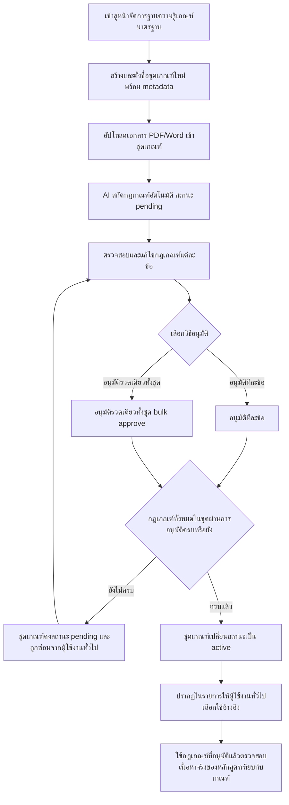

# User Journey: แอดมิน จัดการฐานความรู้เกณฑ์มาตรฐานหลักสูตร

## บริบท / Persona

Journey นี้เป็นของ **แอดมิน** (สิทธิ์จำกัดเฉพาะแอดมิน ผู้ใช้งานทั่วไปไม่มีสิทธิ์เข้าส่วนนี้) ครอบคลุมตั้งแต่การสร้าง "ชุดเกณฑ์" (criteria set) การอัปโหลดเอกสารเข้าชุดเกณฑ์ ให้ AI สกัดกฎเกณฑ์อัตโนมัติ ไปจนถึงการตรวจสอบ แก้ไข และอนุมัติกฎเกณฑ์ก่อนเปิดใช้งานชุดเกณฑ์ให้ผู้ใช้งานทั่วไปนำไปอ้างอิง

Journey นี้เกี่ยวข้องกับฟีเจอร์ต่อไปนี้ใน [[../../01-requirements/02-plan/feature-list|feature-list]]:

- 06. จัดการฐานความรู้เกณฑ์มาตรฐานหลักสูตร (สร้างชุดเกณฑ์ + อัปโหลดเอกสาร)
- 07. ตรวจสอบ แก้ไข และอนุมัติกฎเกณฑ์ที่ AI สกัดมา
- 08. ตรวจสอบเนื้อหาจริงของหลักสูตรเทียบกับเกณฑ์มาตรฐาน

และอ้างอิง requirement ต้นทางที่ [[../../01-requirements/01-spec/20260823-02-criteria-knowledge-base|ระบบจัดการฐานความรู้เกณฑ์มาตรฐานหลักสูตร (Knowledge Base) สำหรับแอดมิน]] ใน [[../../01-requirements/01-spec/index|01-spec]]

Journey นี้เป็นฝั่งแอดมินที่ทำให้เกิดชุดเกณฑ์สถานะ "เปิดใช้งาน (active)" ซึ่งเป็นเงื่อนไขจำเป็นของขั้นตอน "เลือกชุดเกณฑ์" ใน [[20260823-01-user-journey-course-coordinator-upload|ผู้จัดทำหลักสูตร อัปโหลดและตรวจสอบเอกสาร มคอ.2]] และ [[20260823-02-user-journey-course-coordinator-chatbot-advisory|ผู้จัดทำหลักสูตร ขอคำแนะนำระหว่างร่างหลักสูตรผ่านแชทบอท]]

## Diagram

## คำอธิบายขั้นตอน

1. **เข้าสู่หน้าจัดการฐานความรู้เกณฑ์มาตรฐาน** — แอดมินเข้าสู่หน้าจัดการฐานความรู้เกณฑ์มาตรฐานหลักสูตร ซึ่งจำกัดสิทธิ์เฉพาะแอดมินเท่านั้น ผู้ใช้งานทั่วไปไม่มีสิทธิ์เข้าส่วนนี้ (อ้างอิง: [[../../01-requirements/01-spec/20260823-02-criteria-knowledge-base|ระบบจัดการฐานความรู้เกณฑ์มาตรฐานหลักสูตร (Knowledge Base) สำหรับแอดมิน]] FR ข้อ 1)
2. **สร้างและตั้งชื่อชุดเกณฑ์ใหม่ พร้อม metadata** — แอดมินสร้างและตั้งชื่อ "ชุดเกณฑ์" (criteria set) ได้เองอย่างยืดหยุ่น พร้อมกรอก metadata กำกับ ได้แก่ ปี พ.ศ./ช่วงเวลาบังคับใช้ ระดับการศึกษา และขอบเขต/สาขาที่เกี่ยวข้อง (อ้างอิง: [[../../01-requirements/01-spec/20260823-02-criteria-knowledge-base|ระบบจัดการฐานความรู้เกณฑ์มาตรฐานหลักสูตร (Knowledge Base) สำหรับแอดมิน]] FR ข้อ 2)
3. **อัปโหลดเอกสาร PDF/Word เข้าชุดเกณฑ์** — แอดมินอัปโหลดเอกสารรูปแบบ PDF หรือ Word (.docx) เข้าชุดเกณฑ์ อัปโหลดได้หลายไฟล์ สะสมเป็นคลังเอกสารของชุดนั้นเรื่อยๆ (อ้างอิง: [[../../01-requirements/01-spec/20260823-02-criteria-knowledge-base|ระบบจัดการฐานความรู้เกณฑ์มาตรฐานหลักสูตร (Knowledge Base) สำหรับแอดมิน]] FR ข้อ 3)
4. **AI สกัดกฎเกณฑ์อัตโนมัติ สถานะ pending** — เมื่ออัปโหลดเอกสารสำเร็จ ระบบ (AI) สกัด "กฎเกณฑ์" ออกจากเนื้อหาเอกสารโดยอัตโนมัติ กฎเกณฑ์ที่สกัดได้เข้าสู่สถานะ "รอตรวจสอบ (pending)" รอส่งต่อให้แอดมินตรวจสอบก่อนนำไปใช้งานจริง (อ้างอิง: [[../../01-requirements/01-spec/20260823-02-criteria-knowledge-base|ระบบจัดการฐานความรู้เกณฑ์มาตรฐานหลักสูตร (Knowledge Base) สำหรับแอดมิน]] FR ข้อ 3 และ FR ข้อ 2 ส่วนสถานะของชุดเกณฑ์)
5. **ตรวจสอบและแก้ไขกฎเกณฑ์แต่ละข้อ** — แอดมินตรวจสอบและแก้ไขกฎเกณฑ์แต่ละข้อที่ AI สกัดมา เพื่อป้องกันความผิดพลาดจากการสกัดข้อมูลอัตโนมัติก่อนอนุมัติ (อ้างอิง: [[../../01-requirements/01-spec/20260823-02-criteria-knowledge-base|ระบบจัดการฐานความรู้เกณฑ์มาตรฐานหลักสูตร (Knowledge Base) สำหรับแอดมิน]] FR ข้อ 4)
6. **เลือกวิธีอนุมัติ (เงื่อนไขแตกแขนง)** — แอดมินเลือกวิธีอนุมัติกฎเกณฑ์ที่ตรวจสอบแล้ว (อ้างอิง: [[../../01-requirements/01-spec/20260823-02-criteria-knowledge-base|ระบบจัดการฐานความรู้เกณฑ์มาตรฐานหลักสูตร (Knowledge Base) สำหรับแอดมิน]] FR ข้อ 4)
   - **อนุมัติทีละข้อ** → ไปขั้นตอน "อนุมัติทีละข้อ"
   - **อนุมัติรวดเดียวทั้งชุด** → ไปขั้นตอน "อนุมัติรวดเดียวทั้งชุด bulk approve"
7. **อนุมัติทีละข้อ** — แอดมินกดยืนยัน (Approve) กฎเกณฑ์ทีละรายการ (อ้างอิง: [[../../01-requirements/01-spec/20260823-02-criteria-knowledge-base|ระบบจัดการฐานความรู้เกณฑ์มาตรฐานหลักสูตร (Knowledge Base) สำหรับแอดมิน]] FR ข้อ 4)
8. **อนุมัติรวดเดียวทั้งชุด bulk approve** — แอดมินกดอนุมัติกฎเกณฑ์ทั้งหมดในชุดพร้อมกันในครั้งเดียว (อ้างอิง: [[../../01-requirements/01-spec/20260823-02-criteria-knowledge-base|ระบบจัดการฐานความรู้เกณฑ์มาตรฐานหลักสูตร (Knowledge Base) สำหรับแอดมิน]] FR ข้อ 4)
9. **กฎเกณฑ์ทั้งหมดในชุดผ่านการอนุมัติครบหรือยัง (เงื่อนไขแตกแขนง)** — ทั้งสองแขนงของการอนุมัติมาบรรจบกันที่จุดนี้ ระบบตรวจสอบว่ากฎเกณฑ์ทั้งหมดที่ AI สกัดมาในชุดนั้นผ่านการอนุมัติจากแอดมินครบแล้วหรือไม่ (อ้างอิง: [[../../01-requirements/01-spec/20260823-02-criteria-knowledge-base|ระบบจัดการฐานความรู้เกณฑ์มาตรฐานหลักสูตร (Knowledge Base) สำหรับแอดมิน]] FR ข้อ 4)
   - **ยังไม่ครบ** → ไปขั้นตอน "ชุดเกณฑ์คงสถานะ pending และถูกซ่อนจากผู้ใช้งานทั่วไป" แล้ววนกลับไปขั้นตอน "ตรวจสอบและแก้ไขกฎเกณฑ์แต่ละข้อ" เพื่อจัดการกฎเกณฑ์ที่เหลือ
   - **ครบแล้ว** → ไปขั้นตอน "ชุดเกณฑ์เปลี่ยนสถานะเป็น active"
10. **ชุดเกณฑ์คงสถานะ pending และถูกซ่อนจากผู้ใช้งานทั่วไป** — ตราบใดที่ยังมีกฎเกณฑ์ค้างอนุมัติ ชุดเกณฑ์ทั้งชุดยังคงสถานะ "รอตรวจสอบ (pending)" และถูกซ่อนทันทีจากรายการชุดเกณฑ์ที่ผู้ใช้งานทั่วไปเลือกได้ตอนเริ่มตรวจสอบเอกสารหรือสนทนากับแชทบอท (อ้างอิง: [[../../01-requirements/01-spec/20260823-02-criteria-knowledge-base|ระบบจัดการฐานความรู้เกณฑ์มาตรฐานหลักสูตร (Knowledge Base) สำหรับแอดมิน]] FR ข้อ 4 ส่วนเงื่อนไขเปิดใช้งานและการมองเห็นของผู้ใช้งานทั่วไป)
11. **ชุดเกณฑ์เปลี่ยนสถานะเป็น active** — เมื่อกฎเกณฑ์ทั้งหมดในชุดผ่านการอนุมัติครบแล้ว ชุดเกณฑ์เปลี่ยนสถานะเป็น "เปิดใช้งาน (active)" (อ้างอิง: [[../../01-requirements/01-spec/20260823-02-criteria-knowledge-base|ระบบจัดการฐานความรู้เกณฑ์มาตรฐานหลักสูตร (Knowledge Base) สำหรับแอดมิน]] FR ข้อ 4)
12. **ปรากฏในรายการให้ผู้ใช้งานทั่วไปเลือกใช้อ้างอิง** — ชุดเกณฑ์สถานะ active ปรากฏในรายการให้ผู้ใช้งานทั่วไปเลือกใช้อ้างอิงตอนตรวจสอบเอกสาร มคอ.2 (ดู [[20260823-01-user-journey-course-coordinator-upload|ผู้จัดทำหลักสูตร อัปโหลดและตรวจสอบเอกสาร มคอ.2]]) หรือสนทนากับแชทบอท (ดู [[20260823-02-user-journey-course-coordinator-chatbot-advisory|ผู้จัดทำหลักสูตร ขอคำแนะนำระหว่างร่างหลักสูตรผ่านแชทบอท]]) (อ้างอิง: [[../../01-requirements/01-spec/20260823-02-criteria-knowledge-base|ระบบจัดการฐานความรู้เกณฑ์มาตรฐานหลักสูตร (Knowledge Base) สำหรับแอดมิน]] FR ข้อ 4 ส่วนการมองเห็น)
13. **ใช้กฎเกณฑ์ที่อนุมัติแล้วตรวจสอบเนื้อหาจริงของหลักสูตรเทียบกับเกณฑ์** — ระบบใช้กฎเกณฑ์ที่อนุมัติแล้วในชุดนี้ตรวจสอบเนื้อหาจริงของหลักสูตรที่ผู้ใช้งานทั่วไปอัปโหลดเข้ามาเทียบกับเกณฑ์ (เช่น ตรวจว่าหน่วยกิตเป็นไปตามเกณฑ์ที่กำหนด) เป็นจุดจบของ flow ฝั่งแอดมินและจุดที่ผลงานของแอดมินถูกนำไปใช้จริง (อ้างอิง: [[../../01-requirements/01-spec/20260823-02-criteria-knowledge-base|ระบบจัดการฐานความรู้เกณฑ์มาตรฐานหลักสูตร (Knowledge Base) สำหรับแอดมิน]] FR ข้อ 5)

## Mapping กลับไปยัง Requirement

| ขั้นตอนใน Diagram | Requirement อ้างอิง |
| --- | --- |
| เข้าสู่หน้าจัดการฐานความรู้เกณฑ์มาตรฐาน | [[../../01-requirements/01-spec/20260823-02-criteria-knowledge-base\|ระบบจัดการฐานความรู้เกณฑ์มาตรฐานหลักสูตร (Knowledge Base) สำหรับแอดมิน]] (FR ข้อ 1) |
| สร้างและตั้งชื่อชุดเกณฑ์ใหม่ พร้อม metadata | [[../../01-requirements/01-spec/20260823-02-criteria-knowledge-base\|ระบบจัดการฐานความรู้เกณฑ์มาตรฐานหลักสูตร (Knowledge Base) สำหรับแอดมิน]] (FR ข้อ 2) |
| อัปโหลดเอกสาร PDF/Word เข้าชุดเกณฑ์ | [[../../01-requirements/01-spec/20260823-02-criteria-knowledge-base\|ระบบจัดการฐานความรู้เกณฑ์มาตรฐานหลักสูตร (Knowledge Base) สำหรับแอดมิน]] (FR ข้อ 3) |
| AI สกัดกฎเกณฑ์อัตโนมัติ สถานะ pending | [[../../01-requirements/01-spec/20260823-02-criteria-knowledge-base\|ระบบจัดการฐานความรู้เกณฑ์มาตรฐานหลักสูตร (Knowledge Base) สำหรับแอดมิน]] (FR ข้อ 3, FR ข้อ 2 ส่วนสถานะของชุดเกณฑ์) |
| ตรวจสอบและแก้ไขกฎเกณฑ์แต่ละข้อ | [[../../01-requirements/01-spec/20260823-02-criteria-knowledge-base\|ระบบจัดการฐานความรู้เกณฑ์มาตรฐานหลักสูตร (Knowledge Base) สำหรับแอดมิน]] (FR ข้อ 4) |
| เลือกวิธีอนุมัติ | [[../../01-requirements/01-spec/20260823-02-criteria-knowledge-base\|ระบบจัดการฐานความรู้เกณฑ์มาตรฐานหลักสูตร (Knowledge Base) สำหรับแอดมิน]] (FR ข้อ 4) |
| อนุมัติทีละข้อ | [[../../01-requirements/01-spec/20260823-02-criteria-knowledge-base\|ระบบจัดการฐานความรู้เกณฑ์มาตรฐานหลักสูตร (Knowledge Base) สำหรับแอดมิน]] (FR ข้อ 4) |
| อนุมัติรวดเดียวทั้งชุด bulk approve | [[../../01-requirements/01-spec/20260823-02-criteria-knowledge-base\|ระบบจัดการฐานความรู้เกณฑ์มาตรฐานหลักสูตร (Knowledge Base) สำหรับแอดมิน]] (FR ข้อ 4) |
| กฎเกณฑ์ทั้งหมดในชุดผ่านการอนุมัติครบหรือยัง | [[../../01-requirements/01-spec/20260823-02-criteria-knowledge-base\|ระบบจัดการฐานความรู้เกณฑ์มาตรฐานหลักสูตร (Knowledge Base) สำหรับแอดมิน]] (FR ข้อ 4) |
| ชุดเกณฑ์คงสถานะ pending และถูกซ่อนจากผู้ใช้งานทั่วไป | [[../../01-requirements/01-spec/20260823-02-criteria-knowledge-base\|ระบบจัดการฐานความรู้เกณฑ์มาตรฐานหลักสูตร (Knowledge Base) สำหรับแอดมิน]] (FR ข้อ 4 ส่วนเงื่อนไขเปิดใช้งานและการมองเห็นของผู้ใช้งานทั่วไป) |
| ชุดเกณฑ์เปลี่ยนสถานะเป็น active | [[../../01-requirements/01-spec/20260823-02-criteria-knowledge-base\|ระบบจัดการฐานความรู้เกณฑ์มาตรฐานหลักสูตร (Knowledge Base) สำหรับแอดมิน]] (FR ข้อ 4) |
| ปรากฏในรายการให้ผู้ใช้งานทั่วไปเลือกใช้อ้างอิง | [[../../01-requirements/01-spec/20260823-02-criteria-knowledge-base\|ระบบจัดการฐานความรู้เกณฑ์มาตรฐานหลักสูตร (Knowledge Base) สำหรับแอดมิน]] (FR ข้อ 4 ส่วนการมองเห็น) |
| ใช้กฎเกณฑ์ที่อนุมัติแล้วตรวจสอบเนื้อหาจริงของหลักสูตรเทียบกับเกณฑ์ | [[../../01-requirements/01-spec/20260823-02-criteria-knowledge-base\|ระบบจัดการฐานความรู้เกณฑ์มาตรฐานหลักสูตร (Knowledge Base) สำหรับแอดมิน]] (FR ข้อ 5) |

## สมมติฐาน / คำถามที่เปิดไว้

- Journey นี้ไม่ครอบคลุมกรณีแอดมิน "ปฏิเสธ" กฎเกณฑ์ข้อใดข้อหนึ่ง เนื่องจากเอกสาร spec ต้นทางยังไม่ได้กำหนดผลลัพธ์ของการปฏิเสธไว้ (ระบุเป็นคำถามเปิดใน [[../../01-requirements/01-spec/20260823-02-criteria-knowledge-base|ระบบจัดการฐานความรู้เกณฑ์มาตรฐานหลักสูตร (Knowledge Base) สำหรับแอดมิน]]) หากมีการตัดสินใจในอนาคตควรกลับมาปรับปรุง diagram นี้เพิ่มแขนงดังกล่าว
- ยังไม่มีรายละเอียด UI/UX เชิงกราฟิกของหน้าจอสร้างชุดเกณฑ์ หน้าจออัปโหลดเอกสาร และหน้าจอตรวจสอบ/อนุมัติกฎเกณฑ์ (เช่น รูปแบบการแสดงรายการกฎเกณฑ์ทีละข้อ ปุ่ม bulk approve) — เป็นคำถามเปิดที่ส่งต่อให้การออกแบบ mockup โดยละเอียดใน [[index|01-prototypes]] ตัดสินใจต่อ
- ขั้นตอน "ใช้กฎเกณฑ์ที่อนุมัติแล้วตรวจสอบเนื้อหาจริงของหลักสูตรเทียบกับเกณฑ์" (ฟีเจอร์ 08) ในเอกสารนี้แสดงเฉพาะจุดที่ผลงานของแอดมินถูกนำไปใช้ ไม่ได้ลง flow ฝั่งผู้ใช้งานทั่วไปโดยละเอียด เนื่องจาก flow ฝั่งผู้ใช้งานทั่วไปมีอยู่แล้วใน [[20260823-01-user-journey-course-coordinator-upload|ผู้จัดทำหลักสูตร อัปโหลดและตรวจสอบเอกสาร มคอ.2]]

---
[[index|01-prototypes]] · [[../../01-requirements/02-plan/feature-list|feature-list]] · [[../../01-requirements/01-spec/index|01-spec]]
