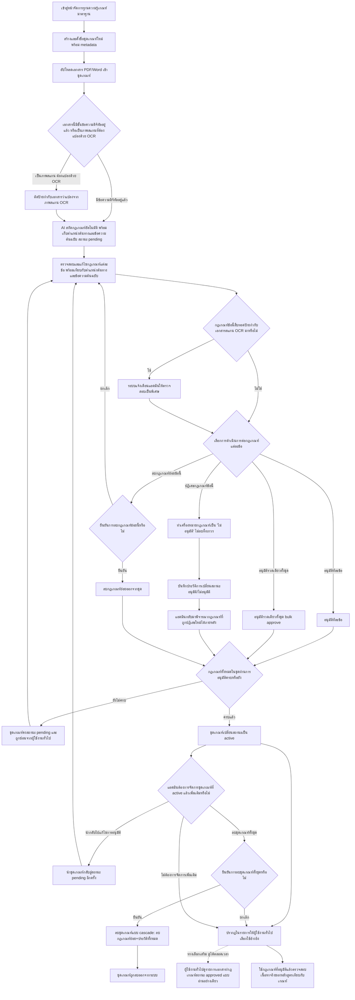
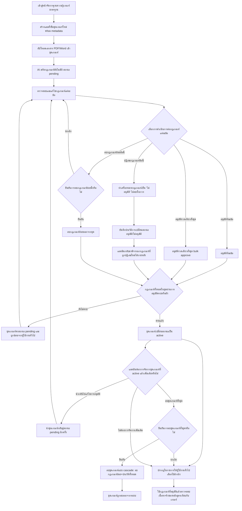

# User Journey: แอดมิน จัดการฐานความรู้เกณฑ์มาตรฐานหลักสูตร

## บริบท / Persona

Journey นี้เป็นของ **แอดมิน** (สิทธิ์จำกัดเฉพาะแอดมิน ผู้ใช้งานทั่วไปไม่มีสิทธิ์เข้าส่วนนี้) ครอบคลุมตั้งแต่การสร้าง "ชุดเกณฑ์" (criteria set) การอัปโหลดเอกสารเข้าชุดเกณฑ์ ให้ AI สกัดกฎเกณฑ์อัตโนมัติ (พร้อมเก็บตำแหน่งต้นทางและข้อความต้นฉบับ และติดป้ายกำกับเอกสารที่แปลงมาจากภาพสแกน **(เพิ่ม 2026-09-13)**) ไปจนถึงการตรวจสอบ แก้ไข และอนุมัติกฎเกณฑ์ก่อนเปิดใช้งานชุดเกณฑ์ให้ผู้ใช้งานทั่วไปนำไปอ้างอิง หรือดูแบบอ่านอย่างเดียว **(เพิ่ม 2026-09-13)**

Journey นี้เกี่ยวข้องกับฟีเจอร์ต่อไปนี้ใน [[../../01-requirements/02-plan/feature-list|feature-list]]:

- 06. จัดการฐานความรู้เกณฑ์มาตรฐานหลักสูตร (สร้างชุดเกณฑ์ + อัปโหลดเอกสาร) **(อัปเดต 2026-09-13 — เพิ่มการเก็บตำแหน่งต้นทาง/ข้อความต้นฉบับและป้ายกำกับเอกสารสแกนตาม FR ข้อ 10-11 ใหม่)**
- 07. ตรวจสอบ แก้ไข และอนุมัติกฎเกณฑ์ที่ AI สกัดมา (รวมปฏิเสธ/ลบ/นำกลับไปแก้ไข) (อัปเดต 2026-09-12 — ชื่อฟีเจอร์ขยายตาม FR ข้อ 7-9 ใหม่) **(อัปเดต 2026-09-13 — หน้าจอตรวจสอบ/อนุมัติต้องแสดงตำแหน่งต้นทาง/ข้อความต้นฉบับ และแจ้งเตือนพิเศษกรณีเอกสารสแกน ตาม FR ข้อ 10-11 ใหม่)**
- 08. ตรวจสอบเนื้อหาจริงของหลักสูตรเทียบกับเกณฑ์มาตรฐาน
- **(เพิ่ม 2026-09-13)** 15. ผู้ใช้งานทั่วไป ดูฐานความรู้แบบอ่านอย่างเดียว — feature-list ระบุว่าใช้ journey ของฟีเจอร์ 02/09 เป็นหลัก แต่ journey นี้ (ฝั่งแอดมิน) เป็นจุดต้นทางที่ทำให้เอกสาร/กฎเกณฑ์สถานะ approved ของชุดเกณฑ์ active พร้อมให้ผู้ใช้งานทั่วไปเห็นได้ จึงระบุเป็น**ผลลัพธ์ปลายทาง**ไว้ในขั้นตอน "ผู้ใช้งานทั่วไปดูรายการเอกสาร/กฎเกณฑ์สถานะ approved แบบอ่านอย่างเดียว" ในไดอะแกรมด้านล่าง

และอ้างอิง requirement ต้นทางที่ [[../../01-requirements/01-spec/20260823-02-criteria-knowledge-base|ระบบจัดการฐานความรู้เกณฑ์มาตรฐานหลักสูตร (Knowledge Base) สำหรับแอดมิน]] ใน [[../../01-requirements/01-spec/index|01-spec]] **(อัปเดต 2026-09-13 — เพิ่ม FR ข้อ 10, 11, 12 ใหม่)**

Journey นี้เป็นฝั่งแอดมินที่ทำให้เกิดชุดเกณฑ์สถานะ "เปิดใช้งาน (active)" ซึ่งเป็นเงื่อนไขจำเป็นของขั้นตอน "เลือกชุดเกณฑ์" ใน [[20260823-01-user-journey-course-coordinator-upload|ผู้จัดทำหลักสูตร อัปโหลดและตรวจสอบเอกสาร มคอ.2]] และ [[20260823-02-user-journey-course-coordinator-chatbot-advisory|ผู้จัดทำหลักสูตร ขอคำแนะนำระหว่างร่างหลักสูตรผ่านแชทบอท]] **(เพิ่ม 2026-09-13)** นอกจากนี้ตำแหน่งต้นทาง+ข้อความต้นฉบับ (FR ข้อ 10) และป้ายกำกับเอกสารสแกน (FR ข้อ 11) ที่เก็บไว้ตั้งแต่ขั้นตอนสกัด/อนุมัติของ journey นี้ ยังเป็นเงื่อนไขจำเป็นที่ทำให้ปุ่มดูข้อความต้นฉบับและแถบอ้างอิงระดับเลขหน้าของแชทบอทใน [[20260823-02-user-journey-course-coordinator-chatbot-advisory|ผู้จัดทำหลักสูตร ขอคำแนะนำระหว่างร่างหลักสูตรผ่านแชทบอท]] ทำงานได้จริง หากไม่เก็บตั้งแต่ต้นทางนี้ ความสามารถฝั่งแชทบอทจะทำไม่ได้เลย

## Diagram

### เวอร์ชันเดิม (เลิกใช้แล้วตั้งแต่ 2026-09-13)

Diagram เดิมด้านล่างนี้ยังไม่มีโหนดใดรองรับ: การแยกแยะเอกสารที่มีข้อความดิจิทัลอยู่แล้วกับเอกสารที่ต้องแปลงจากภาพสแกน (OCR), การติดป้ายกำกับเอกสารสแกนและสืบทอดไปยังกฎเกณฑ์, การเก็บตำแหน่งต้นทาง (เอกสาร+เลขหน้า) และข้อความต้นฉบับของกฎเกณฑ์แต่ละข้อคู่กับขั้นตอนสกัด/ตรวจสอบ, การแจ้งเตือนแอดมินให้ตรวจสอบเป็นพิเศษเมื่อกฎเกณฑ์มาจากเอกสารสแกน และผลลัพธ์ปลายทางที่ผู้ใช้งานทั่วไปดูรายการเอกสาร/กฎเกณฑ์แบบอ่านอย่างเดียว เก็บไว้ที่นี่เพื่อรักษาประวัติการตัดสินใจตามธรรมเนียมของ vault ไม่ใช่ flow ที่ใช้งานจริงอีกต่อไป — ดูเหตุผลเต็มใน [[../../01-requirements/01-spec/20260823-02-criteria-knowledge-base|ระบบจัดการฐานความรู้เกณฑ์มาตรฐานหลักสูตร (Knowledge Base) สำหรับแอดมิน]] (อัปเดต 2026-09-13, FR ข้อ 10-12):

## คำอธิบายขั้นตอน

เรียงลำดับตาม diagram เวอร์ชันปัจจุบันด้านบน:

1. **เข้าสู่หน้าจัดการฐานความรู้เกณฑ์มาตรฐาน** — แอดมินเข้าสู่หน้าจัดการฐานความรู้เกณฑ์มาตรฐานหลักสูตร ซึ่งจำกัดสิทธิ์เฉพาะแอดมินเท่านั้น ผู้ใช้งานทั่วไปไม่มีสิทธิ์เข้าส่วนนี้ (อ้างอิง: [[../../01-requirements/01-spec/20260823-02-criteria-knowledge-base|ระบบจัดการฐานความรู้เกณฑ์มาตรฐานหลักสูตร (Knowledge Base) สำหรับแอดมิน]] FR ข้อ 1)
2. **สร้างและตั้งชื่อชุดเกณฑ์ใหม่ พร้อม metadata** — แอดมินสร้างและตั้งชื่อ "ชุดเกณฑ์" (criteria set) ได้เองอย่างยืดหยุ่น พร้อมกรอก metadata กำกับ ได้แก่ ปี พ.ศ./ช่วงเวลาบังคับใช้ ระดับการศึกษา และขอบเขต/สาขาที่เกี่ยวข้อง (อ้างอิง: [[../../01-requirements/01-spec/20260823-02-criteria-knowledge-base|ระบบจัดการฐานความรู้เกณฑ์มาตรฐานหลักสูตร (Knowledge Base) สำหรับแอดมิน]] FR ข้อ 2)
3. **อัปโหลดเอกสาร PDF/Word เข้าชุดเกณฑ์** — แอดมินอัปโหลดเอกสารรูปแบบ PDF หรือ Word (.docx) เข้าชุดเกณฑ์ อัปโหลดได้หลายไฟล์ สะสมเป็นคลังเอกสารของชุดนั้นเรื่อยๆ (อ้างอิง: [[../../01-requirements/01-spec/20260823-02-criteria-knowledge-base|ระบบจัดการฐานความรู้เกณฑ์มาตรฐานหลักสูตร (Knowledge Base) สำหรับแอดมิน]] FR ข้อ 3)
4. **(ใหม่ 2026-09-13) เอกสารนี้มีชั้นข้อความดิจิทัลอยู่แล้ว หรือเป็นภาพสแกนที่ต้องแปลงด้วย OCR (เงื่อนไขแตกแขนง)** — หลังอัปโหลดเอกสารสำเร็จ ระบบต้องระบุก่อนว่าเอกสารนั้นมีชั้นข้อความดิจิทัลอยู่แล้ว หรือเป็นเอกสารที่ต้องแปลงจากภาพสแกน **ยังเปิดเป็นคำถามไว้ว่าการระบุนี้เป็นการตรวจจับอัตโนมัติของระบบ หรือให้แอดมินระบุเองตอนอัปโหลด หรือทั้งสองอย่าง (ตรวจจับอัตโนมัติแล้วให้แอดมินยืนยัน/แก้ไขได้) — ยังไม่ยืนยัน ไม่เดาคำตอบแทนผู้ใช้ในเอกสารนี้** (อ้างอิง: [[../../01-requirements/01-spec/20260823-02-criteria-knowledge-base|ระบบจัดการฐานความรู้เกณฑ์มาตรฐานหลักสูตร (Knowledge Base) สำหรับแอดมิน]] FR ข้อ 11)
   - **มีข้อความดิจิทัลอยู่แล้ว** → ไปขั้นตอน "AI สกัดกฎเกณฑ์อัตโนมัติ พร้อมเก็บตำแหน่งต้นทางและข้อความต้นฉบับ สถานะ pending" โดยตรง
   - **เป็นภาพสแกน ต้องแปลงด้วย OCR** → ไปขั้นตอน "ติดป้ายกำกับเอกสารว่าแปลงจากภาพสแกน OCR" ก่อน
5. **(ใหม่ 2026-09-13) ติดป้ายกำกับเอกสารว่าแปลงจากภาพสแกน OCR** — เมื่อระบบระบุว่าเอกสารเป็นภาพสแกน ระบบติดป้ายกำกับไว้กับตัวเอกสาร โดยป้ายนี้จะถูกสืบทอดไปยังกฎเกณฑ์ทุกข้อที่สกัดจากเอกสารนั้นในขั้นตอนถัดไป และป้ายนี้ยังถูกส่งต่อไปแสดงในแถบอ้างอิงของแชทบอทด้วย (ดู [[20260823-02-user-journey-course-coordinator-chatbot-advisory|ผู้จัดทำหลักสูตร ขอคำแนะนำระหว่างร่างหลักสูตรผ่านแชทบอท]]) (อ้างอิง: [[../../01-requirements/01-spec/20260823-02-criteria-knowledge-base|ระบบจัดการฐานความรู้เกณฑ์มาตรฐานหลักสูตร (Knowledge Base) สำหรับแอดมิน]] FR ข้อ 11)
6. **AI สกัดกฎเกณฑ์อัตโนมัติ พร้อมเก็บตำแหน่งต้นทางและข้อความต้นฉบับ สถานะ pending** — เมื่ออัปโหลดเอกสารสำเร็จ ระบบ (AI) สกัด "กฎเกณฑ์" ออกจากเนื้อหาเอกสารโดยอัตโนมัติ กฎเกณฑ์ที่สกัดได้เข้าสู่สถานะ "รอตรวจสอบ (pending)" รอส่งต่อให้แอดมินตรวจสอบก่อนนำไปใช้งานจริง ~~เดิมขั้นตอนนี้ไม่ได้ระบุว่าต้องเก็บข้อมูลอื่นนอกจากตัวกฎเกณฑ์เอง~~ **(อัปเดต 2026-09-13: เพิ่มการเก็บตำแหน่งต้นทางและข้อความต้นฉบับ)** ระบบต้องเก็บ**ตำแหน่งต้นทาง** (ชื่อ/รหัสเอกสารต้นฉบับ และเลขหน้าหรือช่วงหน้าที่กฎเกณฑ์นั้นปรากฏ) และ**ข้อความต้นฉบับ (verbatim)** ของส่วนที่ถูกสกัดมาเป็นกฎเกณฑ์ข้อนั้นไว้คู่กันเสมอ เหตุผล: ถ้าไม่เก็บสองอย่างนี้ตั้งแต่ขั้นตอนสกัด ฟีเจอร์อ้างอิงเลขหน้าและปุ่มดูข้อความต้นฉบับของแชทบอทจะทำไม่ได้เลย และแอดมินก็จะไม่มีหลักฐานให้เทียบตอนอนุมัติ (อ้างอิง: [[../../01-requirements/01-spec/20260823-02-criteria-knowledge-base|ระบบจัดการฐานความรู้เกณฑ์มาตรฐานหลักสูตร (Knowledge Base) สำหรับแอดมิน]] FR ข้อ 3, FR ข้อ 2 ส่วนสถานะของชุดเกณฑ์, FR ข้อ 10 ใหม่)
7. **ตรวจสอบและแก้ไขกฎเกณฑ์แต่ละข้อ พร้อมเทียบกับตำแหน่งต้นทางและข้อความต้นฉบับ** — แอดมินตรวจสอบและแก้ไขกฎเกณฑ์แต่ละข้อที่ AI สกัดมา เพื่อป้องกันความผิดพลาดจากการสกัดข้อมูลอัตโนมัติก่อนอนุมัติ ~~เดิมหน้าจอนี้ไม่ได้ระบุว่าต้องแสดงข้อมูลอ้างอิงใดเพิ่มเติม~~ **(อัปเดต 2026-09-13: ต้องแสดงตำแหน่งต้นทาง+ข้อความต้นฉบับให้แอดมินเห็น)** ระบบต้องแสดงตำแหน่งต้นทาง (เอกสาร+เลขหน้า) และข้อความต้นฉบับ (verbatim) ของกฎเกณฑ์แต่ละข้อคู่กับข้อความที่ AI สกัดมา เพื่อให้แอดมินเทียบกับต้นฉบับได้ก่อนกดอนุมัติ (อ้างอิง: [[../../01-requirements/01-spec/20260823-02-criteria-knowledge-base|ระบบจัดการฐานความรู้เกณฑ์มาตรฐานหลักสูตร (Knowledge Base) สำหรับแอดมิน]] FR ข้อ 4, FR ข้อ 10 ใหม่)
8. **(ใหม่ 2026-09-13) กฎเกณฑ์ข้อนี้สืบทอดป้ายกำกับเอกสารสแกน OCR มาหรือไม่ (เงื่อนไขแตกแขนง)** — ก่อนแอดมินเลือกการดำเนินการต่อกฎเกณฑ์แต่ละข้อ ระบบตรวจสอบก่อนว่ากฎเกณฑ์ข้อนั้นสืบทอดป้ายกำกับเอกสารสแกนมาจากเอกสารต้นทางหรือไม่ (อ้างอิง: [[../../01-requirements/01-spec/20260823-02-criteria-knowledge-base|ระบบจัดการฐานความรู้เกณฑ์มาตรฐานหลักสูตร (Knowledge Base) สำหรับแอดมิน]] FR ข้อ 11)
   - **ใช่** → ไปขั้นตอน "ระบบแจ้งเตือนแอดมินให้ตรวจสอบเป็นพิเศษ" ก่อน
   - **ไม่ใช่** → ไปขั้นตอน "เลือกการดำเนินการต่อกฎเกณฑ์แต่ละข้อ" โดยตรง
9. **(ใหม่ 2026-09-13) ระบบแจ้งเตือนแอดมินให้ตรวจสอบเป็นพิเศษ** — เมื่อกฎเกณฑ์ข้อนั้นสกัดมาจากเอกสารที่ติดป้ายกำกับว่าแปลงจากภาพสแกน ระบบแจ้งเตือนแอดมินให้ตรวจสอบกฎเกณฑ์ข้อนั้นเป็นพิเศษ เนื่องจากมีโอกาสสกัดคลาดเคลื่อนสูงกว่าเอกสารที่เป็นข้อความดิจิทัลอยู่แล้ว ก่อนไหลต่อไปยังขั้นตอนเลือกการดำเนินการตามปกติ (อ้างอิง: [[../../01-requirements/01-spec/20260823-02-criteria-knowledge-base|ระบบจัดการฐานความรู้เกณฑ์มาตรฐานหลักสูตร (Knowledge Base) สำหรับแอดมิน]] FR ข้อ 11)
10. **เลือกการดำเนินการต่อกฎเกณฑ์แต่ละข้อ (เงื่อนไขแตกแขนง)** — แอดมินเลือกการดำเนินการต่อกฎเกณฑ์แต่ละข้อที่ตรวจสอบแล้ว (อ้างอิง: [[../../01-requirements/01-spec/20260823-02-criteria-knowledge-base|ระบบจัดการฐานความรู้เกณฑ์มาตรฐานหลักสูตร (Knowledge Base) สำหรับแอดมิน]] FR ข้อ 4, 7, 8)
    - **อนุมัติทีละข้อ** → ไปขั้นตอน "อนุมัติทีละข้อ"
    - **อนุมัติรวดเดียวทั้งชุด** → ไปขั้นตอน "อนุมัติรวดเดียวทั้งชุด bulk approve"
    - **ปฏิเสธกฎเกณฑ์ข้อนี้** → ไปขั้นตอน "ทำเครื่องหมายกฎเกณฑ์เป็น 'ไม่อนุมัติ' ไม่ลบทิ้งถาวร"
    - **ลบกฎเกณฑ์ย่อยข้อนี้** → ไปขั้นตอน "ยืนยันการลบกฎเกณฑ์ย่อยนี้หรือไม่"
11. **อนุมัติทีละข้อ** — แอดมินกดยืนยัน (Approve) กฎเกณฑ์ทีละรายการ (อ้างอิง: [[../../01-requirements/01-spec/20260823-02-criteria-knowledge-base|ระบบจัดการฐานความรู้เกณฑ์มาตรฐานหลักสูตร (Knowledge Base) สำหรับแอดมิน]] FR ข้อ 4)
12. **อนุมัติรวดเดียวทั้งชุด bulk approve** — แอดมินกดอนุมัติกฎเกณฑ์ทั้งหมดในชุดพร้อมกันในครั้งเดียว (อ้างอิง: [[../../01-requirements/01-spec/20260823-02-criteria-knowledge-base|ระบบจัดการฐานความรู้เกณฑ์มาตรฐานหลักสูตร (Knowledge Base) สำหรับแอดมิน]] FR ข้อ 4)
13. **ทำเครื่องหมายกฎเกณฑ์เป็น "ไม่อนุมัติ" ไม่ลบทิ้งถาวร** — เมื่อแอดมินปฏิเสธกฎเกณฑ์ข้อใดข้อหนึ่ง ระบบทำเครื่องหมายสถานะกฎเกณฑ์ข้อนั้นเป็น "ไม่อนุมัติ" เท่านั้น ไม่ลบทิ้งถาวรทันที (อ้างอิง: [[../../01-requirements/01-spec/20260823-02-criteria-knowledge-base|ระบบจัดการฐานความรู้เกณฑ์มาตรฐานหลักสูตร (Knowledge Base) สำหรับแอดมิน]] FR ข้อ 7)
14. **บันทึกประวัติการเปลี่ยนสถานะอนุมัติ/ไม่อนุมัติ** — ทุกครั้งที่มีการเปลี่ยนสถานะการอนุมัติ (อนุมัติ/ไม่อนุมัติ) ของกฎเกณฑ์ ระบบบันทึกประวัติการตัดสินใจไว้เสมอ (อ้างอิง: [[../../01-requirements/01-spec/20260823-02-criteria-knowledge-base|ระบบจัดการฐานความรู้เกณฑ์มาตรฐานหลักสูตร (Knowledge Base) สำหรับแอดมิน]] FR ข้อ 7)
15. **แอดมินกลับมาพิจารณากฎเกณฑ์ที่ถูกปฏิเสธใหม่ได้ภายหลัง** — แอดมินสามารถกลับมาพิจารณากฎเกณฑ์ที่เคยถูกปฏิเสธใหม่ในภายหลัง และเปลี่ยนการตัดสินใจเป็นอนุมัติได้ (วนกลับไปยังขั้นตอน "กฎเกณฑ์ทั้งหมดในชุดผ่านการอนุมัติครบหรือยัง") (อ้างอิง: [[../../01-requirements/01-spec/20260823-02-criteria-knowledge-base|ระบบจัดการฐานความรู้เกณฑ์มาตรฐานหลักสูตร (Knowledge Base) สำหรับแอดมิน]] FR ข้อ 7)
16. **ยืนยันการลบกฎเกณฑ์ย่อยนี้หรือไม่ (เงื่อนไขแตกแขนง)** — ก่อนลบกฎเกณฑ์ย่อยรายข้อ ระบบให้แอดมินยืนยันก่อนดำเนินการเสมอ เพื่อป้องกันการลบผิดพลาด (อ้างอิง: [[../../01-requirements/01-spec/20260823-02-criteria-knowledge-base|ระบบจัดการฐานความรู้เกณฑ์มาตรฐานหลักสูตร (Knowledge Base) สำหรับแอดมิน]] FR ข้อ 8)
    - **ยืนยัน** → ไปขั้นตอน "ลบกฎเกณฑ์ย่อยออกจากชุด"
    - **ยกเลิก** → กลับไปขั้นตอน "ตรวจสอบและแก้ไขกฎเกณฑ์แต่ละข้อ พร้อมเทียบกับตำแหน่งต้นทางและข้อความต้นฉบับ" โดยกฎเกณฑ์ย่อยยังคงอยู่ไม่ถูกลบ
17. **ลบกฎเกณฑ์ย่อยออกจากชุด** — เมื่อแอดมินยืนยันแล้ว ระบบลบกฎเกณฑ์ย่อยข้อนั้นออกจากชุดเกณฑ์เป็นรายข้อ โดยไม่ต้องลบทั้งชุดเกณฑ์ (อ้างอิง: [[../../01-requirements/01-spec/20260823-02-criteria-knowledge-base|ระบบจัดการฐานความรู้เกณฑ์มาตรฐานหลักสูตร (Knowledge Base) สำหรับแอดมิน]] FR ข้อ 8)
18. **กฎเกณฑ์ทั้งหมดในชุดผ่านการอนุมัติครบหรือยัง (เงื่อนไขแตกแขนง)** — ทุกแขนงของการดำเนินการต่อกฎเกณฑ์ (อนุมัติทีละข้อ, bulk approve, พิจารณากฎเกณฑ์ที่ถูกปฏิเสธใหม่, ลบกฎเกณฑ์ย่อยแล้ว) มาบรรจบกันที่จุดนี้ ระบบตรวจสอบว่ากฎเกณฑ์ทั้งหมดที่ยังอยู่ในชุด (หลังหักกฎเกณฑ์ที่ถูกลบออกไปแล้ว) ผ่านการอนุมัติจากแอดมินครบแล้วหรือไม่ — กฎเกณฑ์ที่ยังอยู่ในสถานะ "ไม่อนุมัติ" (ถูกปฏิเสธแต่ยังไม่ถูกลบ) จะทำให้ผลตรวจสอบเป็น "ยังไม่ครบ" เสมอ จนกว่าแอดมินจะเปลี่ยนเป็นอนุมัติหรือลบข้อนั้นทิ้ง (อ้างอิง: [[../../01-requirements/01-spec/20260823-02-criteria-knowledge-base|ระบบจัดการฐานความรู้เกณฑ์มาตรฐานหลักสูตร (Knowledge Base) สำหรับแอดมิน]] FR ข้อ 4, 7, 8)
    - **ยังไม่ครบ** → ไปขั้นตอน "ชุดเกณฑ์คงสถานะ pending และถูกซ่อนจากผู้ใช้งานทั่วไป" แล้ววนกลับไปขั้นตอน "ตรวจสอบและแก้ไขกฎเกณฑ์แต่ละข้อ พร้อมเทียบกับตำแหน่งต้นทางและข้อความต้นฉบับ" เพื่อจัดการกฎเกณฑ์ที่เหลือ
    - **ครบแล้ว** → ไปขั้นตอน "ชุดเกณฑ์เปลี่ยนสถานะเป็น active"
19. **ชุดเกณฑ์คงสถานะ pending และถูกซ่อนจากผู้ใช้งานทั่วไป** — ตราบใดที่ยังมีกฎเกณฑ์ค้างอนุมัติ ชุดเกณฑ์ทั้งชุดยังคงสถานะ "รอตรวจสอบ (pending)" และถูกซ่อนทันทีจากรายการชุดเกณฑ์ที่ผู้ใช้งานทั่วไปเลือกได้ตอนเริ่มตรวจสอบเอกสารหรือสนทนากับแชทบอท (อ้างอิง: [[../../01-requirements/01-spec/20260823-02-criteria-knowledge-base|ระบบจัดการฐานความรู้เกณฑ์มาตรฐานหลักสูตร (Knowledge Base) สำหรับแอดมิน]] FR ข้อ 4 ส่วนเงื่อนไขเปิดใช้งานและการมองเห็นของผู้ใช้งานทั่วไป)
20. **ชุดเกณฑ์เปลี่ยนสถานะเป็น active** — เมื่อกฎเกณฑ์ทั้งหมดในชุดผ่านการอนุมัติครบแล้ว ชุดเกณฑ์เปลี่ยนสถานะเป็น "เปิดใช้งาน (active)" (อ้างอิง: [[../../01-requirements/01-spec/20260823-02-criteria-knowledge-base|ระบบจัดการฐานความรู้เกณฑ์มาตรฐานหลักสูตร (Knowledge Base) สำหรับแอดมิน]] FR ข้อ 4)
21. **ปรากฏในรายการให้ผู้ใช้งานทั่วไปเลือกใช้อ้างอิง** — ชุดเกณฑ์สถานะ active ปรากฏในรายการให้ผู้ใช้งานทั่วไปเลือกใช้อ้างอิงตอนตรวจสอบเอกสาร มคอ.2 (ดู [[20260823-01-user-journey-course-coordinator-upload|ผู้จัดทำหลักสูตร อัปโหลดและตรวจสอบเอกสาร มคอ.2]]) หรือสนทนากับแชทบอท (ดู [[20260823-02-user-journey-course-coordinator-chatbot-advisory|ผู้จัดทำหลักสูตร ขอคำแนะนำระหว่างร่างหลักสูตรผ่านแชทบอท]]) (อ้างอิง: [[../../01-requirements/01-spec/20260823-02-criteria-knowledge-base|ระบบจัดการฐานความรู้เกณฑ์มาตรฐานหลักสูตร (Knowledge Base) สำหรับแอดมิน]] FR ข้อ 4 ส่วนการมองเห็น)
22. **(ใหม่ 2026-09-13) ผู้ใช้งานทั่วไปดูรายการเอกสาร/กฎเกณฑ์สถานะ approved แบบอ่านอย่างเดียว (ทางเลือกเสริม)** — นอกจากผู้ใช้งานทั่วไปเลือกชุดเกณฑ์ไปอ้างอิงตรวจสอบ/สนทนาได้แล้ว ผู้ใช้งานทั่วไป (ไม่ใช่เฉพาะแอดมิน) ยังเปิดดูรายการเอกสารและกฎเกณฑ์ที่อยู่ในชุดเกณฑ์สถานะ active ได้ตลอดเวลาแบบ**อ่านอย่างเดียว** แก้ไขอะไรไม่ได้ เห็นเฉพาะกฎเกณฑ์สถานะ approved เท่านั้น (กฎเกณฑ์ที่ยัง pending หรือถูก reject ต้องไม่ปรากฏ) รายการแสดงอย่างน้อยชื่อเอกสาร ประเภทเอกสาร ช่วงหน้า และป้ายกำกับเอกสารสแกน — นี่คือผลลัพธ์ปลายทางของงานที่แอดมินอนุมัติไว้ใน journey นี้ ใช้งานจริงผ่าน journey ของฟีเจอร์ 02/09 คือขั้นตอน "ดูขอบเขต/รายการเอกสารของชุดเกณฑ์ที่เลือกไว้" ใน [[20260823-02-user-journey-course-coordinator-chatbot-advisory|ผู้จัดทำหลักสูตร ขอคำแนะนำระหว่างร่างหลักสูตรผ่านแชทบอท]] (อ้างอิง: [[../../01-requirements/01-spec/20260823-02-criteria-knowledge-base|ระบบจัดการฐานความรู้เกณฑ์มาตรฐานหลักสูตร (Knowledge Base) สำหรับแอดมิน]] FR ข้อ 12, [[../../01-requirements/01-spec/20260823-03-advisory-chatbot|ระบบแชทบอทให้คำแนะนำระหว่างจัดทำหลักสูตร (Advisory Chatbot)]] FR ข้อ 11) — ครอบคลุมฟีเจอร์ 15 ใน feature-list
23. **ใช้กฎเกณฑ์ที่อนุมัติแล้วตรวจสอบเนื้อหาจริงของหลักสูตรเทียบกับเกณฑ์** — ระบบใช้กฎเกณฑ์ที่อนุมัติแล้วในชุดนี้ตรวจสอบเนื้อหาจริงของหลักสูตรที่ผู้ใช้งานทั่วไปอัปโหลดเข้ามาเทียบกับเกณฑ์ (เช่น ตรวจว่าหน่วยกิตเป็นไปตามเกณฑ์ที่กำหนด) (อ้างอิง: [[../../01-requirements/01-spec/20260823-02-criteria-knowledge-base|ระบบจัดการฐานความรู้เกณฑ์มาตรฐานหลักสูตร (Knowledge Base) สำหรับแอดมิน]] FR ข้อ 5)
24. **แอดมินต้องการจัดการชุดเกณฑ์ที่ active แล้วเพิ่มเติมหรือไม่ (เงื่อนไขแตกแขนง)** — หลังชุดเกณฑ์เปลี่ยนเป็น active แล้ว แอดมินสามารถกลับมาจัดการชุดเกณฑ์นั้นเพิ่มเติมได้ทุกเมื่อ (อ้างอิง: [[../../01-requirements/01-spec/20260823-02-criteria-knowledge-base|ระบบจัดการฐานความรู้เกณฑ์มาตรฐานหลักสูตร (Knowledge Base) สำหรับแอดมิน]] FR ข้อ 8, 9)
    - **นำกลับไปแก้ไขการอนุมัติ** → ไปขั้นตอน "นำชุดเกณฑ์กลับสู่สถานะ pending อีกครั้ง"
    - **ลบชุดเกณฑ์ทั้งชุด** → ไปขั้นตอน "ยืนยันการลบชุดเกณฑ์ทั้งชุดหรือไม่"
    - **ไม่ต้องการจัดการเพิ่มเติม** → กลับไปขั้นตอน "ปรากฏในรายการให้ผู้ใช้งานทั่วไปเลือกใช้อ้างอิง" (ชุดเกณฑ์ยังคง active ตามปกติ)
25. **นำชุดเกณฑ์กลับสู่สถานะ pending อีกครั้ง** — แอดมินนำชุดเกณฑ์ที่ active แล้วกลับไปสู่สถานะรอตรวจสอบ (pending) อีกครั้ง เพื่อแก้ไขการอนุมัติ/ไม่อนุมัติกฎเกณฑ์ย่อยแต่ละข้อใหม่ ระหว่างนี้กฎเกณฑ์เดิมยังคงใช้งานได้ตามปกติจนกว่าจะมีการเปลี่ยนแปลงจริง แล้ววนกลับไปยังขั้นตอน "ตรวจสอบและแก้ไขกฎเกณฑ์แต่ละข้อ พร้อมเทียบกับตำแหน่งต้นทางและข้อความต้นฉบับ" (อ้างอิง: [[../../01-requirements/01-spec/20260823-02-criteria-knowledge-base|ระบบจัดการฐานความรู้เกณฑ์มาตรฐานหลักสูตร (Knowledge Base) สำหรับแอดมิน]] FR ข้อ 9)
26. **ยืนยันการลบชุดเกณฑ์ทั้งชุดหรือไม่ (เงื่อนไขแตกแขนง)** — ก่อนลบชุดเกณฑ์ทั้งชุด ระบบให้แอดมินยืนยันก่อนดำเนินการเสมอ เพื่อป้องกันการลบผิดพลาด (อ้างอิง: [[../../01-requirements/01-spec/20260823-02-criteria-knowledge-base|ระบบจัดการฐานความรู้เกณฑ์มาตรฐานหลักสูตร (Knowledge Base) สำหรับแอดมิน]] FR ข้อ 8)
    - **ยืนยัน** → ไปขั้นตอน "ลบชุดเกณฑ์แบบ cascade: ลบกฎเกณฑ์ย่อย+ประวัติทั้งหมด"
    - **ยกเลิก** → กลับไปขั้นตอน "ปรากฏในรายการให้ผู้ใช้งานทั่วไปเลือกใช้อ้างอิง" โดยชุดเกณฑ์ยังคงอยู่ไม่ถูกลบ
27. **ลบชุดเกณฑ์แบบ cascade: ลบกฎเกณฑ์ย่อย+ประวัติทั้งหมด** — เมื่อแอดมินยืนยันแล้ว ระบบลบชุดเกณฑ์ทั้งชุดแบบพ่วง (cascade) ลบกฎเกณฑ์ย่อยทั้งหมดและประวัติการตรวจสอบ/อนุมัติของชุดนั้นไปด้วย เพื่อป้องกันข้อมูลค้างอ้างอิงถึงชุดเกณฑ์ที่ไม่มีอยู่จริง (อ้างอิง: [[../../01-requirements/01-spec/20260823-02-criteria-knowledge-base|ระบบจัดการฐานความรู้เกณฑ์มาตรฐานหลักสูตร (Knowledge Base) สำหรับแอดมิน]] FR ข้อ 8)
28. **ชุดเกณฑ์ถูกลบออกจากระบบ** — เป็นจุดจบของแขนงการลบชุดเกณฑ์ทั้งชุด ชุดเกณฑ์และข้อมูลที่พ่วงมาทั้งหมดไม่ปรากฏในระบบอีกต่อไป (อ้างอิง: [[../../01-requirements/01-spec/20260823-02-criteria-knowledge-base|ระบบจัดการฐานความรู้เกณฑ์มาตรฐานหลักสูตร (Knowledge Base) สำหรับแอดมิน]] FR ข้อ 8)

## Mapping กลับไปยัง Requirement

| ขั้นตอนใน Diagram | Requirement อ้างอิง |
| --- | --- |
| เข้าสู่หน้าจัดการฐานความรู้เกณฑ์มาตรฐาน | [[../../01-requirements/01-spec/20260823-02-criteria-knowledge-base\|ระบบจัดการฐานความรู้เกณฑ์มาตรฐานหลักสูตร (Knowledge Base) สำหรับแอดมิน]] (FR ข้อ 1) |
| สร้างและตั้งชื่อชุดเกณฑ์ใหม่ พร้อม metadata | [[../../01-requirements/01-spec/20260823-02-criteria-knowledge-base\|ระบบจัดการฐานความรู้เกณฑ์มาตรฐานหลักสูตร (Knowledge Base) สำหรับแอดมิน]] (FR ข้อ 2) |
| อัปโหลดเอกสาร PDF/Word เข้าชุดเกณฑ์ | [[../../01-requirements/01-spec/20260823-02-criteria-knowledge-base\|ระบบจัดการฐานความรู้เกณฑ์มาตรฐานหลักสูตร (Knowledge Base) สำหรับแอดมิน]] (FR ข้อ 3) |
| เอกสารนี้มีชั้นข้อความดิจิทัลอยู่แล้ว หรือเป็นภาพสแกนที่ต้องแปลงด้วย OCR | [[../../01-requirements/01-spec/20260823-02-criteria-knowledge-base\|ระบบจัดการฐานความรู้เกณฑ์มาตรฐานหลักสูตร (Knowledge Base) สำหรับแอดมิน]] (FR ข้อ 11 — ยังเปิดคำถามว่าเป็น auto-detect/แอดมินระบุเอง/ทั้งสองอย่าง) |
| ติดป้ายกำกับเอกสารว่าแปลงจากภาพสแกน OCR | [[../../01-requirements/01-spec/20260823-02-criteria-knowledge-base\|ระบบจัดการฐานความรู้เกณฑ์มาตรฐานหลักสูตร (Knowledge Base) สำหรับแอดมิน]] (FR ข้อ 11) |
| AI สกัดกฎเกณฑ์อัตโนมัติ พร้อมเก็บตำแหน่งต้นทางและข้อความต้นฉบับ สถานะ pending | [[../../01-requirements/01-spec/20260823-02-criteria-knowledge-base\|ระบบจัดการฐานความรู้เกณฑ์มาตรฐานหลักสูตร (Knowledge Base) สำหรับแอดมิน]] (FR ข้อ 3, FR ข้อ 2 ส่วนสถานะของชุดเกณฑ์, FR ข้อ 10) |
| ตรวจสอบและแก้ไขกฎเกณฑ์แต่ละข้อ พร้อมเทียบกับตำแหน่งต้นทางและข้อความต้นฉบับ | [[../../01-requirements/01-spec/20260823-02-criteria-knowledge-base\|ระบบจัดการฐานความรู้เกณฑ์มาตรฐานหลักสูตร (Knowledge Base) สำหรับแอดมิน]] (FR ข้อ 4, FR ข้อ 10) |
| กฎเกณฑ์ข้อนี้สืบทอดป้ายกำกับเอกสารสแกน OCR มาหรือไม่ | [[../../01-requirements/01-spec/20260823-02-criteria-knowledge-base\|ระบบจัดการฐานความรู้เกณฑ์มาตรฐานหลักสูตร (Knowledge Base) สำหรับแอดมิน]] (FR ข้อ 11) |
| ระบบแจ้งเตือนแอดมินให้ตรวจสอบเป็นพิเศษ | [[../../01-requirements/01-spec/20260823-02-criteria-knowledge-base\|ระบบจัดการฐานความรู้เกณฑ์มาตรฐานหลักสูตร (Knowledge Base) สำหรับแอดมิน]] (FR ข้อ 11) |
| เลือกการดำเนินการต่อกฎเกณฑ์แต่ละข้อ | [[../../01-requirements/01-spec/20260823-02-criteria-knowledge-base\|ระบบจัดการฐานความรู้เกณฑ์มาตรฐานหลักสูตร (Knowledge Base) สำหรับแอดมิน]] (FR ข้อ 4, 7, 8) |
| อนุมัติทีละข้อ | [[../../01-requirements/01-spec/20260823-02-criteria-knowledge-base\|ระบบจัดการฐานความรู้เกณฑ์มาตรฐานหลักสูตร (Knowledge Base) สำหรับแอดมิน]] (FR ข้อ 4) |
| อนุมัติรวดเดียวทั้งชุด bulk approve | [[../../01-requirements/01-spec/20260823-02-criteria-knowledge-base\|ระบบจัดการฐานความรู้เกณฑ์มาตรฐานหลักสูตร (Knowledge Base) สำหรับแอดมิน]] (FR ข้อ 4) |
| ทำเครื่องหมายกฎเกณฑ์เป็น "ไม่อนุมัติ" ไม่ลบทิ้งถาวร | [[../../01-requirements/01-spec/20260823-02-criteria-knowledge-base\|ระบบจัดการฐานความรู้เกณฑ์มาตรฐานหลักสูตร (Knowledge Base) สำหรับแอดมิน]] (FR ข้อ 7) |
| บันทึกประวัติการเปลี่ยนสถานะอนุมัติ/ไม่อนุมัติ | [[../../01-requirements/01-spec/20260823-02-criteria-knowledge-base\|ระบบจัดการฐานความรู้เกณฑ์มาตรฐานหลักสูตร (Knowledge Base) สำหรับแอดมิน]] (FR ข้อ 7) |
| แอดมินกลับมาพิจารณากฎเกณฑ์ที่ถูกปฏิเสธใหม่ได้ภายหลัง | [[../../01-requirements/01-spec/20260823-02-criteria-knowledge-base\|ระบบจัดการฐานความรู้เกณฑ์มาตรฐานหลักสูตร (Knowledge Base) สำหรับแอดมิน]] (FR ข้อ 7) |
| ยืนยันการลบกฎเกณฑ์ย่อยนี้หรือไม่ | [[../../01-requirements/01-spec/20260823-02-criteria-knowledge-base\|ระบบจัดการฐานความรู้เกณฑ์มาตรฐานหลักสูตร (Knowledge Base) สำหรับแอดมิน]] (FR ข้อ 8) |
| ลบกฎเกณฑ์ย่อยออกจากชุด | [[../../01-requirements/01-spec/20260823-02-criteria-knowledge-base\|ระบบจัดการฐานความรู้เกณฑ์มาตรฐานหลักสูตร (Knowledge Base) สำหรับแอดมิน]] (FR ข้อ 8) |
| กฎเกณฑ์ทั้งหมดในชุดผ่านการอนุมัติครบหรือยัง | [[../../01-requirements/01-spec/20260823-02-criteria-knowledge-base\|ระบบจัดการฐานความรู้เกณฑ์มาตรฐานหลักสูตร (Knowledge Base) สำหรับแอดมิน]] (FR ข้อ 4, 7, 8) |
| ชุดเกณฑ์คงสถานะ pending และถูกซ่อนจากผู้ใช้งานทั่วไป | [[../../01-requirements/01-spec/20260823-02-criteria-knowledge-base\|ระบบจัดการฐานความรู้เกณฑ์มาตรฐานหลักสูตร (Knowledge Base) สำหรับแอดมิน]] (FR ข้อ 4 ส่วนเงื่อนไขเปิดใช้งานและการมองเห็นของผู้ใช้งานทั่วไป) |
| ชุดเกณฑ์เปลี่ยนสถานะเป็น active | [[../../01-requirements/01-spec/20260823-02-criteria-knowledge-base\|ระบบจัดการฐานความรู้เกณฑ์มาตรฐานหลักสูตร (Knowledge Base) สำหรับแอดมิน]] (FR ข้อ 4) |
| ปรากฏในรายการให้ผู้ใช้งานทั่วไปเลือกใช้อ้างอิง | [[../../01-requirements/01-spec/20260823-02-criteria-knowledge-base\|ระบบจัดการฐานความรู้เกณฑ์มาตรฐานหลักสูตร (Knowledge Base) สำหรับแอดมิน]] (FR ข้อ 4 ส่วนการมองเห็น) |
| ผู้ใช้งานทั่วไปดูรายการเอกสาร/กฎเกณฑ์สถานะ approved แบบอ่านอย่างเดียว | [[../../01-requirements/01-spec/20260823-02-criteria-knowledge-base\|ระบบจัดการฐานความรู้เกณฑ์มาตรฐานหลักสูตร (Knowledge Base) สำหรับแอดมิน]] (FR ข้อ 12), [[../../01-requirements/01-spec/20260823-03-advisory-chatbot\|ระบบแชทบอทให้คำแนะนำระหว่างจัดทำหลักสูตร (Advisory Chatbot)]] (FR ข้อ 11) — ครอบคลุมฟีเจอร์ 15 |
| ใช้กฎเกณฑ์ที่อนุมัติแล้วตรวจสอบเนื้อหาจริงของหลักสูตรเทียบกับเกณฑ์ | [[../../01-requirements/01-spec/20260823-02-criteria-knowledge-base\|ระบบจัดการฐานความรู้เกณฑ์มาตรฐานหลักสูตร (Knowledge Base) สำหรับแอดมิน]] (FR ข้อ 5) |
| แอดมินต้องการจัดการชุดเกณฑ์ที่ active แล้วเพิ่มเติมหรือไม่ | [[../../01-requirements/01-spec/20260823-02-criteria-knowledge-base\|ระบบจัดการฐานความรู้เกณฑ์มาตรฐานหลักสูตร (Knowledge Base) สำหรับแอดมิน]] (FR ข้อ 8, 9) |
| นำชุดเกณฑ์กลับสู่สถานะ pending อีกครั้ง | [[../../01-requirements/01-spec/20260823-02-criteria-knowledge-base\|ระบบจัดการฐานความรู้เกณฑ์มาตรฐานหลักสูตร (Knowledge Base) สำหรับแอดมิน]] (FR ข้อ 9) |
| ยืนยันการลบชุดเกณฑ์ทั้งชุดหรือไม่ | [[../../01-requirements/01-spec/20260823-02-criteria-knowledge-base\|ระบบจัดการฐานความรู้เกณฑ์มาตรฐานหลักสูตร (Knowledge Base) สำหรับแอดมิน]] (FR ข้อ 8) |
| ลบชุดเกณฑ์แบบ cascade: ลบกฎเกณฑ์ย่อย+ประวัติทั้งหมด | [[../../01-requirements/01-spec/20260823-02-criteria-knowledge-base\|ระบบจัดการฐานความรู้เกณฑ์มาตรฐานหลักสูตร (Knowledge Base) สำหรับแอดมิน]] (FR ข้อ 8) |
| ชุดเกณฑ์ถูกลบออกจากระบบ | [[../../01-requirements/01-spec/20260823-02-criteria-knowledge-base\|ระบบจัดการฐานความรู้เกณฑ์มาตรฐานหลักสูตร (Knowledge Base) สำหรับแอดมิน]] (FR ข้อ 8) |

## สมมติฐาน / คำถามที่เปิดไว้

- Journey นี้ไม่ครอบคลุมกรณีแอดมิน "ปฏิเสธ" กฎเกณฑ์ข้อใดข้อหนึ่ง เนื่องจากเอกสาร spec ต้นทางยังไม่ได้กำหนดผลลัพธ์ของการปฏิเสธไว้ (ระบุเป็นคำถามเปิดใน [[../../01-requirements/01-spec/20260823-02-criteria-knowledge-base|ระบบจัดการฐานความรู้เกณฑ์มาตรฐานหลักสูตร (Knowledge Base) สำหรับแอดมิน]]) หากมีการตัดสินใจในอนาคตควรกลับมาปรับปรุง diagram นี้เพิ่มแขนงดังกล่าว **(ตอบแล้ว 2026-09-12 — ดู FR ข้อ 7 ของ spec ต้นทาง และ diagram/ขั้นตอนที่เพิ่มด้านบน)** นอกจากนี้ยังเพิ่มแขนงการลบชุดเกณฑ์/กฎเกณฑ์ย่อย (FR ข้อ 8) และการนำชุดเกณฑ์ active กลับไปสู่สถานะ pending เพื่อแก้ไขการอนุมัติเดิม (FR ข้อ 9) เข้าไปใน diagram แล้วเช่นกัน
- ยังไม่มีรายละเอียด UI/UX เชิงกราฟิกของหน้าจอสร้างชุดเกณฑ์ หน้าจออัปโหลดเอกสาร และหน้าจอตรวจสอบ/อนุมัติกฎเกณฑ์ (เช่น รูปแบบการแสดงรายการกฎเกณฑ์ทีละข้อ ปุ่ม bulk approve, รูปแบบการแสดงตำแหน่งต้นทาง+ข้อความต้นฉบับคู่กัน **(เพิ่ม 2026-09-13)**) — เป็นคำถามเปิดที่ส่งต่อให้การออกแบบ mockup โดยละเอียดใน [[index|01-prototypes]] ตัดสินใจต่อ
- ขั้นตอน "ใช้กฎเกณฑ์ที่อนุมัติแล้วตรวจสอบเนื้อหาจริงของหลักสูตรเทียบกับเกณฑ์" (ฟีเจอร์ 08) ในเอกสารนี้แสดงเฉพาะจุดที่ผลงานของแอดมินถูกนำไปใช้ ไม่ได้ลง flow ฝั่งผู้ใช้งานทั่วไปโดยละเอียด เนื่องจาก flow ฝั่งผู้ใช้งานทั่วไปมีอยู่แล้วใน [[20260823-01-user-journey-course-coordinator-upload|ผู้จัดทำหลักสูตร อัปโหลดและตรวจสอบเอกสาร มคอ.2]]
- **(เพิ่ม 2026-09-13)** ยังเปิดเป็นคำถามไว้ว่าการระบุประเภทเอกสารว่าเป็นภาพสแกน (OCR) หรือมีข้อความดิจิทัลอยู่แล้ว (ขั้นตอน "เอกสารนี้มีชั้นข้อความดิจิทัลอยู่แล้ว หรือเป็นภาพสแกนที่ต้องแปลงด้วย OCR" ในไดอะแกรมด้านบน) เป็นการตรวจจับอัตโนมัติของระบบ หรือให้แอดมินระบุเองตอนอัปโหลด หรือทั้งสองอย่าง (ตรวจจับอัตโนมัติแล้วให้แอดมินยืนยัน/แก้ไขได้) — สืบเนื่องจากคำถามเปิดของ FR ข้อ 11 ใน [[../../01-requirements/01-spec/20260823-02-criteria-knowledge-base|ระบบจัดการฐานความรู้เกณฑ์มาตรฐานหลักสูตร (Knowledge Base) สำหรับแอดมิน]] ส่งต่อให้ [[../../02-design/02-technical/index|02-technical]] และ [[index|01-prototypes]] ตัดสินใจต่อ **ยังไม่ตัดสินใจแทนผู้ใช้ในเอกสารนี้**
- **(เพิ่ม 2026-09-13)** ยังไม่มีรายละเอียด UI/UX ของหน้าจอที่ผู้ใช้งานทั่วไปดูรายการเอกสาร/กฎเกณฑ์แบบอ่านอย่างเดียว (ขั้นตอน "ผู้ใช้งานทั่วไปดูรายการเอกสาร/กฎเกณฑ์สถานะ approved แบบอ่านอย่างเดียว") — journey นี้ระบุเพียงผลลัพธ์ปลายทางว่าเข้าถึงได้จากขั้นตอนของฟีเจอร์ 02/09 เท่านั้น รายละเอียด UI เต็มรูปแบบส่งต่อให้การออกแบบ mockup ใน [[index|01-prototypes]] ตัดสินใจต่อ

---
[[index|01-prototypes]] · [[../../01-requirements/02-plan/feature-list|feature-list]] · [[../../01-requirements/01-spec/index|01-spec]]
