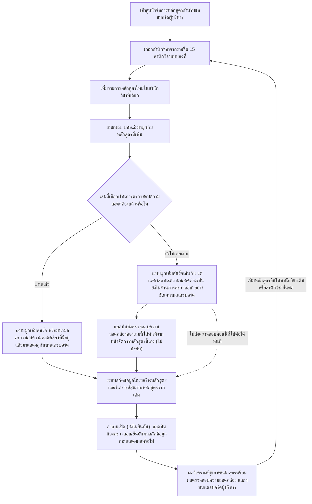
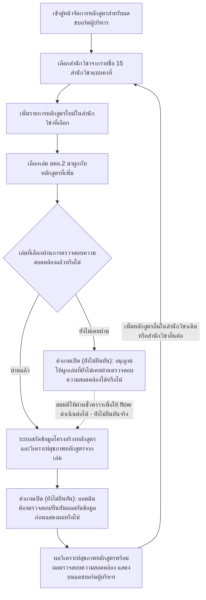
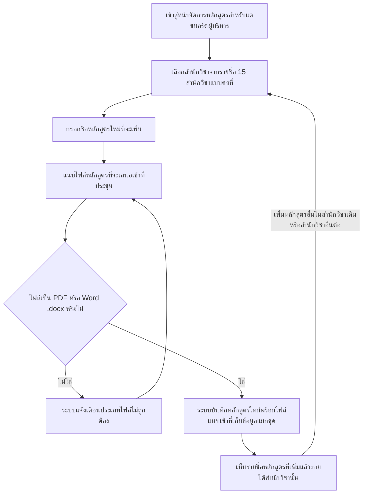

# User Journey: ~~แอดมิน จัดการรายชื่อหลักสูตรและไฟล์ที่จะเสนอเข้าที่ประชุม~~ **(อัปเดต 2026-09-13: เปลี่ยนชื่อให้ตรงกับฟีเจอร์ลำดับ 10 ที่ปรับปรุงแล้วใน [[../../01-requirements/02-plan/feature-list|feature-list]] — แอดมินไม่อัปโหลดไฟล์แยกชุดอีกต่อไป แต่ผูกเล่ม มคอ.2 ที่ผ่านการตรวจสอบความสอดคล้องแล้วแทน)** แอดมิน จัดการรายชื่อหลักสูตรและผูกเล่ม มคอ.2 ต่อสำนักวิชา

## บริบท / Persona

Journey นี้เป็นของ **แอดมิน** — ใช้บทบาทเดียวกับที่จัดการฐานความรู้เกณฑ์มาตรฐานหลักสูตรใน [[20260823-03-user-journey-admin-manage-criteria-knowledge-base|แอดมิน จัดการฐานความรู้เกณฑ์มาตรฐานหลักสูตร]] ~~(ยังไม่ยืนยันว่าเป็นแอดมินคนเดียวกันเป๊ะหรือเป็นสิทธิ์ย่อยแยกต่างหาก — ดูหัวข้อสมมติฐาน)~~ **(อัปเดต 2026-09-13: ได้รับคำตอบแล้ว — ยืนยันว่าเป็นแอดมินคนเดียวกันเป๊ะข้ามทุกฟีเจอร์ ไม่ใช่สิทธิ์ย่อยแยกต่างหาก ดู [[../../01-requirements/01-spec/20260912-05-authentication-user-roles|20260912-05-authentication-user-roles]])** แต่ทำงานกับหน้าจอและที่เก็บข้อมูลคนละชุดโดยสิ้นเชิง คือหน้าจอบริหารจัดการ "รายชื่อหลักสูตร" ต่อสำนักวิชา ~~และไฟล์ที่จะเสนอเข้าที่ประชุม~~ **(อัปเดต 2026-09-13: ไม่มีการอัปโหลดไฟล์แยกชุดอีกต่อไป — แอดมินผูกเล่ม มคอ.2 ที่ผ่านการตรวจสอบความสอดคล้องแล้วเข้ากับรายการหลักสูตรแทน)**

Journey นี้เกี่ยวข้องกับฟีเจอร์ลำดับ 10 ~~"แอดมิน เพิ่ม/จัดการรายชื่อหลักสูตรและไฟล์ที่จะเสนอเข้าที่ประชุมต่อสำนักวิชา"~~ **(อัปเดต 2026-09-13)** "แอดมิน เพิ่ม/จัดการรายชื่อหลักสูตรและผูกเล่ม มคอ.2 ต่อสำนักวิชา" ใน [[../../01-requirements/02-plan/feature-list|feature-list]]

และอ้างอิง requirement ต้นทางที่ [[../../01-requirements/01-spec/20260904-04-executive-curriculum-dashboard|ระบบแดชบอร์ดวิเคราะห์ข้อมูลหลักสูตรสำหรับผู้บริหาร (Executive Curriculum Analytics Dashboard)]] ~~FR ข้อ 3-6~~ **(อัปเดต 2026-09-13: ขยายเป็น FR ข้อ 3-8 เนื่องจาก FR ข้อ 5 ถูกรื้อและแทนที่ด้วยกลไก "ผูกเล่ม มคอ.2 ที่ตรวจสอบผ่านแล้ว" และ journey นี้ต้องครอบคลุมถึงขั้นตอนสกัดข้อมูล/วิเคราะห์สุขภาพหลักสูตรที่ตามมาทันทีหลังผูกเล่มด้วย)** FR ข้อ 3-8 ใน [[../../01-requirements/01-spec/index|01-spec]]

Journey นี้เป็น**เงื่อนไขจำเป็น**ของ journey ฝั่งผู้บริหาร (ฟีเจอร์ลำดับ 11 "ผู้บริหาร ดูแดชบอร์ดวิเคราะห์ข้อมูลหลักสูตรตามสำนักวิชา/หลักสูตร" — journey อยู่ที่ [[20260904-05-user-journey-executive-view-dashboard|ผู้บริหาร ดูแดชบอร์ดวิเคราะห์ข้อมูลหลักสูตร]]) เพราะผู้บริหารต้องมีรายชื่อหลักสูตรและเล่ม มคอ.2 ที่ผูกไว้ให้เลือกดูก่อน ระบบจึงจะแสดงผลวิเคราะห์ได้

## Diagram

### เวอร์ชันก่อนหน้า (คำถามเปิดยังไม่ได้คำตอบ — เลิกใช้แล้วตั้งแต่ 2026-09-13)

Diagram ด้านล่างนี้คือเวอร์ชันที่เคยเป็น "เวอร์ชันปัจจุบัน" ของไฟล์นี้ระหว่างวันที่ 2026-09-13 ก่อนที่ผู้ใช้จะตอบคำถามเปิดเรื่องเล่มที่ยังไม่เคยผ่านการตรวจสอบความสอดคล้อง diagram นี้ยังมีโหนดคำถามเปิด (ยังไม่ยืนยัน) อยู่ที่เส้นทาง "ยังไม่เคยผ่าน" และใช้เส้นประสมมติให้ผ่านชั่วคราวเพื่อให้ flow ดำเนินต่อได้ในทางปฏิบัติเท่านั้น เก็บไว้ที่นี่เพื่อรักษาประวัติการตัดสินใจตามธรรมเนียมของ vault — คำถามนี้ได้รับคำตอบแล้วและถูกแทนที่ด้วย diagram เวอร์ชันปัจจุบันด้านบน ดู [[../../01-requirements/01-spec/20260904-04-executive-curriculum-dashboard|ระบบแดชบอร์ดวิเคราะห์ข้อมูลหลักสูตรสำหรับผู้บริหาร (Executive Curriculum Analytics Dashboard)]] FR ข้อ 5.1 (เพิ่ม 2026-09-13):

### เวอร์ชันเดิม (เลิกใช้แล้วตั้งแต่ 2026-09-13)

Diagram เดิมด้านล่างนี้อ้างอิง FR ข้อ 5 และ 6 **เดิม** ของ spec ที่ถูกรื้อทิ้งทั้งหมดแล้ว (แอดมินเคยต้องอัปโหลด "ไฟล์หลักสูตรที่จะเสนอเข้าที่ประชุม" เป็นไฟล์แยกชุดต่างหากจากเล่ม มคอ.2) เก็บไว้ที่นี่เพื่อรักษาประวัติการตัดสินใจตามธรรมเนียมของ vault ไม่ใช่ flow ที่ใช้งานจริงอีกต่อไป — ดูเหตุผลเต็มใน [[../../01-requirements/01-spec/20260904-04-executive-curriculum-dashboard|ระบบแดชบอร์ดวิเคราะห์ข้อมูลหลักสูตรสำหรับผู้บริหาร (Executive Curriculum Analytics Dashboard)]] FR ข้อ 5 (ปรับปรุง 2026-09-13):

## คำอธิบายขั้นตอน

เรียงลำดับตาม diagram เวอร์ชันปัจจุบันด้านบน:

1. **เข้าสู่หน้าจัดการหลักสูตรสำหรับแดชบอร์ดผู้บริหาร** — แอดมินเข้าสู่หน้าจอบริหารจัดการรายชื่อหลักสูตรสำหรับแดชบอร์ดผู้บริหาร ซึ่งเป็นหน้าจอที่**แยกต่างหาก**จากหน้าจอจัดการฐานความรู้เกณฑ์มาตรฐานเดิมใน [[20260823-03-user-journey-admin-manage-criteria-knowledge-base|แอดมิน จัดการฐานความรู้เกณฑ์มาตรฐานหลักสูตร]] เป็นจุดเริ่มต้นของ flow ยังไม่มี requirement เฉพาะข้อใดกำกับโดยตรง (บริบทโดยรวมของหน้าจอนี้อยู่ใน FR ข้อ 4 ของ spec)
2. **เลือกสำนักวิชาจากรายชื่อ 15 สำนักวิชาแบบคงที่** — แอดมินเลือก "สำนักวิชา" ที่ต้องการเพิ่มหลักสูตรจากรายชื่อสำนักวิชาแบบคงที่ (master data) จำนวน 15 สำนักวิชา เวอร์ชันแรกไม่เปิดให้แอดมินเพิ่ม/แก้ไขรายชื่อสำนักวิชาเอง (อ้างอิง: [[../../01-requirements/01-spec/20260904-04-executive-curriculum-dashboard|ระบบแดชบอร์ดวิเคราะห์ข้อมูลหลักสูตรสำหรับผู้บริหาร (Executive Curriculum Analytics Dashboard)]] FR ข้อ 3)
3. **เพิ่มรายการหลักสูตรใหม่ในสำนักวิชาที่เลือก** — แอดมินเพิ่มรายชื่อหลักสูตรใหม่เข้าไปในสำนักวิชาที่เลือกไว้ (อ้างอิง: [[../../01-requirements/01-spec/20260904-04-executive-curriculum-dashboard|ระบบแดชบอร์ดวิเคราะห์ข้อมูลหลักสูตรสำหรับผู้บริหาร (Executive Curriculum Analytics Dashboard)]] FR ข้อ 4)
4. **เลือกเล่ม มคอ.2 มาผูกกับหลักสูตรที่เพิ่ม** — ~~แอดมินแนบ "ไฟล์หลักสูตรที่จะเสนอเข้าที่ประชุม" ซึ่งเป็นไฟล์แยกต่างหาก~~ **(อัปเดต 2026-09-13: FR ข้อ 5 เดิมถูกรื้อทั้งหมด)** แอดมินเลือก**เล่ม มคอ.2** มาผูกเข้ากับหลักสูตรที่เพิ่งเพิ่มไว้ ไม่ต้องอัปโหลดไฟล์แยกชุดอีกต่อไป เล่มที่เลือกอาจผ่านหรือยังไม่เคยผ่านการตรวจสอบความสอดคล้องตาม [[20260812-01-tqf2-consistency-check]] มาก่อนก็ได้ (ดูขั้นตอนถัดไป) ไฟล์/เล่มที่ใช้ยังคงรองรับรูปแบบ PDF และ Word (.docx) (อ้างอิง: [[../../01-requirements/01-spec/20260904-04-executive-curriculum-dashboard|ระบบแดชบอร์ดวิเคราะห์ข้อมูลหลักสูตรสำหรับผู้บริหาร (Executive Curriculum Analytics Dashboard)]] FR ข้อ 5 (ปรับปรุง 2026-09-13), FR ข้อ 6)
5. **เล่มที่เลือกผ่านการตรวจสอบความสอดคล้องแล้วหรือไม่ (เงื่อนไขแตกแขนง)** — ระบบตรวจสอบว่าเล่ม มคอ.2 ที่แอดมินเลือกมาผูกนั้นเคยผ่านกระบวนการตรวจสอบความสอดคล้องตาม [[20260812-01-tqf2-consistency-check]] มาแล้วหรือไม่ **(อัปเดต 2026-09-13: ได้รับคำตอบแล้วว่าอนุญาตให้ผูกได้ทั้งสองกรณี — ดู FR ข้อ 5.1)** (อ้างอิง: [[../../01-requirements/01-spec/20260904-04-executive-curriculum-dashboard|ระบบแดชบอร์ดวิเคราะห์ข้อมูลหลักสูตรสำหรับผู้บริหาร (Executive Curriculum Analytics Dashboard)]] FR ข้อ 5.1)
   - **ผ่านแล้ว** → ไปขั้นตอน "ระบบผูกเล่มสำเร็จ พร้อมนำผลตรวจสอบความสอดคล้องที่มีอยู่แล้วมาแสดงคู่กันบนแดชบอร์ด"
   - **ยังไม่เคยผ่าน** → ไปขั้นตอน "ระบบผูกเล่มสำเร็จเช่นกัน แต่แสดงสถานะความสอดคล้องเป็น 'ยังไม่ผ่านการตรวจสอบ' อย่างชัดเจนบนแดชบอร์ด"
6. **ระบบผูกเล่มสำเร็จ พร้อมนำผลตรวจสอบความสอดคล้องที่มีอยู่แล้วมาแสดงคู่กันบนแดชบอร์ด** — เมื่อเล่มที่เลือกเคยผ่านการตรวจสอบความสอดคล้องมาแล้ว ระบบผูกเล่มเข้ากับหลักสูตรทันที และดึงผลตรวจสอบความสอดคล้องที่มีอยู่แล้วมาเตรียมแสดงคู่กับผลวิเคราะห์สุขภาพหลักสูตรบนแดชบอร์ด (อ้างอิง: [[../../01-requirements/01-spec/20260904-04-executive-curriculum-dashboard|ระบบแดชบอร์ดวิเคราะห์ข้อมูลหลักสูตรสำหรับผู้บริหาร (Executive Curriculum Analytics Dashboard)]] FR ข้อ 5 (ปรับปรุง 2026-09-13))
7. **ระบบผูกเล่มสำเร็จเช่นกัน แต่แสดงสถานะความสอดคล้องเป็น "ยังไม่ผ่านการตรวจสอบ" อย่างชัดเจนบนแดชบอร์ด** — **(อัปเดต 2026-09-13: ปิดคำถามเปิดเดิมแล้ว — ได้รับคำตอบจากผู้ใช้)** ระบบ**อนุญาต**ให้แอดมินผูกเล่ม มคอ.2 ที่ยังไม่เคยผ่านการตรวจสอบความสอดคล้องเข้ากับหลักสูตรได้ เพราะเล่มของหน่วยงานที่จะเข้าที่ประชุมอาจไม่เคยถูกนำเข้าระบบ Curmate มาก่อน และแอดมินจะเป็นผู้สั่งตรวจซ้ำเองอยู่แล้ว ช่องสถานะความสอดคล้องบนแดชบอร์ดต้องแสดง **"ยังไม่ผ่านการตรวจสอบ"** อย่างชัดเจน ห้ามเว้นว่างและห้ามแสดงในลักษณะที่ทำให้เข้าใจว่าผ่านการตรวจสอบแล้ว สอดคล้องกับกฎ "ไม่มีข้อมูล ไม่เท่ากับศูนย์" ของ FR ข้อ 12 (อ้างอิง: [[../../01-requirements/01-spec/20260904-04-executive-curriculum-dashboard|ระบบแดชบอร์ดวิเคราะห์ข้อมูลหลักสูตรสำหรับผู้บริหาร (Executive Curriculum Analytics Dashboard)]] FR ข้อ 5.1)
8. **แอดมินสั่งตรวจสอบความสอดคล้องของเล่มนี้ได้ทันทีจากหน้าจัดการหลักสูตรนี้เอง (ไม่บังคับ)** — **(เพิ่ม 2026-09-13)** เมื่อเล่มยังไม่เคยผ่านการตรวจสอบ ระบบต้องมีช่องทางให้แอดมินสั่งตรวจสอบความสอดคล้องของเล่มนั้นได้โดยตรงจากหน้าจัดการหลักสูตรนี้เลย โดยไม่ต้องออกไปเริ่มใหม่ที่ฝั่งฟีเจอร์ตรวจสอบเอกสาร [[20260812-01-tqf2-consistency-check]] ขั้นตอนนี้เป็นทางเลือกเสริม — แอดมินไม่สั่งตรวจสอบตอนนี้ก็ไปต่อขั้นตอนสกัดข้อมูลได้ทันที (อ้างอิง: [[../../01-requirements/01-spec/20260904-04-executive-curriculum-dashboard|ระบบแดชบอร์ดวิเคราะห์ข้อมูลหลักสูตรสำหรับผู้บริหาร (Executive Curriculum Analytics Dashboard)]] FR ข้อ 5.1)
9. **ระบบสกัดข้อมูลโครงสร้างหลักสูตรและวิเคราะห์สุขภาพหลักสูตรจากเล่ม** — ไม่ว่าเล่มที่ผูกจะผ่านหรือยังไม่ผ่านการตรวจสอบความสอดคล้องมาก่อน ระบบดึงข้อมูลโครงสร้างหลักสูตรจากเล่มและวิเคราะห์สุขภาพหลักสูตร 4 มิติ (คุณภาพหลักสูตร, ศักยภาพการจัดการเรียนการสอน, ความเป็นนานาชาติ, ความสอดคล้องกับทักษะที่ตลาดต้องการ) เพื่อเตรียมแสดงผลต่อผู้บริหาร (อ้างอิง: [[../../01-requirements/01-spec/20260904-04-executive-curriculum-dashboard|ระบบแดชบอร์ดวิเคราะห์ข้อมูลหลักสูตรสำหรับผู้บริหาร (Executive Curriculum Analytics Dashboard)]] FR ข้อ 7, FR ข้อ 8)
10. **คำถามเปิด (ยังไม่ยืนยัน): แอดมินต้องตรวจสอบ/ยืนยันผลสกัดข้อมูลก่อนแสดงผลหรือไม่** — spec ต้นทางยังไม่ยืนยันว่ากลไกสกัดข้อมูล/วิเคราะห์สุขภาพหลักสูตรเป็นแบบอัตโนมัติเต็มรูปแบบ หรือกึ่งอัตโนมัติที่ต้องให้แอดมินตรวจสอบ/แก้ไข/ยืนยันผลก่อนส่งต่อให้ผู้บริหารเห็น คำถามนี้สำคัญขึ้นกว่าเดิมหลังการปรับปรุง 2026-09-13 เพราะตอนนี้มีการตีความเชิงคุณภาพจาก AI เข้ามาเกี่ยวข้อง ไม่ใช่แค่ตัวเลขสถิติเชิงปริมาณเหมือนเดิม — **คำถามนี้ยังเปิดอยู่ ไม่ได้รับคำตอบพร้อมกับ FR ข้อ 5.1** (อ้างอิง: [[../../01-requirements/01-spec/20260904-04-executive-curriculum-dashboard|ระบบแดชบอร์ดวิเคราะห์ข้อมูลหลักสูตรสำหรับผู้บริหาร (Executive Curriculum Analytics Dashboard)]] FR ข้อ 7 — หัวข้อสมมติฐาน/คำถามที่เปิดไว้)
11. **ผลวิเคราะห์สุขภาพหลักสูตรพร้อมผลตรวจสอบความสอดคล้อง แสดงบนแดชบอร์ดผู้บริหาร** — ผลวิเคราะห์สุขภาพหลักสูตร 4 มิติ พร้อมผลตรวจสอบความสอดคล้องของเล่ม มคอ.2 ที่ผูกไว้ (ไม่ว่าจะเป็นผลจริงหรือสถานะ "ยังไม่ผ่านการตรวจสอบ") ไหลไปแสดงคู่กันบนแดชบอร์ดผู้บริหาร (ฟีเจอร์ 11) เพื่อให้ผู้บริหารเห็นในหน้าเดียวว่าหลักสูตรนี้ยังติดเกณฑ์ข้อใดอยู่บ้างก่อนเข้าที่ประชุม แอดมินสามารถกลับไปเลือกสำนักวิชาเดิมหรือสำนักวิชาอื่นเพื่อเพิ่มหลักสูตรต่อได้เรื่อยๆ (อ้างอิง: [[../../01-requirements/01-spec/20260904-04-executive-curriculum-dashboard|ระบบแดชบอร์ดวิเคราะห์ข้อมูลหลักสูตรสำหรับผู้บริหาร (Executive Curriculum Analytics Dashboard)]] FR ข้อ 5, FR ข้อ 5.1, FR ข้อ 8)

## Mapping กลับไปยัง Requirement

| ขั้นตอนใน Diagram | Requirement อ้างอิง |
| --- | --- |
| เข้าสู่หน้าจัดการหลักสูตรสำหรับแดชบอร์ดผู้บริหาร | ไม่มี requirement เฉพาะ — เป็นจุดเริ่มต้นของ flow (บริบทโดยรวมตาม [[../../01-requirements/01-spec/20260904-04-executive-curriculum-dashboard\|ระบบแดชบอร์ดวิเคราะห์ข้อมูลหลักสูตรสำหรับผู้บริหาร (Executive Curriculum Analytics Dashboard)]] FR ข้อ 4) |
| เลือกสำนักวิชาจากรายชื่อ 15 สำนักวิชาแบบคงที่ | [[../../01-requirements/01-spec/20260904-04-executive-curriculum-dashboard\|ระบบแดชบอร์ดวิเคราะห์ข้อมูลหลักสูตรสำหรับผู้บริหาร (Executive Curriculum Analytics Dashboard)]] (FR ข้อ 3) |
| เพิ่มรายการหลักสูตรใหม่ในสำนักวิชาที่เลือก | [[../../01-requirements/01-spec/20260904-04-executive-curriculum-dashboard\|ระบบแดชบอร์ดวิเคราะห์ข้อมูลหลักสูตรสำหรับผู้บริหาร (Executive Curriculum Analytics Dashboard)]] (FR ข้อ 4) |
| เลือกเล่ม มคอ.2 มาผูกกับหลักสูตรที่เพิ่ม | [[../../01-requirements/01-spec/20260904-04-executive-curriculum-dashboard\|ระบบแดชบอร์ดวิเคราะห์ข้อมูลหลักสูตรสำหรับผู้บริหาร (Executive Curriculum Analytics Dashboard)]] (FR ข้อ 5 ปรับปรุง 2026-09-13, FR ข้อ 6) |
| เล่มที่เลือกผ่านการตรวจสอบความสอดคล้องแล้วหรือไม่ | [[../../01-requirements/01-spec/20260904-04-executive-curriculum-dashboard\|ระบบแดชบอร์ดวิเคราะห์ข้อมูลหลักสูตรสำหรับผู้บริหาร (Executive Curriculum Analytics Dashboard)]] (FR ข้อ 5.1 — ได้รับคำตอบแล้ว) |
| ระบบผูกเล่มสำเร็จ พร้อมนำผลตรวจสอบความสอดคล้องที่มีอยู่แล้วมาแสดงคู่กันบนแดชบอร์ด | [[../../01-requirements/01-spec/20260904-04-executive-curriculum-dashboard\|ระบบแดชบอร์ดวิเคราะห์ข้อมูลหลักสูตรสำหรับผู้บริหาร (Executive Curriculum Analytics Dashboard)]] (FR ข้อ 5 ปรับปรุง 2026-09-13) |
| ระบบผูกเล่มสำเร็จเช่นกัน แต่แสดงสถานะความสอดคล้องเป็น "ยังไม่ผ่านการตรวจสอบ" อย่างชัดเจนบนแดชบอร์ด | [[../../01-requirements/01-spec/20260904-04-executive-curriculum-dashboard\|ระบบแดชบอร์ดวิเคราะห์ข้อมูลหลักสูตรสำหรับผู้บริหาร (Executive Curriculum Analytics Dashboard)]] (FR ข้อ 5.1) |
| แอดมินสั่งตรวจสอบความสอดคล้องของเล่มนี้ได้ทันทีจากหน้าจัดการหลักสูตรนี้เอง (ไม่บังคับ) | [[../../01-requirements/01-spec/20260904-04-executive-curriculum-dashboard\|ระบบแดชบอร์ดวิเคราะห์ข้อมูลหลักสูตรสำหรับผู้บริหาร (Executive Curriculum Analytics Dashboard)]] (FR ข้อ 5.1) |
| ระบบสกัดข้อมูลโครงสร้างหลักสูตรและวิเคราะห์สุขภาพหลักสูตรจากเล่ม | [[../../01-requirements/01-spec/20260904-04-executive-curriculum-dashboard\|ระบบแดชบอร์ดวิเคราะห์ข้อมูลหลักสูตรสำหรับผู้บริหาร (Executive Curriculum Analytics Dashboard)]] (FR ข้อ 7, FR ข้อ 8) |
| คำถามเปิด: แอดมินต้องตรวจสอบ/ยืนยันผลสกัดข้อมูลก่อนแสดงผลหรือไม่ | [[../../01-requirements/01-spec/20260904-04-executive-curriculum-dashboard\|ระบบแดชบอร์ดวิเคราะห์ข้อมูลหลักสูตรสำหรับผู้บริหาร (Executive Curriculum Analytics Dashboard)]] (FR ข้อ 7 — หัวข้อสมมติฐาน/คำถามที่เปิดไว้ — **ยังไม่ยืนยัน**) |
| ผลวิเคราะห์สุขภาพหลักสูตรพร้อมผลตรวจสอบความสอดคล้อง แสดงบนแดชบอร์ดผู้บริหาร | [[../../01-requirements/01-spec/20260904-04-executive-curriculum-dashboard\|ระบบแดชบอร์ดวิเคราะห์ข้อมูลหลักสูตรสำหรับผู้บริหาร (Executive Curriculum Analytics Dashboard)]] (FR ข้อ 5, FR ข้อ 5.1, FR ข้อ 8) — เชื่อมต่อไปยัง [[20260904-05-user-journey-executive-view-dashboard\|ผู้บริหาร ดูแดชบอร์ดวิเคราะห์ข้อมูลหลักสูตร]] |

## สมมติฐาน / คำถามที่เปิดไว้

- ~~บทบาท "แอดมิน" ในหน้าจอนี้เป็นแอดมินคนเดียวกับที่จัดการฐานความรู้เกณฑ์มาตรฐานใน [[20260823-03-user-journey-admin-manage-criteria-knowledge-base|แอดมิน จัดการฐานความรู้เกณฑ์มาตรฐานหลักสูตร]] หรือเป็นสิทธิ์ย่อยแยกต่างหาก ยังไม่ยืนยันจากผู้ใช้~~ **(อัปเดต 2026-09-13: ได้รับคำตอบแล้ว — เป็นแอดมินคนเดียวกันเป๊ะ ดู [[../../01-requirements/01-spec/20260912-05-authentication-user-roles|20260912-05-authentication-user-roles]])**
- ~~ขั้นตอน "ระบบแจ้งเตือนประเภทไฟล์ไม่ถูกต้อง" เป็น alternative flow ที่เพิ่มขึ้นเองตามดุลยพินิจ...~~ **(อัปเดต 2026-09-13: ขั้นตอนนี้ล้าสมัยแล้ว เพราะไม่มีการอัปโหลดไฟล์แยกชุดอีกต่อไป ดู diagram เวอร์ชันเดิมที่เก็บไว้ด้านบนสำหรับบริบทเดิม)**
- ยังไม่มีรายละเอียด UI/UX เชิงกราฟิกของหน้าจอบริหารจัดการหลักสูตรนี้ (เช่น รูปแบบรายการหลักสูตรที่แสดง ปุ่มแก้ไข/ลบหลักสูตร, หน้าจอเลือกเล่ม มคอ.2 มาผูก) — เป็นคำถามเปิดที่ส่งต่อให้การออกแบบ mockup โดยละเอียดใน [[index|01-prototypes]] ตัดสินใจต่อ
- ~~กลไกการดึงข้อมูล/คำนวณสถิติจากไฟล์ที่อัปโหลดเป็นแบบอัตโนมัติเต็มรูปแบบหรือกึ่งอัตโนมัติที่ต้องแอดมินยืนยันก่อนแสดงผล ยังไม่ยืนยัน — journey นี้ยังไม่ลงรายละเอียดขั้นตอนนี้เนื่องจากเป็นส่วนของฝั่งผู้บริหาร~~ **(อัปเดต 2026-09-13: ยังไม่ยืนยันเหมือนเดิม แต่ตอนนี้ journey นี้ลงรายละเอียดขั้นตอนสกัดข้อมูล/วิเคราะห์สุขภาพหลักสูตรไว้อย่างชัดเจนแล้วในโหนด "ระบบสกัดข้อมูลโครงสร้างหลักสูตรและวิเคราะห์สุขภาพหลักสูตรจากเล่ม" พร้อมทำเครื่องหมายคำถามเปิดนี้เป็นโหนดของตัวเองในไดอะแกรม — ดู [[../../01-requirements/01-spec/20260904-04-executive-curriculum-dashboard|ระบบแดชบอร์ดวิเคราะห์ข้อมูลหลักสูตรสำหรับผู้บริหาร (Executive Curriculum Analytics Dashboard)]] FR ข้อ 7 และหัวข้อสมมติฐานของ spec)**
- **(เพิ่ม 2026-09-13)** กรณีหลักสูตรที่ยังไม่เคยผ่านฝั่งตรวจสอบความสอดคล้องเลย ระบบควรอนุญาตให้แอดมินผูกเล่มเข้ามาตรงๆ เพื่อทำแดชบอร์ดอย่างเดียวหรือไม่ และช่องสถานะความสอดคล้องบนแดชบอร์ดควรแสดงอย่างไรในกรณีนี้ — สะท้อนเป็นโหนดคำถามเปิดแยกในไดอะแกรมข้างต้นแล้ว ยังไม่ตัดสินใจแทนผู้ใช้ (สืบทอดคำถามเปิดจาก [[../../01-requirements/01-spec/20260904-04-executive-curriculum-dashboard|ระบบแดชบอร์ดวิเคราะห์ข้อมูลหลักสูตรสำหรับผู้บริหาร (Executive Curriculum Analytics Dashboard)]] FR ข้อ 5) **(อัปเดต 2026-09-13: ได้รับคำตอบแล้ว — ดู FR ข้อ 5.1)**

---
[[index|01-prototypes]] · [[../../01-requirements/02-plan/feature-list|feature-list]] · [[../../01-requirements/01-spec/index|01-spec]]
