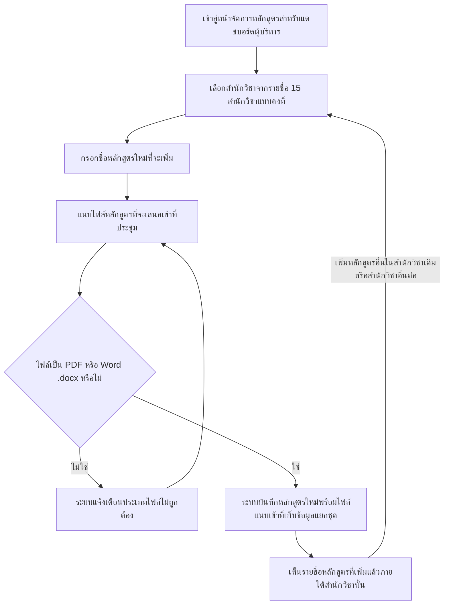

# User Journey: แอดมิน จัดการรายชื่อหลักสูตรและไฟล์ที่จะเสนอเข้าที่ประชุม

## บริบท / Persona

Journey นี้เป็นของ **แอดมิน** — ใช้บทบาทเดียวกับที่จัดการฐานความรู้เกณฑ์มาตรฐานหลักสูตรใน [[20260823-03-user-journey-admin-manage-criteria-knowledge-base|แอดมิน จัดการฐานความรู้เกณฑ์มาตรฐานหลักสูตร]] (ยังไม่ยืนยันว่าเป็นแอดมินคนเดียวกันเป๊ะหรือเป็นสิทธิ์ย่อยแยกต่างหาก — ดูหัวข้อสมมติฐาน) แต่ทำงานกับหน้าจอและที่เก็บข้อมูลคนละชุดโดยสิ้นเชิง คือหน้าจอบริหารจัดการ "รายชื่อหลักสูตรและไฟล์ที่จะเสนอเข้าที่ประชุม" ต่อสำนักวิชา

Journey นี้เกี่ยวข้องกับฟีเจอร์ลำดับ 10 "แอดมิน เพิ่ม/จัดการรายชื่อหลักสูตรและไฟล์ที่จะเสนอเข้าที่ประชุมต่อสำนักวิชา" ใน [[../../01-requirements/02-plan/feature-list|feature-list]]

และอ้างอิง requirement ต้นทางที่ [[../../01-requirements/01-spec/20260904-04-executive-curriculum-dashboard|ระบบแดชบอร์ดวิเคราะห์ข้อมูลหลักสูตรสำหรับผู้บริหาร (Executive Curriculum Analytics Dashboard)]] FR ข้อ 3-6 ใน [[../../01-requirements/01-spec/index|01-spec]]

Journey นี้เป็น**เงื่อนไขจำเป็น**ของ journey ฝั่งผู้บริหาร (ฟีเจอร์ลำดับ 11 "ผู้บริหาร ดูแดชบอร์ดวิเคราะห์ข้อมูลหลักสูตรตามสำนักวิชา/หลักสูตร" — จะสร้างเอกสาร journey ที่ `20260904-05-user-journey-executive-view-dashboard` ในขั้นตอนถัดไป) เพราะผู้บริหารต้องมีรายชื่อหลักสูตรและไฟล์ให้เลือกดูก่อน ระบบจึงจะแสดงสถิติวิเคราะห์ได้

## Diagram

## คำอธิบายขั้นตอน

1. **เข้าสู่หน้าจัดการหลักสูตรสำหรับแดชบอร์ดผู้บริหาร** — แอดมินเข้าสู่หน้าจอบริหารจัดการรายชื่อหลักสูตรสำหรับแดชบอร์ดผู้บริหาร ซึ่งเป็นหน้าจอที่**แยกต่างหาก**จากหน้าจอจัดการฐานความรู้เกณฑ์มาตรฐานเดิมใน [[20260823-03-user-journey-admin-manage-criteria-knowledge-base|แอดมิน จัดการฐานความรู้เกณฑ์มาตรฐานหลักสูตร]] เป็นจุดเริ่มต้นของ flow ยังไม่มี requirement เฉพาะข้อใดกำกับโดยตรง (บริบทโดยรวมของหน้าจอนี้อยู่ใน FR ข้อ 4 ของ spec)
2. **เลือกสำนักวิชาจากรายชื่อ 15 สำนักวิชาแบบคงที่** — แอดมินเลือก "สำนักวิชา" ที่ต้องการเพิ่มหลักสูตรจากรายชื่อสำนักวิชาแบบคงที่ (master data) จำนวน 15 สำนักวิชา เวอร์ชันแรกไม่เปิดให้แอดมินเพิ่ม/แก้ไขรายชื่อสำนักวิชาเอง (อ้างอิง: [[../../01-requirements/01-spec/20260904-04-executive-curriculum-dashboard|ระบบแดชบอร์ดวิเคราะห์ข้อมูลหลักสูตรสำหรับผู้บริหาร (Executive Curriculum Analytics Dashboard)]] FR ข้อ 3)
3. **กรอกชื่อหลักสูตรใหม่ที่จะเพิ่ม** — แอดมินกรอกชื่อหลักสูตรใหม่ที่จะเพิ่มเข้าไปในสำนักวิชาที่เลือกไว้ (อ้างอิง: [[../../01-requirements/01-spec/20260904-04-executive-curriculum-dashboard|ระบบแดชบอร์ดวิเคราะห์ข้อมูลหลักสูตรสำหรับผู้บริหาร (Executive Curriculum Analytics Dashboard)]] FR ข้อ 4)
4. **แนบไฟล์หลักสูตรที่จะเสนอเข้าที่ประชุม** — แอดมินแนบ "ไฟล์หลักสูตรที่จะเสนอเข้าที่ประชุม" เข้ากับหลักสูตรที่กรอกไว้ ไฟล์นี้เป็น**ไฟล์แยกต่างหาก** ไม่ใช่ไฟล์เดียวกับเล่ม มคอ.2 ที่ใช้ในฟีเจอร์ตรวจสอบความสอดคล้องเดิม (อาจเป็นไฟล์เวอร์ชันที่จะเสนอที่ประชุมจริงซึ่งอาจต่างจากไฟล์ที่ใช้ตรวจสอบตอนจัดทำ) รองรับไฟล์ PDF และ Word (.docx) (อ้างอิง: [[../../01-requirements/01-spec/20260904-04-executive-curriculum-dashboard|ระบบแดชบอร์ดวิเคราะห์ข้อมูลหลักสูตรสำหรับผู้บริหาร (Executive Curriculum Analytics Dashboard)]] FR ข้อ 5, FR ข้อ 6)
5. **ไฟล์เป็น PDF หรือ Word .docx หรือไม่ (เงื่อนไขแตกแขนง)** — ระบบตรวจสอบประเภทไฟล์ที่แนบว่าอยู่ในรูปแบบที่รองรับหรือไม่ (อ้างอิง: [[../../01-requirements/01-spec/20260904-04-executive-curriculum-dashboard|ระบบแดชบอร์ดวิเคราะห์ข้อมูลหลักสูตรสำหรับผู้บริหาร (Executive Curriculum Analytics Dashboard)]] FR ข้อ 6)
   - **ไม่ใช่** → ไปขั้นตอน "ระบบแจ้งเตือนประเภทไฟล์ไม่ถูกต้อง"
   - **ใช่** → ไปขั้นตอน "ระบบบันทึกหลักสูตรใหม่พร้อมไฟล์แนบเข้าที่เก็บข้อมูลแยกชุด"
6. **ระบบแจ้งเตือนประเภทไฟล์ไม่ถูกต้อง** — ระบบแจ้งเตือนแอดมินว่าไฟล์ที่แนบไม่ใช่รูปแบบ PDF หรือ Word (.docx) ที่รองรับ แล้ววนกลับไปให้แอดมินแนบไฟล์ใหม่ที่ขั้นตอน "แนบไฟล์หลักสูตรที่จะเสนอเข้าที่ประชุม" (เป็น alternative flow สั้นๆ ตามดุลยพินิจ เนื่องจาก spec ต้นทางไม่ได้ลงรายละเอียดข้อความแจ้งเตือนไว้ — ดูหัวข้อสมมติฐาน) (อ้างอิง: [[../../01-requirements/01-spec/20260904-04-executive-curriculum-dashboard|ระบบแดชบอร์ดวิเคราะห์ข้อมูลหลักสูตรสำหรับผู้บริหาร (Executive Curriculum Analytics Dashboard)]] FR ข้อ 6)
7. **ระบบบันทึกหลักสูตรใหม่พร้อมไฟล์แนบเข้าที่เก็บข้อมูลแยกชุด** — เมื่อไฟล์ผ่านการตรวจสอบประเภทแล้ว ระบบบันทึกหลักสูตรใหม่พร้อมไฟล์แนบเข้าไปในที่เก็บข้อมูล/ฐานข้อมูลที่แยกชุดต่างหากจากฐานความรู้เกณฑ์มาตรฐานเดิมโดยสิ้นเชิง ไม่มีการเชื่อมโยง/sync ข้อมูลระหว่างกันในเวอร์ชันแรก (อ้างอิง: [[../../01-requirements/01-spec/20260904-04-executive-curriculum-dashboard|ระบบแดชบอร์ดวิเคราะห์ข้อมูลหลักสูตรสำหรับผู้บริหาร (Executive Curriculum Analytics Dashboard)]] FR ข้อ 5)
8. **เห็นรายชื่อหลักสูตรที่เพิ่มแล้วภายใต้สำนักวิชานั้น** — แอดมินเห็นรายชื่อหลักสูตรที่เพิ่มแล้วภายใต้สำนักวิชานั้น พร้อมสามารถกลับไปเลือกสำนักวิชาเดิมหรือสำนักวิชาอื่นเพื่อเพิ่มหลักสูตรต่อได้เรื่อยๆ เป็นจุดที่รายชื่อหลักสูตร/ไฟล์นี้พร้อมถูกนำไปใช้ในหน้าแดชบอร์ดของผู้บริหารต่อไป (อ้างอิง: [[../../01-requirements/01-spec/20260904-04-executive-curriculum-dashboard|ระบบแดชบอร์ดวิเคราะห์ข้อมูลหลักสูตรสำหรับผู้บริหาร (Executive Curriculum Analytics Dashboard)]] FR ข้อ 4)

## Mapping กลับไปยัง Requirement

| ขั้นตอนใน Diagram | Requirement อ้างอิง |
| --- | --- |
| เข้าสู่หน้าจัดการหลักสูตรสำหรับแดชบอร์ดผู้บริหาร | ไม่มี requirement เฉพาะ — เป็นจุดเริ่มต้นของ flow (บริบทโดยรวมตาม [[../../01-requirements/01-spec/20260904-04-executive-curriculum-dashboard\|ระบบแดชบอร์ดวิเคราะห์ข้อมูลหลักสูตรสำหรับผู้บริหาร (Executive Curriculum Analytics Dashboard)]] FR ข้อ 4) |
| เลือกสำนักวิชาจากรายชื่อ 15 สำนักวิชาแบบคงที่ | [[../../01-requirements/01-spec/20260904-04-executive-curriculum-dashboard\|ระบบแดชบอร์ดวิเคราะห์ข้อมูลหลักสูตรสำหรับผู้บริหาร (Executive Curriculum Analytics Dashboard)]] (FR ข้อ 3) |
| กรอกชื่อหลักสูตรใหม่ที่จะเพิ่ม | [[../../01-requirements/01-spec/20260904-04-executive-curriculum-dashboard\|ระบบแดชบอร์ดวิเคราะห์ข้อมูลหลักสูตรสำหรับผู้บริหาร (Executive Curriculum Analytics Dashboard)]] (FR ข้อ 4) |
| แนบไฟล์หลักสูตรที่จะเสนอเข้าที่ประชุม | [[../../01-requirements/01-spec/20260904-04-executive-curriculum-dashboard\|ระบบแดชบอร์ดวิเคราะห์ข้อมูลหลักสูตรสำหรับผู้บริหาร (Executive Curriculum Analytics Dashboard)]] (FR ข้อ 5, FR ข้อ 6) |
| ไฟล์เป็น PDF หรือ Word .docx หรือไม่ | [[../../01-requirements/01-spec/20260904-04-executive-curriculum-dashboard\|ระบบแดชบอร์ดวิเคราะห์ข้อมูลหลักสูตรสำหรับผู้บริหาร (Executive Curriculum Analytics Dashboard)]] (FR ข้อ 6) |
| ระบบแจ้งเตือนประเภทไฟล์ไม่ถูกต้อง | [[../../01-requirements/01-spec/20260904-04-executive-curriculum-dashboard\|ระบบแดชบอร์ดวิเคราะห์ข้อมูลหลักสูตรสำหรับผู้บริหาร (Executive Curriculum Analytics Dashboard)]] (FR ข้อ 6) |
| ระบบบันทึกหลักสูตรใหม่พร้อมไฟล์แนบเข้าที่เก็บข้อมูลแยกชุด | [[../../01-requirements/01-spec/20260904-04-executive-curriculum-dashboard\|ระบบแดชบอร์ดวิเคราะห์ข้อมูลหลักสูตรสำหรับผู้บริหาร (Executive Curriculum Analytics Dashboard)]] (FR ข้อ 5) |
| เห็นรายชื่อหลักสูตรที่เพิ่มแล้วภายใต้สำนักวิชานั้น | [[../../01-requirements/01-spec/20260904-04-executive-curriculum-dashboard\|ระบบแดชบอร์ดวิเคราะห์ข้อมูลหลักสูตรสำหรับผู้บริหาร (Executive Curriculum Analytics Dashboard)]] (FR ข้อ 4) |

## สมมติฐาน / คำถามที่เปิดไว้

- บทบาท "แอดมิน" ในหน้าจอนี้เป็นแอดมินคนเดียวกับที่จัดการฐานความรู้เกณฑ์มาตรฐานใน [[20260823-03-user-journey-admin-manage-criteria-knowledge-base|แอดมิน จัดการฐานความรู้เกณฑ์มาตรฐานหลักสูตร]] หรือเป็นสิทธิ์ย่อยแยกต่างหาก ยังไม่ยืนยันจากผู้ใช้ (สืบทอดคำถามเปิดเดิมจาก [[../../01-requirements/01-spec/20260904-04-executive-curriculum-dashboard|ระบบแดชบอร์ดวิเคราะห์ข้อมูลหลักสูตรสำหรับผู้บริหาร (Executive Curriculum Analytics Dashboard)]])
- ขั้นตอน "ระบบแจ้งเตือนประเภทไฟล์ไม่ถูกต้อง" เป็น alternative flow ที่เพิ่มขึ้นเองตามดุลยพินิจในสไตล์เดียวกับ journey อื่นในโปรเจกต์ (เช่นระบบตรวจสอบประเภทไฟล์ในฟีเจอร์อัปโหลด มคอ.2) เนื่องจาก spec ต้นทางยังไม่ได้ลงรายละเอียดพฤติกรรมเมื่อไฟล์ผิดประเภทไว้โดยตรง หากมีการตัดสินใจในอนาคตควรกลับมาปรับปรุง diagram นี้
- ยังไม่มีรายละเอียด UI/UX เชิงกราฟิกของหน้าจอบริหารจัดการหลักสูตรนี้ (เช่น รูปแบบรายการหลักสูตรที่แสดง ปุ่มแก้ไข/ลบหลักสูตร) — เป็นคำถามเปิดที่ส่งต่อให้การออกแบบ mockup โดยละเอียดใน [[index|01-prototypes]] ตัดสินใจต่อ
- กลไกการดึงข้อมูล/คำนวณสถิติจากไฟล์ที่อัปโหลดเป็นแบบอัตโนมัติเต็มรูปแบบหรือกึ่งอัตโนมัติที่ต้องแอดมินยืนยันก่อนแสดงผล ยังไม่ยืนยัน — journey นี้ยังไม่ลงรายละเอียดขั้นตอนนี้เนื่องจากเป็นส่วนของฝั่งผู้บริหาร (ดู [[../../01-requirements/01-spec/20260904-04-executive-curriculum-dashboard|ระบบแดชบอร์ดวิเคราะห์ข้อมูลหลักสูตรสำหรับผู้บริหาร (Executive Curriculum Analytics Dashboard)]] FR ข้อ 7 และหัวข้อสมมติฐานของ spec)

---
[[index|01-prototypes]] · [[../../01-requirements/02-plan/feature-list|feature-list]] · [[../../01-requirements/01-spec/index|01-spec]]
