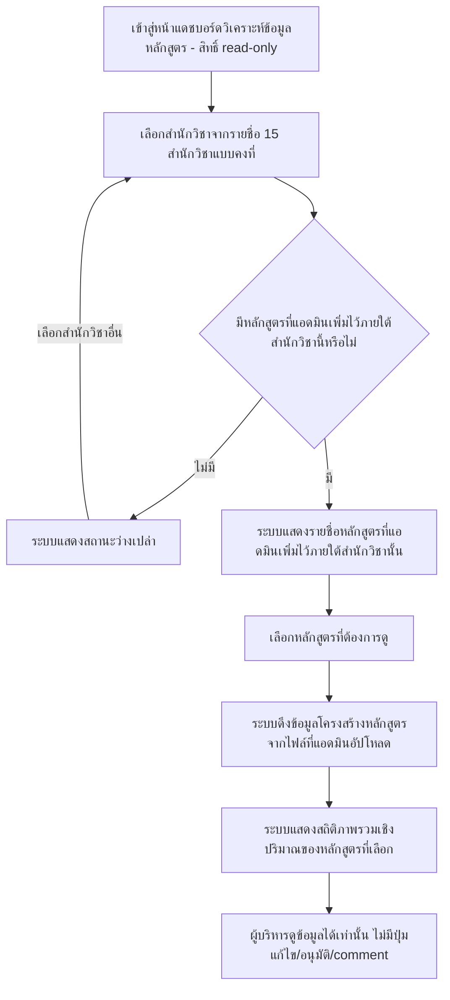

# User Journey: ผู้บริหาร ดูแดชบอร์ดวิเคราะห์ข้อมูลหลักสูตร

## บริบท / Persona

Journey นี้เป็นของ **ผู้บริหาร (executive)** — บทบาทผู้ใช้งานใหม่ที่ไม่เคยมีมาก่อนในระบบ มีสิทธิ์ **read-only เท่านั้น** ไม่มีสิทธิ์แก้ไข อัปโหลด อนุมัติ หรือ comment ใดๆ

Journey นี้เกี่ยวข้องกับฟีเจอร์ลำดับ 11 "ผู้บริหาร ดูแดชบอร์ดวิเคราะห์ข้อมูลหลักสูตรตามสำนักวิชา/หลักสูตร" ใน [[../../01-requirements/02-plan/feature-list|feature-list]]

และอ้างอิง requirement ต้นทางที่ [[../../01-requirements/01-spec/20260904-04-executive-curriculum-dashboard|ระบบแดชบอร์ดวิเคราะห์ข้อมูลหลักสูตรสำหรับผู้บริหาร (Executive Curriculum Analytics Dashboard)]] FR ข้อ 1, 2, 3, 7, 8 ใน [[../../01-requirements/01-spec/index|01-spec]]

Journey นี้ต่อเนื่องมาจาก journey ฝั่งแอดมิน [[20260904-04-user-journey-admin-manage-executive-courses|แอดมิน จัดการรายชื่อหลักสูตรและไฟล์ที่จะเสนอเข้าที่ประชุม]] กล่าวคือ ผู้บริหารจะเห็นหลักสูตรได้ก็ต่อเมื่อแอดมินเพิ่มไว้แล้วเท่านั้น (journey ฝั่งแอดมินเป็นเงื่อนไขจำเป็นของ journey นี้)

## Diagram

## คำอธิบายขั้นตอน

1. **เข้าสู่หน้าแดชบอร์ดวิเคราะห์ข้อมูลหลักสูตร - สิทธิ์ read-only** — ผู้บริหารเข้าสู่หน้าจอแดชบอร์ดวิเคราะห์ข้อมูลหลักสูตร ซึ่งเป็นหน้าจอเฉพาะของบทบาท "ผู้บริหาร" ที่มีสิทธิ์ read-only เท่านั้น ตั้งแต่จุดเริ่มต้นไม่มีปุ่มแก้ไข/อัปโหลด/อนุมัติ/comment ปรากฏบนหน้าจอนี้เลย (อ้างอิง: [[../../01-requirements/01-spec/20260904-04-executive-curriculum-dashboard|ระบบแดชบอร์ดวิเคราะห์ข้อมูลหลักสูตรสำหรับผู้บริหาร (Executive Curriculum Analytics Dashboard)]] FR ข้อ 1)
2. **เลือกสำนักวิชาจากรายชื่อ 15 สำนักวิชาแบบคงที่** — ผู้บริหารเลือก "สำนักวิชา" จากรายชื่อสำนักวิชาแบบคงที่ (master data) จำนวน 15 สำนักวิชาที่กำหนดไว้ล่วงหน้าในระบบ (อ้างอิง: [[../../01-requirements/01-spec/20260904-04-executive-curriculum-dashboard|ระบบแดชบอร์ดวิเคราะห์ข้อมูลหลักสูตรสำหรับผู้บริหาร (Executive Curriculum Analytics Dashboard)]] FR ข้อ 3)
3. **มีหลักสูตรที่แอดมินเพิ่มไว้ภายใต้สำนักวิชานี้หรือไม่ (เงื่อนไขแตกแขนง)** — ระบบตรวจสอบว่าสำนักวิชาที่เลือกมีรายชื่อหลักสูตรที่แอดมินเพิ่มไว้แล้วหรือยัง (ตาม journey [[20260904-04-user-journey-admin-manage-executive-courses|แอดมิน จัดการรายชื่อหลักสูตรและไฟล์ที่จะเสนอเข้าที่ประชุม]]) (อ้างอิง: [[../../01-requirements/01-spec/20260904-04-executive-curriculum-dashboard|ระบบแดชบอร์ดวิเคราะห์ข้อมูลหลักสูตรสำหรับผู้บริหาร (Executive Curriculum Analytics Dashboard)]] FR ข้อ 2)
   - **ไม่มี** → ไปขั้นตอน "ระบบแสดงสถานะว่างเปล่า"
   - **มี** → ไปขั้นตอน "ระบบแสดงรายชื่อหลักสูตรที่แอดมินเพิ่มไว้ภายใต้สำนักวิชานั้น"
4. **ระบบแสดงสถานะว่างเปล่า** — กรณีสำนักวิชาที่เลือกยังไม่มีหลักสูตรใดถูกแอดมินเพิ่มไว้เลย ระบบแสดงสถานะว่างเปล่าแทนการแสดงรายชื่อหลักสูตร แล้วผู้บริหารสามารถกลับไปเลือกสำนักวิชาอื่นได้ที่ขั้นตอน "เลือกสำนักวิชาจากรายชื่อ 15 สำนักวิชาแบบคงที่" (เป็น alternative flow ที่เพิ่มขึ้นตามดุลยพินิจ เนื่องจาก spec ต้นทางไม่ได้ลงรายละเอียดพฤติกรรมของสถานะว่างเปล่าไว้โดยตรง — ดูหัวข้อสมมติฐาน) (อ้างอิง: [[../../01-requirements/01-spec/20260904-04-executive-curriculum-dashboard|ระบบแดชบอร์ดวิเคราะห์ข้อมูลหลักสูตรสำหรับผู้บริหาร (Executive Curriculum Analytics Dashboard)]] FR ข้อ 2)
5. **ระบบแสดงรายชื่อหลักสูตรที่แอดมินเพิ่มไว้ภายใต้สำนักวิชานั้น** — เมื่อสำนักวิชาที่เลือกมีหลักสูตรอยู่แล้ว ระบบแสดงรายชื่อหลักสูตรทั้งหมดที่แอดมินเพิ่มไว้ล่วงหน้าภายใต้สำนักวิชานั้นให้ผู้บริหารเลือกดู (อ้างอิง: [[../../01-requirements/01-spec/20260904-04-executive-curriculum-dashboard|ระบบแดชบอร์ดวิเคราะห์ข้อมูลหลักสูตรสำหรับผู้บริหาร (Executive Curriculum Analytics Dashboard)]] FR ข้อ 2)
6. **เลือกหลักสูตรที่ต้องการดู** — ผู้บริหารเลือกหลักสูตรหนึ่งรายการจากรายชื่อที่แสดงเพื่อดูข้อมูลวิเคราะห์เชิงสถิติของหลักสูตรนั้น (อ้างอิง: [[../../01-requirements/01-spec/20260904-04-executive-curriculum-dashboard|ระบบแดชบอร์ดวิเคราะห์ข้อมูลหลักสูตรสำหรับผู้บริหาร (Executive Curriculum Analytics Dashboard)]] FR ข้อ 2)
7. **ระบบดึงข้อมูลโครงสร้างหลักสูตรจากไฟล์ที่แอดมินอัปโหลด** — ระบบดึง (extract) ข้อมูลโครงสร้างหลักสูตรจากไฟล์ "หลักสูตรที่จะเสนอเข้าที่ประชุม" ที่แอดมินอัปโหลดไว้ (ตาม journey [[20260904-04-user-journey-admin-manage-executive-courses|แอดมิน จัดการรายชื่อหลักสูตรและไฟล์ที่จะเสนอเข้าที่ประชุม]]) เพื่อนำไปคำนวณสถิติในขั้นตอนถัดไป — ยังไม่ยืนยันว่ากลไกนี้เป็นแบบอัตโนมัติเต็มรูปแบบหรือกึ่งอัตโนมัติที่ต้องแอดมินยืนยันก่อน (ดูหัวข้อสมมติฐานของ spec ต้นทาง) (อ้างอิง: [[../../01-requirements/01-spec/20260904-04-executive-curriculum-dashboard|ระบบแดชบอร์ดวิเคราะห์ข้อมูลหลักสูตรสำหรับผู้บริหาร (Executive Curriculum Analytics Dashboard)]] FR ข้อ 7)
8. **ระบบแสดงสถิติภาพรวมเชิงปริมาณของหลักสูตรที่เลือก** — ระบบแสดงสถิติภาพรวมเชิงปริมาณของหลักสูตรที่เลือก ได้แก่ จำนวนหลักสูตรทั้งหมดต่อสำนักวิชา (และภาพรวมทุกสำนักวิชารวมกัน), หน่วยกิตรวมของหลักสูตรที่เลือกดู, และสัดส่วน/จำนวนหน่วยกิตแยกตามหมวดวิชา (เช่น หมวดวิชาศึกษาทั่วไป/หมวดวิชาเฉพาะ/หมวดวิชาเลือกเสรี ตามโครงสร้างที่พบจริงในไฟล์) เวอร์ชันแรกเน้นสถิติเชิงปริมาณ ไม่ต้องพึ่ง AI ตีความเชิงลึก (อ้างอิง: [[../../01-requirements/01-spec/20260904-04-executive-curriculum-dashboard|ระบบแดชบอร์ดวิเคราะห์ข้อมูลหลักสูตรสำหรับผู้บริหาร (Executive Curriculum Analytics Dashboard)]] FR ข้อ 8)
9. **ผู้บริหารดูข้อมูลได้เท่านั้น ไม่มีปุ่มแก้ไข/อนุมัติ/comment** — ตลอดหน้าจอแดชบอร์ดนี้ ผู้บริหารทำได้เพียงดูข้อมูลเท่านั้น ไม่มีปุ่มแก้ไข อัปโหลด อนุมัติ หรือ comment ใดๆ ปรากฏให้ใช้งาน ยืนยันความเป็น read-only ตลอด flow (อ้างอิง: [[../../01-requirements/01-spec/20260904-04-executive-curriculum-dashboard|ระบบแดชบอร์ดวิเคราะห์ข้อมูลหลักสูตรสำหรับผู้บริหาร (Executive Curriculum Analytics Dashboard)]] FR ข้อ 1)

## Mapping กลับไปยัง Requirement

| ขั้นตอนใน Diagram | Requirement อ้างอิง |
| --- | --- |
| เข้าสู่หน้าแดชบอร์ดวิเคราะห์ข้อมูลหลักสูตร - สิทธิ์ read-only | [[../../01-requirements/01-spec/20260904-04-executive-curriculum-dashboard\|ระบบแดชบอร์ดวิเคราะห์ข้อมูลหลักสูตรสำหรับผู้บริหาร (Executive Curriculum Analytics Dashboard)]] (FR ข้อ 1) |
| เลือกสำนักวิชาจากรายชื่อ 15 สำนักวิชาแบบคงที่ | [[../../01-requirements/01-spec/20260904-04-executive-curriculum-dashboard\|ระบบแดชบอร์ดวิเคราะห์ข้อมูลหลักสูตรสำหรับผู้บริหาร (Executive Curriculum Analytics Dashboard)]] (FR ข้อ 3) |
| มีหลักสูตรที่แอดมินเพิ่มไว้ภายใต้สำนักวิชานี้หรือไม่ | [[../../01-requirements/01-spec/20260904-04-executive-curriculum-dashboard\|ระบบแดชบอร์ดวิเคราะห์ข้อมูลหลักสูตรสำหรับผู้บริหาร (Executive Curriculum Analytics Dashboard)]] (FR ข้อ 2) |
| ระบบแสดงสถานะว่างเปล่า | [[../../01-requirements/01-spec/20260904-04-executive-curriculum-dashboard\|ระบบแดชบอร์ดวิเคราะห์ข้อมูลหลักสูตรสำหรับผู้บริหาร (Executive Curriculum Analytics Dashboard)]] (FR ข้อ 2) |
| ระบบแสดงรายชื่อหลักสูตรที่แอดมินเพิ่มไว้ภายใต้สำนักวิชานั้น | [[../../01-requirements/01-spec/20260904-04-executive-curriculum-dashboard\|ระบบแดชบอร์ดวิเคราะห์ข้อมูลหลักสูตรสำหรับผู้บริหาร (Executive Curriculum Analytics Dashboard)]] (FR ข้อ 2) |
| เลือกหลักสูตรที่ต้องการดู | [[../../01-requirements/01-spec/20260904-04-executive-curriculum-dashboard\|ระบบแดชบอร์ดวิเคราะห์ข้อมูลหลักสูตรสำหรับผู้บริหาร (Executive Curriculum Analytics Dashboard)]] (FR ข้อ 2) |
| ระบบดึงข้อมูลโครงสร้างหลักสูตรจากไฟล์ที่แอดมินอัปโหลด | [[../../01-requirements/01-spec/20260904-04-executive-curriculum-dashboard\|ระบบแดชบอร์ดวิเคราะห์ข้อมูลหลักสูตรสำหรับผู้บริหาร (Executive Curriculum Analytics Dashboard)]] (FR ข้อ 7) |
| ระบบแสดงสถิติภาพรวมเชิงปริมาณของหลักสูตรที่เลือก | [[../../01-requirements/01-spec/20260904-04-executive-curriculum-dashboard\|ระบบแดชบอร์ดวิเคราะห์ข้อมูลหลักสูตรสำหรับผู้บริหาร (Executive Curriculum Analytics Dashboard)]] (FR ข้อ 8) |
| ผู้บริหารดูข้อมูลได้เท่านั้น ไม่มีปุ่มแก้ไข/อนุมัติ/comment | [[../../01-requirements/01-spec/20260904-04-executive-curriculum-dashboard\|ระบบแดชบอร์ดวิเคราะห์ข้อมูลหลักสูตรสำหรับผู้บริหาร (Executive Curriculum Analytics Dashboard)]] (FR ข้อ 1) |

## สมมติฐาน / คำถามที่เปิดไว้

- ขั้นตอน "ระบบแสดงสถานะว่างเปล่า" (กรณีสำนักวิชายังไม่มีหลักสูตรถูกเพิ่ม) เป็น alternative flow ที่เพิ่มขึ้นเองตามดุลยพินิจในสไตล์เดียวกับ journey ฝั่งแอดมิน เนื่องจาก spec ต้นทางยังไม่ได้ลงรายละเอียดพฤติกรรมของสถานะว่างเปล่าไว้โดยตรง หากมีการตัดสินใจในอนาคตควรกลับมาปรับปรุง diagram นี้
- กลไกการดึงข้อมูล/คำนวณสถิติจากไฟล์ที่อัปโหลด (ขั้นตอนที่ 7) เป็นแบบอัตโนมัติเต็มรูปแบบหรือกึ่งอัตโนมัติที่ต้องแอดมินยืนยันก่อนแสดงผล ยังไม่ยืนยันจากผู้ใช้ (สืบทอดคำถามเปิดเดิมจาก [[../../01-requirements/01-spec/20260904-04-executive-curriculum-dashboard|ระบบแดชบอร์ดวิเคราะห์ข้อมูลหลักสูตรสำหรับผู้บริหาร (Executive Curriculum Analytics Dashboard)]])
- รูปแบบ/สไตล์การนำเสนอข้อมูลบนแดชบอร์ดเชิงกราฟิก (เช่น กราฟ/ตาราง/การ์ดสรุป) ยังไม่เจาะจง เป็นคำถามเปิดที่ส่งต่อให้การออกแบบ mockup โดยละเอียดใน [[index|01-prototypes]] ตัดสินใจต่อ
- Authentication/บัญชีผู้ใช้ของ "ผู้บริหาร" (บัญชีแยกต่างหาก หรือ SSO/ระบบเดียวกับผู้ใช้กลุ่มอื่น) ยังไม่ยืนยัน ส่งต่อขั้นออกแบบเชิงเทคนิคที่ [[../../02-design/02-technical/index|02-technical]]

---
[[index|01-prototypes]] · [[../../01-requirements/02-plan/feature-list|feature-list]] · [[../../01-requirements/01-spec/index|01-spec]]
