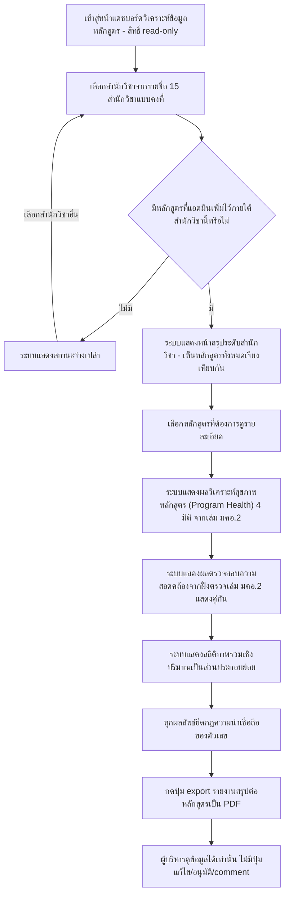
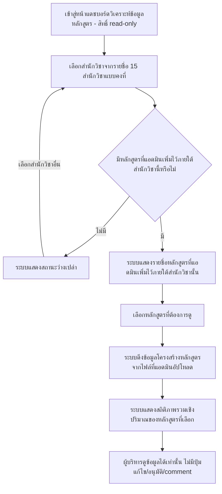

# User Journey: ผู้บริหาร ดูแดชบอร์ดวิเคราะห์ข้อมูลหลักสูตร

## บริบท / Persona

Journey นี้เป็นของ **ผู้บริหาร (executive)** — บทบาทผู้ใช้งานใหม่ที่ไม่เคยมีมาก่อนในระบบ มีสิทธิ์ **read-only เท่านั้น** ไม่มีสิทธิ์แก้ไข อัปโหลด อนุมัติ หรือ comment ใดๆ

Journey นี้เกี่ยวข้องกับฟีเจอร์ลำดับ 11 "ผู้บริหาร ดูแดชบอร์ดวิเคราะห์ข้อมูลหลักสูตรตามสำนักวิชา/หลักสูตร (รวมวิเคราะห์สุขภาพหลักสูตร 4 มิติ — ขยายขอบเขต 2026-09-13)" ใน [[../../01-requirements/02-plan/feature-list|feature-list]]

และอ้างอิง requirement ต้นทางที่ [[../../01-requirements/01-spec/20260904-04-executive-curriculum-dashboard|ระบบแดชบอร์ดวิเคราะห์ข้อมูลหลักสูตรสำหรับผู้บริหาร (Executive Curriculum Analytics Dashboard)]] ~~FR ข้อ 1, 2, 3, 7, 8~~ ~~**(อัปเดต 2026-09-13: FR ข้อ 7 เดิมถูกรื้อทิ้งทั้งหมด และ FR ข้อ 8 เดิมถูกแทนที่ด้วยการวิเคราะห์สุขภาพหลักสูตร — journey นี้จึงอ้างอิง FR ชุดใหม่ด้านล่างแทน)**~~ **(ซ่อมอ้างอิง 2026-09-15: ข้อความอัปเดต 2026-09-13 ข้างต้นคลาดเคลื่อน — FR ข้อ 7 เดิมไม่ได้ถูกรื้อทิ้ง ยังคงเป็นข้อกำหนดที่ใช้งานอยู่ เพียงเปลี่ยนแหล่งที่มาของไฟล์จาก "ไฟล์แยกชุดที่อัปโหลด" เป็น "เล่ม มคอ.2 ที่แอดมินผูกไว้" เท่านั้น ส่วน FR ข้อ 8 เดิมถูกแทนที่ด้วยการวิเคราะห์สุขภาพหลักสูตรจริงตามที่ระบุไว้ — journey นี้จึงอ้างอิง FR ชุดใหม่ด้านล่าง ซึ่งรวม FR ข้อ 7 ไว้ด้วย)** FR ข้อ 1, 2, 3, 5, 7, 8, 9, 10, 11, 12 ใน [[../../01-requirements/01-spec/index|01-spec]]

Journey นี้ต่อเนื่องมาจาก journey ฝั่งแอดมิน ~~[[20260904-04-user-journey-admin-manage-executive-courses|แอดมิน จัดการรายชื่อหลักสูตรและไฟล์ที่จะเสนอเข้าที่ประชุม]] กล่าวคือ ผู้บริหารจะเห็นหลักสูตรได้ก็ต่อเมื่อแอดมินเพิ่มไว้แล้วเท่านั้น (journey ฝั่งแอดมินเป็นเงื่อนไขจำเป็นของ journey นี้)~~ **(อัปเดต 2026-09-13: journey ฝั่งแอดมินเปลี่ยนชื่อและเนื้อหาแล้ว เพราะตอนนี้ครอบคลุมถึงขั้นตอนผูกเล่ม มคอ.2 และสกัดข้อมูล/วิเคราะห์สุขภาพหลักสูตรที่ไหลมาแสดงในหน้านี้ต่อด้วย)** [[20260904-04-user-journey-admin-manage-executive-courses|แอดมิน จัดการรายชื่อหลักสูตรและผูกเล่ม มคอ.2 ต่อสำนักวิชา]] กล่าวคือ ผู้บริหารจะเห็นหลักสูตรและผลวิเคราะห์ได้ก็ต่อเมื่อแอดมินเพิ่มหลักสูตรและผูกเล่ม มคอ.2 ที่ผ่านการตรวจสอบความสอดคล้องแล้วเท่านั้น (journey ฝั่งแอดมินเป็นเงื่อนไขจำเป็นของ journey นี้)

## Diagram

### เวอร์ชันเดิม (เลิกใช้แล้วตั้งแต่ 2026-09-13)

Diagram เดิมด้านล่างนี้อ้างอิง FR ข้อ 7 และ 8 **เดิม** ของ spec ~~ซึ่งถูกรื้อทิ้งทั้งหมดแล้ว~~ **(ซ่อมอ้างอิง 2026-09-15: ข้อความเดิมคลาดเคลื่อน — มีเพียง FR ข้อ 8 เดิมเท่านั้นที่ถูกแทนที่ด้วยการวิเคราะห์สุขภาพหลักสูตร ส่วน FR ข้อ 7 เดิมยังคงมีอยู่จริงในปัจจุบัน เพียงเปลี่ยนแหล่งที่มาของไฟล์จากไฟล์แยกชุดที่อัปโหลดเป็นเล่ม มคอ.2 ที่แอดมินผูกไว้ — diagram เวอร์ชันปัจจุบันด้านบนจึงยังอ้างอิง FR ข้อ 7 อยู่ เพียงแต่ขั้นตอน "ดึงข้อมูลจากไฟล์ที่อัปโหลด" แบบเดิมที่แสดงไว้ด้านล่างนี้ถูกแทนที่ด้วยขั้นตอนที่อ้างอิงเล่ม มคอ.2 แล้วเท่านั้น)** (เดิมระบบดึงข้อมูลจากไฟล์แยกชุดที่แอดมินอัปโหลด แล้วแสดงเพียงสถิติภาพรวมเชิงปริมาณเป็นเนื้อหาหลัก ไม่มีหน้าสรุประดับสำนักวิชา ไม่มีผลวิเคราะห์สุขภาพหลักสูตร ไม่มีผลตรวจสอบความสอดคล้องคู่กัน ไม่มีปุ่ม export PDF และไม่มีกฎความน่าเชื่อถือของตัวเลขกำกับ) เก็บไว้ที่นี่เพื่อรักษาประวัติการตัดสินใจตามธรรมเนียมของ vault ไม่ใช่ flow ที่ใช้งานจริงอีกต่อไป — ดูเหตุผลเต็มใน [[../../01-requirements/01-spec/20260904-04-executive-curriculum-dashboard|ระบบแดชบอร์ดวิเคราะห์ข้อมูลหลักสูตรสำหรับผู้บริหาร (Executive Curriculum Analytics Dashboard)]] FR ข้อ 8 (ปรับปรุง 2026-09-13):

## คำอธิบายขั้นตอน

เรียงลำดับตาม diagram เวอร์ชันปัจจุบันด้านบน:

1. **เข้าสู่หน้าแดชบอร์ดวิเคราะห์ข้อมูลหลักสูตร - สิทธิ์ read-only** — ผู้บริหารเข้าสู่หน้าจอแดชบอร์ดวิเคราะห์ข้อมูลหลักสูตร ซึ่งเป็นหน้าจอเฉพาะของบทบาท "ผู้บริหาร" ที่มีสิทธิ์ read-only เท่านั้น ตั้งแต่จุดเริ่มต้นไม่มีปุ่มแก้ไข/อัปโหลด/อนุมัติ/comment ปรากฏบนหน้าจอนี้เลย (อ้างอิง: [[../../01-requirements/01-spec/20260904-04-executive-curriculum-dashboard|ระบบแดชบอร์ดวิเคราะห์ข้อมูลหลักสูตรสำหรับผู้บริหาร (Executive Curriculum Analytics Dashboard)]] FR ข้อ 1)
2. **เลือกสำนักวิชาจากรายชื่อ 15 สำนักวิชาแบบคงที่** — ผู้บริหารเลือก "สำนักวิชา" จากรายชื่อสำนักวิชาแบบคงที่ (master data) จำนวน 15 สำนักวิชาที่กำหนดไว้ล่วงหน้าในระบบ (อ้างอิง: [[../../01-requirements/01-spec/20260904-04-executive-curriculum-dashboard|ระบบแดชบอร์ดวิเคราะห์ข้อมูลหลักสูตรสำหรับผู้บริหาร (Executive Curriculum Analytics Dashboard)]] FR ข้อ 3)
3. **มีหลักสูตรที่แอดมินเพิ่มไว้ภายใต้สำนักวิชานี้หรือไม่ (เงื่อนไขแตกแขนง)** — ระบบตรวจสอบว่าสำนักวิชาที่เลือกมีรายชื่อหลักสูตรที่แอดมินเพิ่มไว้แล้วหรือยัง (ตาม journey [[20260904-04-user-journey-admin-manage-executive-courses|แอดมิน จัดการรายชื่อหลักสูตรและผูกเล่ม มคอ.2 ต่อสำนักวิชา]]) (อ้างอิง: [[../../01-requirements/01-spec/20260904-04-executive-curriculum-dashboard|ระบบแดชบอร์ดวิเคราะห์ข้อมูลหลักสูตรสำหรับผู้บริหาร (Executive Curriculum Analytics Dashboard)]] FR ข้อ 2)
   - **ไม่มี** → ไปขั้นตอน "ระบบแสดงสถานะว่างเปล่า"
   - **มี** → ~~ไปขั้นตอน "ระบบแสดงรายชื่อหลักสูตรที่แอดมินเพิ่มไว้ภายใต้สำนักวิชานั้น"~~ **(อัปเดต 2026-09-13: เปลี่ยนเป็นไปขั้นตอน "ระบบแสดงหน้าสรุประดับสำนักวิชา" ก่อน ตาม FR ข้อ 10 ใหม่ ที่เติมชั้นกลางระหว่างเลือกสำนักวิชากับเลือกหลักสูตร)** ไปขั้นตอน "ระบบแสดงหน้าสรุประดับสำนักวิชา - เห็นหลักสูตรทั้งหมดเรียงเทียบกัน"
4. **ระบบแสดงสถานะว่างเปล่า** — กรณีสำนักวิชาที่เลือกยังไม่มีหลักสูตรใดถูกแอดมินเพิ่มไว้เลย ระบบแสดงสถานะว่างเปล่าแทนการแสดงหน้าสรุประดับสำนักวิชา แล้วผู้บริหารสามารถกลับไปเลือกสำนักวิชาอื่นได้ที่ขั้นตอน "เลือกสำนักวิชาจากรายชื่อ 15 สำนักวิชาแบบคงที่" (เป็น alternative flow ที่เพิ่มขึ้นตามดุลยพินิจ เนื่องจาก spec ต้นทางไม่ได้ลงรายละเอียดพฤติกรรมของสถานะว่างเปล่าไว้โดยตรง — ดูหัวข้อสมมติฐาน) (อ้างอิง: [[../../01-requirements/01-spec/20260904-04-executive-curriculum-dashboard|ระบบแดชบอร์ดวิเคราะห์ข้อมูลหลักสูตรสำหรับผู้บริหาร (Executive Curriculum Analytics Dashboard)]] FR ข้อ 2)
5. **ระบบแสดงหน้าสรุประดับสำนักวิชา - เห็นหลักสูตรทั้งหมดเรียงเทียบกัน** — ~~เดิมคือขั้นตอน "ระบบแสดงรายชื่อหลักสูตรที่แอดมินเพิ่มไว้ภายใต้สำนักวิชานั้น" ซึ่งเป็นเพียงรายการชื่อหลักสูตรธรรมดาให้เลือก~~ **(อัปเดต 2026-09-13: FR ข้อ 10 ใหม่กำหนดให้เติมชั้นกลางนี้แทนรายชื่อธรรมดา)** เมื่อสำนักวิชาที่เลือกมีหลักสูตรอยู่แล้ว ระบบแสดง**หน้าสรุประดับสำนักวิชา** ที่เห็นหลักสูตรทั้งหมดภายใต้สำนักวิชานั้นเรียงเทียบกันได้ในหน้าเดียว ก่อนที่ผู้บริหารจะเจาะเข้าไปดูรายหลักสูตร — เวอร์ชันนี้**ไม่ทำ**ภาพรวมข้ามทั้ง 15 สำนักวิชา (ยกเว้นตัวเลขจำนวนหลักสูตรรวมที่มีอยู่แล้วในสถิติเชิงปริมาณ) (อ้างอิง: [[../../01-requirements/01-spec/20260904-04-executive-curriculum-dashboard|ระบบแดชบอร์ดวิเคราะห์ข้อมูลหลักสูตรสำหรับผู้บริหาร (Executive Curriculum Analytics Dashboard)]] FR ข้อ 10)
6. **เลือกหลักสูตรที่ต้องการดูรายละเอียด** — ผู้บริหารเลือกหลักสูตรหนึ่งรายการจากหน้าสรุประดับสำนักวิชาเพื่อเจาะเข้าไปดูผลวิเคราะห์ของหลักสูตรนั้นโดยละเอียด (อ้างอิง: [[../../01-requirements/01-spec/20260904-04-executive-curriculum-dashboard|ระบบแดชบอร์ดวิเคราะห์ข้อมูลหลักสูตรสำหรับผู้บริหาร (Executive Curriculum Analytics Dashboard)]] FR ข้อ 2)
7. **ระบบแสดงผลวิเคราะห์สุขภาพหลักสูตร (Program Health) 4 มิติ จากเล่ม มคอ.2** — ~~เดิมคือ 2 ขั้นตอนแยกกัน: "ระบบดึงข้อมูลโครงสร้างหลักสูตรจากไฟล์ที่แอดมินอัปโหลด" และ "ระบบแสดงสถิติภาพรวมเชิงปริมาณของหลักสูตรที่เลือก ... เวอร์ชันแรกเน้นสถิติเชิงปริมาณ ไม่ต้องพึ่ง AI ตีความเชิงลึก" ซึ่งอ้างอิง FR ข้อ 7 และ 8 เดิมที่ถูกรื้อทิ้งทั้งหมดแล้วเมื่อ 2026-09-13~~ **(ซ่อมอ้างอิง 2026-09-15: ข้อความอัปเดต 2026-09-13 ข้างต้นคลาดเคลื่อน — มีเพียง FR ข้อ 8 เดิมเท่านั้นที่ถูกรื้อทิ้ง/แทนที่ ส่วน FR ข้อ 7 เดิมยังคงมีอยู่และยังใช้งานอยู่ เพียงเปลี่ยนแหล่งที่มาของไฟล์จากไฟล์ที่แอดมินอัปโหลดแยกชุดเป็นเล่ม มคอ.2 ที่ผูกไว้ ขั้นตอนนี้จึงยังคงอ้างอิง FR ข้อ 7 อยู่ ไม่ใช่ถูกตัดทิ้ง)** **(อัปเดต 2026-09-13: แทนที่ทั้งหมดด้วยขั้นตอนนี้ — ระบบไม่ได้ "ดึงข้อมูลจากไฟล์ที่อัปโหลด" อีกต่อไปเพราะเปลี่ยนมาใช้เล่ม มคอ.2 ที่ผูกไว้แล้วตาม FR ข้อ 5 ที่ปรับปรุง และเนื้อหาหลักไม่ใช่สถิติเชิงปริมาณอีกต่อไป)** ระบบแสดงผลวิเคราะห์สุขภาพหลักสูตร (Program Health) 4 มิติที่สกัด/วิเคราะห์ได้จากตัวเล่ม มคอ.2 เท่านั้น (ไม่พึ่งข้อมูลภายนอก) ได้แก่ (ก) คุณภาพหลักสูตร (ข) ศักยภาพการจัดการเรียนการสอน — จากตารางอาจารย์ในเล่ม (ค) ความเป็นนานาชาติ (ง) ความสอดคล้องกับทักษะที่ตลาดต้องการ — มิติ (ง) แสดงเป็น **"ครอบคลุม X จาก Y ทักษะ"** เทียบกับชุดกรอบทักษะอ้างอิงที่แอดมินอนุมัติไว้ พร้อมระดับความครอบคลุมต่อทักษะ (ครอบคลุมชัดเจน/ครอบคลุมบางส่วน/ไม่พบ) และหลักฐานอ้างอิงกลับไปยังรายวิชาและ CLO ที่เป็นที่มาเสมอ ไม่ใช่คะแนน 0-100 (อ้างอิง: [[../../01-requirements/01-spec/20260904-04-executive-curriculum-dashboard|ระบบแดชบอร์ดวิเคราะห์ข้อมูลหลักสูตรสำหรับผู้บริหาร (Executive Curriculum Analytics Dashboard)]] FR ข้อ 7 (การดึงข้อมูลโครงสร้างหลักสูตรจากเล่ม มคอ.2 ที่ผูกไว้), FR ข้อ 8 ปรับปรุง 2026-09-13, FR ข้อ 9)
8. **ระบบแสดงผลตรวจสอบความสอดคล้องจากฝั่งตรวจเล่ม มคอ.2 แสดงคู่กัน** — (ใหม่ 2026-09-13) ผลตรวจสอบความสอดคล้องของเล่ม มคอ.2 ที่ผูกไว้กับหลักสูตรนี้ (จากฟีเจอร์ [[../../01-requirements/01-spec/20260812-01-tqf2-consistency-check|20260812-01-tqf2-consistency-check]]) แสดงคู่กันกับผลวิเคราะห์สุขภาพหลักสูตรในหน้าเดียวกัน เพื่อให้ผู้บริหารเห็นทั้งคะแนนสุขภาพและสถานะความสอดคล้องในหน้าเดียวก่อนเข้าที่ประชุม (อ้างอิง: [[../../01-requirements/01-spec/20260904-04-executive-curriculum-dashboard|ระบบแดชบอร์ดวิเคราะห์ข้อมูลหลักสูตรสำหรับผู้บริหาร (Executive Curriculum Analytics Dashboard)]] FR ข้อ 5 ปรับปรุง 2026-09-13)
9. **ระบบแสดงสถิติภาพรวมเชิงปริมาณเป็นส่วนประกอบย่อย** — ~~เดิมเป็นเนื้อหาหลักของแดชบอร์ด ("เวอร์ชันแรกเน้นสถิติเชิงปริมาณ ไม่ต้องพึ่ง AI ตีความเชิงลึก")~~ **(อัปเดต 2026-09-13: ลดบทบาทลงเป็นส่วนประกอบย่อยเท่านั้น ไม่ใช่เนื้อหาหลักอีกต่อไป แต่ยังคงแสดงอยู่ ไม่ได้ถูกตัดทิ้ง)** ระบบยังคงแสดงจำนวนหลักสูตรทั้งหมดต่อสำนักวิชา (และภาพรวมทุกสำนักวิชารวมกัน), หน่วยกิตรวมของหลักสูตรที่เลือกดู, และสัดส่วน/จำนวนหน่วยกิตแยกตามหมวดวิชา (เช่น หมวดวิชาศึกษาทั่วไป/หมวดวิชาเฉพาะ/หมวดวิชาเลือกเสรี) ตามโครงสร้างที่พบจริงในเล่ม (อ้างอิง: [[../../01-requirements/01-spec/20260904-04-executive-curriculum-dashboard|ระบบแดชบอร์ดวิเคราะห์ข้อมูลหลักสูตรสำหรับผู้บริหาร (Executive Curriculum Analytics Dashboard)]] FR ข้อ 8 — ส่วนสถิติเชิงปริมาณเดิมที่ยังคงอยู่)
10. **ทุกผลลัพธ์ยึดกฎความน่าเชื่อถือของตัวเลข** — (ใหม่ 2026-09-13) ทุกผลลัพธ์ที่แสดงในขั้นตอนก่อนหน้า (ผลวิเคราะห์สุขภาพหลักสูตร ผลตรวจสอบความสอดคล้อง และสถิติเชิงปริมาณ) ต้องยึดกฎ: จุดที่สกัดข้อมูลจากเล่มไม่ได้แสดงเป็น "—" พร้อมร้อยละความครบถ้วน (ไม่นับเป็นศูนย์), ทุกผลลัพธ์แสดง provenance กลับไปยังจุดในเล่มและระบุเวอร์ชันของชุดกรอบทักษะ/ชุดเกณฑ์ที่ใช้, ผลลัพธ์ที่ AI ตีความมีตัวบ่งชี้ความมั่นใจและแหล่งอ้างอิงเสมอ, น้ำเสียงเป็น "ข้อสังเกตประกอบการพิจารณา" ไม่ใช่การฟันธงหรืออนุมัติ/ไม่อนุมัติหลักสูตร (อ้างอิง: [[../../01-requirements/01-spec/20260904-04-executive-curriculum-dashboard|ระบบแดชบอร์ดวิเคราะห์ข้อมูลหลักสูตรสำหรับผู้บริหาร (Executive Curriculum Analytics Dashboard)]] FR ข้อ 12)
11. **กดปุ่ม export รายงานสรุปต่อหลักสูตรเป็น PDF** — (ใหม่ 2026-09-13) ผู้บริหารกดปุ่ม export รายงานสรุปต่อหลักสูตรที่กำลังดูอยู่เป็นไฟล์ PDF เพื่อพิมพ์/แนบเข้าวาระการประชุม เป็นรายงานสรุปเรียบง่ายต่อหลักสูตร ไม่ใช่ชุดเอกสารเสนอสภาแบบเต็มรูปแบบหลายสิบหน้า เนื้อหาใน PDF มีข้อมูลกำกับความน่าเชื่อถือเช่นเดียวกับที่แสดงบนหน้าจอ (อ้างอิง: [[../../01-requirements/01-spec/20260904-04-executive-curriculum-dashboard|ระบบแดชบอร์ดวิเคราะห์ข้อมูลหลักสูตรสำหรับผู้บริหาร (Executive Curriculum Analytics Dashboard)]] FR ข้อ 11)
12. **ผู้บริหารดูข้อมูลได้เท่านั้น ไม่มีปุ่มแก้ไข/อนุมัติ/comment** — ตลอดหน้าจอแดชบอร์ดนี้ ผู้บริหารทำได้เพียงดูข้อมูลเท่านั้น ไม่มีปุ่มแก้ไข อัปโหลด อนุมัติ หรือ comment ใดๆ ปรากฏให้ใช้งาน ยืนยันความเป็น read-only ตลอด flow (อ้างอิง: [[../../01-requirements/01-spec/20260904-04-executive-curriculum-dashboard|ระบบแดชบอร์ดวิเคราะห์ข้อมูลหลักสูตรสำหรับผู้บริหาร (Executive Curriculum Analytics Dashboard)]] FR ข้อ 1)

## Mapping กลับไปยัง Requirement

| ขั้นตอนใน Diagram | Requirement อ้างอิง |
| --- | --- |
| เข้าสู่หน้าแดชบอร์ดวิเคราะห์ข้อมูลหลักสูตร - สิทธิ์ read-only | [[../../01-requirements/01-spec/20260904-04-executive-curriculum-dashboard\|ระบบแดชบอร์ดวิเคราะห์ข้อมูลหลักสูตรสำหรับผู้บริหาร (Executive Curriculum Analytics Dashboard)]] (FR ข้อ 1) |
| เลือกสำนักวิชาจากรายชื่อ 15 สำนักวิชาแบบคงที่ | [[../../01-requirements/01-spec/20260904-04-executive-curriculum-dashboard\|ระบบแดชบอร์ดวิเคราะห์ข้อมูลหลักสูตรสำหรับผู้บริหาร (Executive Curriculum Analytics Dashboard)]] (FR ข้อ 3) |
| มีหลักสูตรที่แอดมินเพิ่มไว้ภายใต้สำนักวิชานี้หรือไม่ | [[../../01-requirements/01-spec/20260904-04-executive-curriculum-dashboard\|ระบบแดชบอร์ดวิเคราะห์ข้อมูลหลักสูตรสำหรับผู้บริหาร (Executive Curriculum Analytics Dashboard)]] (FR ข้อ 2) |
| ระบบแสดงสถานะว่างเปล่า | [[../../01-requirements/01-spec/20260904-04-executive-curriculum-dashboard\|ระบบแดชบอร์ดวิเคราะห์ข้อมูลหลักสูตรสำหรับผู้บริหาร (Executive Curriculum Analytics Dashboard)]] (FR ข้อ 2) |
| ระบบแสดงหน้าสรุประดับสำนักวิชา - เห็นหลักสูตรทั้งหมดเรียงเทียบกัน | ~~[[../../01-requirements/01-spec/20260904-04-executive-curriculum-dashboard\|ระบบแดชบอร์ดวิเคราะห์ข้อมูลหลักสูตรสำหรับผู้บริหาร (Executive Curriculum Analytics Dashboard)]] (FR ข้อ 2)~~ **(อัปเดต 2026-09-13)** [[../../01-requirements/01-spec/20260904-04-executive-curriculum-dashboard\|ระบบแดชบอร์ดวิเคราะห์ข้อมูลหลักสูตรสำหรับผู้บริหาร (Executive Curriculum Analytics Dashboard)]] (FR ข้อ 10) |
| เลือกหลักสูตรที่ต้องการดูรายละเอียด | [[../../01-requirements/01-spec/20260904-04-executive-curriculum-dashboard\|ระบบแดชบอร์ดวิเคราะห์ข้อมูลหลักสูตรสำหรับผู้บริหาร (Executive Curriculum Analytics Dashboard)]] (FR ข้อ 2) |
| ระบบแสดงผลวิเคราะห์สุขภาพหลักสูตร (Program Health) 4 มิติ จากเล่ม มคอ.2 | ~~[[../../01-requirements/01-spec/20260904-04-executive-curriculum-dashboard\|ระบบแดชบอร์ดวิเคราะห์ข้อมูลหลักสูตรสำหรับผู้บริหาร (Executive Curriculum Analytics Dashboard)]] (FR ข้อ 7, FR ข้อ 8 — รื้อทิ้งแล้ว 2026-09-13)~~ **(ซ่อมอ้างอิง 2026-09-15: ข้อความอัปเดต 2026-09-13 ข้างต้นคลาดเคลื่อน — FR ข้อ 7 ไม่ได้ถูกรื้อทิ้ง ยังคงเป็นข้อกำหนดที่ใช้งานอยู่ เพียงเปลี่ยนแหล่งไฟล์เป็นเล่ม มคอ.2 ที่แอดมินผูกไว้ มีเพียง FR ข้อ 8 เดิมเท่านั้นที่ถูกแทนที่ด้วยการวิเคราะห์สุขภาพหลักสูตร)** [[../../01-requirements/01-spec/20260904-04-executive-curriculum-dashboard\|ระบบแดชบอร์ดวิเคราะห์ข้อมูลหลักสูตรสำหรับผู้บริหาร (Executive Curriculum Analytics Dashboard)]] (FR ข้อ 7, FR ข้อ 8 ปรับปรุง 2026-09-13, FR ข้อ 9) |
| ระบบแสดงผลตรวจสอบความสอดคล้องจากฝั่งตรวจเล่ม มคอ.2 แสดงคู่กัน | [[../../01-requirements/01-spec/20260904-04-executive-curriculum-dashboard\|ระบบแดชบอร์ดวิเคราะห์ข้อมูลหลักสูตรสำหรับผู้บริหาร (Executive Curriculum Analytics Dashboard)]] (FR ข้อ 5 ปรับปรุง 2026-09-13) — **(เพิ่ม 2026-09-13)** |
| ระบบแสดงสถิติภาพรวมเชิงปริมาณเป็นส่วนประกอบย่อย | [[../../01-requirements/01-spec/20260904-04-executive-curriculum-dashboard\|ระบบแดชบอร์ดวิเคราะห์ข้อมูลหลักสูตรสำหรับผู้บริหาร (Executive Curriculum Analytics Dashboard)]] (FR ข้อ 8 — ส่วนสถิติเชิงปริมาณเดิม) |
| ทุกผลลัพธ์ยึดกฎความน่าเชื่อถือของตัวเลข | [[../../01-requirements/01-spec/20260904-04-executive-curriculum-dashboard\|ระบบแดชบอร์ดวิเคราะห์ข้อมูลหลักสูตรสำหรับผู้บริหาร (Executive Curriculum Analytics Dashboard)]] (FR ข้อ 12) — **(เพิ่ม 2026-09-13)** |
| กดปุ่ม export รายงานสรุปต่อหลักสูตรเป็น PDF | [[../../01-requirements/01-spec/20260904-04-executive-curriculum-dashboard\|ระบบแดชบอร์ดวิเคราะห์ข้อมูลหลักสูตรสำหรับผู้บริหาร (Executive Curriculum Analytics Dashboard)]] (FR ข้อ 11) — **(เพิ่ม 2026-09-13)** |
| ผู้บริหารดูข้อมูลได้เท่านั้น ไม่มีปุ่มแก้ไข/อนุมัติ/comment | [[../../01-requirements/01-spec/20260904-04-executive-curriculum-dashboard\|ระบบแดชบอร์ดวิเคราะห์ข้อมูลหลักสูตรสำหรับผู้บริหาร (Executive Curriculum Analytics Dashboard)]] (FR ข้อ 1) |

## สมมติฐาน / คำถามที่เปิดไว้

- ขั้นตอน "ระบบแสดงสถานะว่างเปล่า" (กรณีสำนักวิชายังไม่มีหลักสูตรถูกเพิ่ม) เป็น alternative flow ที่เพิ่มขึ้นเองตามดุลยพินิจในสไตล์เดียวกับ journey ฝั่งแอดมิน เนื่องจาก spec ต้นทางยังไม่ได้ลงรายละเอียดพฤติกรรมของสถานะว่างเปล่าไว้โดยตรง หากมีการตัดสินใจในอนาคตควรกลับมาปรับปรุง diagram นี้
- ~~กลไกการดึงข้อมูล/คำนวณสถิติจากไฟล์ที่อัปโหลด (ขั้นตอนที่ 7 เดิม) เป็นแบบอัตโนมัติเต็มรูปแบบหรือกึ่งอัตโนมัติที่ต้องแอดมินยืนยันก่อนแสดงผล ยังไม่ยืนยันจากผู้ใช้~~ **(อัปเดต 2026-09-13: ขั้นตอนดึงข้อมูลจากไฟล์อัปโหลดถูกรื้อทิ้งจาก diagram นี้แล้ว เพราะเปลี่ยนมาใช้เล่ม มคอ.2 ที่ผูกไว้แล้วแทน คำถามเปิดนี้ถูกย้ายไปอยู่ในขอบเขตของ journey ฝั่งแอดมิน [[20260904-04-user-journey-admin-manage-executive-courses|แอดมิน จัดการรายชื่อหลักสูตรและผูกเล่ม มคอ.2 ต่อสำนักวิชา]] แทน เนื่องจากขั้นตอนสกัดข้อมูล/วิเคราะห์เกิดขึ้นฝั่งแอดมินก่อนไหลมาแสดงที่นี่)**
- รูปแบบ/สไตล์การนำเสนอข้อมูลบนแดชบอร์ดเชิงกราฟิก (เช่น กราฟ/ตาราง/การ์ดสรุป) ยังไม่เจาะจง เป็นคำถามเปิดที่ส่งต่อให้การออกแบบ mockup โดยละเอียดใน [[index|01-prototypes]] ตัดสินใจต่อ — Curmate ยืมเฉพาะแนวคิดการนำเสนอจากระบบภูมิทัศน์หลักสูตร มฟล. ที่อ้างถึงใน spec ไม่ใช่หน้าตา UI โดยตรง
- ~~Authentication/บัญชีผู้ใช้ของ "ผู้บริหาร" (บัญชีแยกต่างหาก หรือ SSO/ระบบเดียวกับผู้ใช้กลุ่มอื่น) ยังไม่ยืนยัน ส่งต่อขั้นออกแบบเชิงเทคนิคที่ [[../../02-design/02-technical/index|02-technical]]~~ **(อัปเดต 2026-09-13: ได้รับคำตอบแล้วตั้งแต่ 2026-09-12 — ใช้ระบบบัญชี/login เดียวกันครอบคลุมทั้ง 3 กลุ่มผู้ใช้ ไม่แยก SSO ต่างหากสำหรับผู้บริหาร ดู [[../../01-requirements/01-spec/20260912-05-authentication-user-roles|20260912-05-authentication-user-roles]])**
- **(เพิ่ม 2026-09-13)** มิติ (ก) คุณภาพหลักสูตร, (ข) ศักยภาพการจัดการเรียนการสอน, (ค) ความเป็นนานาชาติ ควรแสดงผลลัพธ์เป็นระดับ+หลักฐานรูปแบบเดียวกับมิติ (ง) หรือใช้รูปแบบอื่น — journey นี้ยังไม่ตัดสินใจแทนผู้ใช้ ส่งต่อให้ตัดสินใจตอนออกแบบ [[index|01-prototypes]]/[[../../02-design/02-technical/index|02-technical]] (สืบทอดคำถามเปิดจาก [[../../01-requirements/01-spec/20260904-04-executive-curriculum-dashboard|ระบบแดชบอร์ดวิเคราะห์ข้อมูลหลักสูตรสำหรับผู้บริหาร (Executive Curriculum Analytics Dashboard)]] FR ข้อ 9)
- **(เพิ่ม 2026-09-13)** ตัวชี้วัด (driver) รายมิติและเกณฑ์ตัดช่วงที่ Curmate จะใช้จริง ต้องได้รับการรับรองจากคณะกรรมการวิชาการหรือหน่วยงานใดก่อนนำไปใช้อ้างอิงในที่ประชุมหรือไม่ — journey นี้ยังไม่ตัดสินใจแทนผู้ใช้ (สืบทอดคำถามเปิดจาก [[../../01-requirements/01-spec/20260904-04-executive-curriculum-dashboard|ระบบแดชบอร์ดวิเคราะห์ข้อมูลหลักสูตรสำหรับผู้บริหาร (Executive Curriculum Analytics Dashboard)]] FR ข้อ 13)
- **(เพิ่ม 2026-09-13)** กรณีหลักสูตรที่ยังไม่เคยผ่านฝั่งตรวจสอบความสอดคล้องเลย ช่องสถานะความสอดคล้องที่โหนด "ระบบแสดงผลตรวจสอบความสอดคล้องจากฝั่งตรวจเล่ม มคอ.2 แสดงคู่กัน" ควรแสดงอย่างไร ยังไม่ยืนยัน — เป็นคำถามเปิดที่ต่อเนื่องมาจาก journey ฝั่งแอดมิน (ดู [[20260904-04-user-journey-admin-manage-executive-courses|แอดมิน จัดการรายชื่อหลักสูตรและผูกเล่ม มคอ.2 ต่อสำนักวิชา]])

---
[[index|01-prototypes]] · [[../../01-requirements/02-plan/feature-list|feature-list]] · [[../../01-requirements/01-spec/index|01-spec]]
