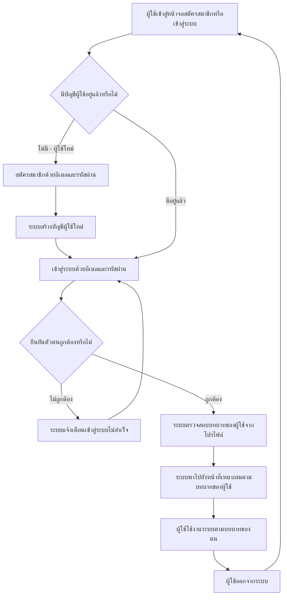

# User Journey: ผู้ใช้สมัครสมาชิกและเข้าสู่ระบบ

## บริบท / Persona

Journey นี้เป็น flow ทั่วไปที่ผู้ใช้**ทุกบทบาท**ในระบบใช้ร่วมกัน ไม่ใช่ journey เฉพาะบทบาทใดบทบาทหนึ่ง ครอบคลุมทั้งแอดมิน, ผู้ใช้งานทั่วไป (เจ้าหน้าที่/อาจารย์ผู้จัดทำหลักสูตร) และผู้บริหาร เนื่องจากระบบใช้บัญชี/การเข้าสู่ระบบชุดเดียวกันครอบคลุมผู้ใช้งานทั้ง 3 กลุ่ม โดยบทบาทเป็นเพียงคุณสมบัติของโปรไฟล์ผู้ใช้ที่ผูกกับบัญชีเดียวกัน ไม่มีระบบ SSO แยกต่างหากสำหรับผู้บริหาร

Journey นี้เกี่ยวข้องกับฟีเจอร์ลำดับ 12 "สมัครสมาชิกและเข้าสู่ระบบ" ใน [[../../01-requirements/02-plan/feature-list|feature-list]]

และอ้างอิง requirement ต้นทางที่ [[../../01-requirements/01-spec/20260912-05-authentication-user-roles|ระบบยืนยันตัวตนและจัดการบทบาทผู้ใช้ (Authentication & User Role Management)]] FR ข้อ 1-2 ใน [[../../01-requirements/01-spec/index|01-spec]]

**ข้อควรระวัง**: journey นี้เป็นเชิงแนวคิด/พฤติกรรมผู้ใช้เท่านั้น ไม่ลงรายละเอียดทางเทคนิคของกลไกยืนยันตัวตน (เช่น จะใช้ผู้ให้บริการ/ไลบรารีใด) เนื่องจาก spec ต้นทางเองยังไม่ตัดสินใจเรื่องนี้ (ส่งต่อขั้นออกแบบเชิงเทคนิคใน [[../../02-design/02-technical/index|02-technical]])

## Diagram

## คำอธิบายขั้นตอน

1. **ผู้ใช้เข้าสู่หน้าจอสมัครสมาชิกหรือเข้าสู่ระบบ** — จุดเริ่มต้นของ journey ผู้ใช้ (ไม่ว่าจะเป็นแอดมิน ผู้ใช้งานทั่วไป หรือผู้บริหาร) เข้าสู่หน้าจอเดียวกันที่ให้เลือกสมัครสมาชิกหรือเข้าสู่ระบบ ไม่มีหน้าจอแยกตามบทบาท (ไม่มี requirement เฉพาะ — เป็นจุดเริ่มของ flow)
2. **มีบัญชีผู้ใช้อยู่แล้วหรือไม่** — จุดแยกเส้นทางระหว่างผู้ใช้ใหม่ที่ยังไม่มีบัญชีกับผู้ใช้เดิมที่มีบัญชีอยู่แล้ว ทั้งสองเส้นทางใช้ระบบบัญชีเดียวกัน (อ้างอิง: [[../../01-requirements/01-spec/20260912-05-authentication-user-roles|ระบบยืนยันตัวตนและจัดการบทบาทผู้ใช้ (Authentication & User Role Management)]] FR ข้อ 1)
3. **สมัครสมาชิกด้วยอีเมลและรหัสผ่าน** — ผู้ใช้ใหม่กรอกอีเมลและรหัสผ่านเพื่อสมัครสมาชิก (อ้างอิง: [[../../01-requirements/01-spec/20260912-05-authentication-user-roles|ระบบยืนยันตัวตนและจัดการบทบาทผู้ใช้ (Authentication & User Role Management)]] FR ข้อ 1)
4. **ระบบสร้างบัญชีผู้ใช้ใหม่** — ระบบสร้างบัญชีผู้ใช้ใหม่จากข้อมูลที่กรอก บัญชีนี้เป็นบัญชีเดียวที่จะใช้ครอบคลุมทั้ง 3 บทบาทในระบบ (แอดมิน/ผู้ใช้งานทั่วไป/ผู้บริหาร) โดยบทบาทเป็นคุณสมบัติของโปรไฟล์ที่ผูกกับบัญชีนี้ (ยังไม่ยืนยันว่าบทบาทเริ่มต้นของบัญชีใหม่คืออะไร — ดูหัวข้อสมมติฐาน) (อ้างอิง: [[../../01-requirements/01-spec/20260912-05-authentication-user-roles|ระบบยืนยันตัวตนและจัดการบทบาทผู้ใช้ (Authentication & User Role Management)]] FR ข้อ 1, 2)
5. **เข้าสู่ระบบด้วยอีเมลและรหัสผ่าน** — ผู้ใช้ (ทั้งที่เพิ่งสมัครสมาชิกเสร็จและผู้ใช้เดิมที่มีบัญชีอยู่แล้ว) เข้าสู่ระบบด้วยอีเมลและรหัสผ่านของบัญชีเดียวกัน ไม่ว่าจะเป็นบทบาทใด (อ้างอิง: [[../../01-requirements/01-spec/20260912-05-authentication-user-roles|ระบบยืนยันตัวตนและจัดการบทบาทผู้ใช้ (Authentication & User Role Management)]] FR ข้อ 1)
6. **ยืนยันตัวตนถูกต้องหรือไม่** — ระบบตรวจสอบว่าอีเมล/รหัสผ่านที่กรอกถูกต้องหรือไม่ (เป็นแขนงที่เพิ่มขึ้นตามดุลยพินิจของผู้เขียน journey เนื่องจาก spec ต้นทางยังไม่ได้ลงรายละเอียดพฤติกรรมกรณีเข้าสู่ระบบไม่สำเร็จไว้โดยตรง — ดูหัวข้อสมมติฐาน) (อ้างอิง: [[../../01-requirements/01-spec/20260912-05-authentication-user-roles|ระบบยืนยันตัวตนและจัดการบทบาทผู้ใช้ (Authentication & User Role Management)]] FR ข้อ 1)
   - **ไม่ถูกต้อง** → ไปขั้นตอน "ระบบแจ้งเตือนเข้าสู่ระบบไม่สำเร็จ"
   - **ถูกต้อง** → ไปขั้นตอน "ระบบตรวจสอบบทบาทของผู้ใช้จากโปรไฟล์"
7. **ระบบแจ้งเตือนเข้าสู่ระบบไม่สำเร็จ** — กรณีอีเมล/รหัสผ่านไม่ถูกต้อง ระบบแจ้งเตือนผู้ใช้แล้วให้กลับไปกรอกใหม่ที่ขั้นตอน "เข้าสู่ระบบด้วยอีเมลและรหัสผ่าน" (ไม่มี requirement เฉพาะ — เป็น alternative flow ที่เพิ่มตามดุลยพินิจ เนื่องจาก spec ต้นทางไม่ได้ระบุพฤติกรรมนี้ไว้โดยตรง — ดูหัวข้อสมมติฐาน)
8. **ระบบตรวจสอบบทบาทของผู้ใช้จากโปรไฟล์** — เมื่อยืนยันตัวตนสำเร็จ ระบบตรวจสอบบทบาท (role) ของผู้ใช้จากโปรไฟล์ที่ผูกกับบัญชี ซึ่งอาจเป็นแอดมิน ผู้ใช้งานทั่วไป หรือผู้บริหาร (อ้างอิง: [[../../01-requirements/01-spec/20260912-05-authentication-user-roles|ระบบยืนยันตัวตนและจัดการบทบาทผู้ใช้ (Authentication & User Role Management)]] FR ข้อ 2)
9. **ระบบพาไปยังหน้าที่เหมาะสมตามบทบาทของผู้ใช้** — ระบบพาผู้ใช้ไปยังหน้าจอที่เหมาะสมกับบทบาทของตนโดยอัตโนมัติ (เช่น แอดมินไปหน้าจัดการฐานความรู้เกณฑ์มาตรฐาน, ผู้ใช้งานทั่วไปไปหน้าอัปโหลด มคอ.2, ผู้บริหารไปหน้าแดชบอร์ด) โดยไม่มีระบบ SSO แยกต่างหากสำหรับบทบาทใดบทบาทหนึ่ง (อ้างอิง: [[../../01-requirements/01-spec/20260912-05-authentication-user-roles|ระบบยืนยันตัวตนและจัดการบทบาทผู้ใช้ (Authentication & User Role Management)]] FR ข้อ 2)
10. **ผู้ใช้ใช้งานระบบตามบทบาทของตน** — ผู้ใช้ใช้งานฟีเจอร์ต่างๆ ตามสิทธิ์ของบทบาทของตน รายละเอียดของแต่ละ flow อยู่ใน journey เฉพาะบทบาทอื่นๆ เช่น [[20260823-01-user-journey-course-coordinator-upload|ผู้จัดทำหลักสูตร อัปโหลดและตรวจสอบเอกสาร มคอ.2]], [[20260823-03-user-journey-admin-manage-criteria-knowledge-base|แอดมิน จัดการฐานความรู้เกณฑ์มาตรฐานหลักสูตร]], [[20260904-05-user-journey-executive-view-dashboard|ผู้บริหาร ดูแดชบอร์ดวิเคราะห์ข้อมูลหลักสูตร]] (ไม่มี requirement เฉพาะในเอกสารนี้ — เป็นจุดเชื่อมต่อไปยัง journey อื่น อยู่นอกขอบเขตของ journey นี้)
11. **ผู้ใช้ออกจากระบบ** — ผู้ใช้ออกจากระบบ (logout) แล้ววนกลับไปยังหน้าจอสมัครสมาชิก/เข้าสู่ระบบเริ่มต้น (อ้างอิง: [[../../01-requirements/01-spec/20260912-05-authentication-user-roles|ระบบยืนยันตัวตนและจัดการบทบาทผู้ใช้ (Authentication & User Role Management)]] FR ข้อ 1)

## Mapping กลับไปยัง Requirement

| ขั้นตอนใน Diagram | Requirement อ้างอิง |
| --- | --- |
| ผู้ใช้เข้าสู่หน้าจอสมัครสมาชิกหรือเข้าสู่ระบบ | ไม่มี requirement เฉพาะ — เป็นจุดเริ่มของ flow |
| มีบัญชีผู้ใช้อยู่แล้วหรือไม่ | [[../../01-requirements/01-spec/20260912-05-authentication-user-roles\|ระบบยืนยันตัวตนและจัดการบทบาทผู้ใช้ (Authentication & User Role Management)]] (FR ข้อ 1) |
| สมัครสมาชิกด้วยอีเมลและรหัสผ่าน | [[../../01-requirements/01-spec/20260912-05-authentication-user-roles\|ระบบยืนยันตัวตนและจัดการบทบาทผู้ใช้ (Authentication & User Role Management)]] (FR ข้อ 1) |
| ระบบสร้างบัญชีผู้ใช้ใหม่ | [[../../01-requirements/01-spec/20260912-05-authentication-user-roles\|ระบบยืนยันตัวตนและจัดการบทบาทผู้ใช้ (Authentication & User Role Management)]] (FR ข้อ 1, 2) |
| เข้าสู่ระบบด้วยอีเมลและรหัสผ่าน | [[../../01-requirements/01-spec/20260912-05-authentication-user-roles\|ระบบยืนยันตัวตนและจัดการบทบาทผู้ใช้ (Authentication & User Role Management)]] (FR ข้อ 1) |
| ยืนยันตัวตนถูกต้องหรือไม่ | [[../../01-requirements/01-spec/20260912-05-authentication-user-roles\|ระบบยืนยันตัวตนและจัดการบทบาทผู้ใช้ (Authentication & User Role Management)]] (FR ข้อ 1) |
| ระบบแจ้งเตือนเข้าสู่ระบบไม่สำเร็จ | ไม่มี requirement เฉพาะ — alternative flow เพิ่มตามดุลยพินิจ (ดูหัวข้อสมมติฐาน) |
| ระบบตรวจสอบบทบาทของผู้ใช้จากโปรไฟล์ | [[../../01-requirements/01-spec/20260912-05-authentication-user-roles\|ระบบยืนยันตัวตนและจัดการบทบาทผู้ใช้ (Authentication & User Role Management)]] (FR ข้อ 2) |
| ระบบพาไปยังหน้าที่เหมาะสมตามบทบาทของผู้ใช้ | [[../../01-requirements/01-spec/20260912-05-authentication-user-roles\|ระบบยืนยันตัวตนและจัดการบทบาทผู้ใช้ (Authentication & User Role Management)]] (FR ข้อ 2) |
| ผู้ใช้ใช้งานระบบตามบทบาทของตน | ไม่มี requirement เฉพาะในเอกสารนี้ — นอกขอบเขต ส่งต่อไปยัง journey เฉพาะบทบาทอื่น |
| ผู้ใช้ออกจากระบบ | [[../../01-requirements/01-spec/20260912-05-authentication-user-roles\|ระบบยืนยันตัวตนและจัดการบทบาทผู้ใช้ (Authentication & User Role Management)]] (FR ข้อ 1) |

## สมมติฐาน / คำถามที่เปิดไว้

- **การสร้างบัญชีแรกของระบบ (bootstrap แอดมินคนแรก)**: ยังไม่ตัดสินใจว่าใช้วิธีตั้งบัญชีแอดมินแรกด้วยมือผ่านเบื้องหลังระบบ หรือมี provisioning flow ที่เป็นทางการ (invite-only/seed script) journey นี้จึงยังไม่ลงรายละเอียด/ไม่มีแขนงสำหรับกรณีนี้ (สืบทอดคำถามเปิดจาก [[../../01-requirements/01-spec/20260912-05-authentication-user-roles|ระบบยืนยันตัวตนและจัดการบทบาทผู้ใช้ (Authentication & User Role Management)]])
- **Password reset / Email verification**: ยังไม่ยืนยันว่าจำเป็นสำหรับเวอร์ชันแรกหรือไม่ journey เวอร์ชันแรกนี้จึงยังไม่มีแขนงของทั้งสองกรณีนี้ (สืบทอดคำถามเปิดเดียวกัน)
- **บทบาทเริ่มต้นของบัญชีที่เพิ่งสมัครสมาชิกใหม่**: ยังไม่ยืนยันว่าบัญชีใหม่เริ่มต้นด้วยบทบาทใด (เช่น เริ่มเป็น "ผู้ใช้งานทั่วไป" เสมอแล้วรอแอดมินปรับบทบาทภายหลัง) เป็นคำถามที่เกี่ยวโยงกับ journey [[20260912-07-user-journey-admin-manage-user-roles|แอดมิน จัดการบทบาทผู้ใช้]]
- **พฤติกรรมกรณีเข้าสู่ระบบไม่สำเร็จ (ขั้นตอน 6-7)**: เพิ่มขึ้นตามดุลยพินิจของผู้เขียน journey เนื่องจาก spec ต้นทางยังไม่ได้ลงรายละเอียดข้อความ/จำนวนครั้งที่อนุญาตให้ลองใหม่ ยังไม่มี requirement เฉพาะรองรับ

---
[[index|01-prototypes]] · [[../../01-requirements/02-plan/feature-list|feature-list]] · [[../../01-requirements/01-spec/index|01-spec]]
