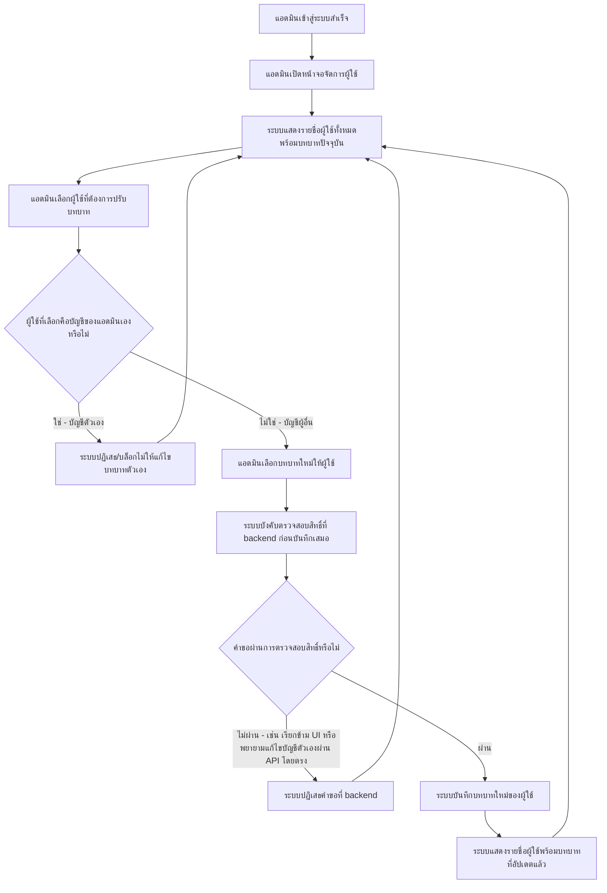

# User Journey: แอดมิน จัดการบทบาทผู้ใช้

## บริบท / Persona

Journey นี้เป็น flow เฉพาะบทบาท **แอดมิน** (สิทธิ์สูงสุดในระบบ) ต่อยอดโดยตรงจาก journey [[20260912-06-user-journey-signup-login|ผู้ใช้สมัครสมาชิกและเข้าสู่ระบบ]] — แอดมินต้องเข้าสู่ระบบสำเร็จผ่าน flow นั้นก่อนเสมอ journey นี้จึงเริ่มต้นหลังจากขั้นตอน "ระบบพาไปยังหน้าที่เหมาะสมตามบทบาทของผู้ใช้" ของ journey `20260912-06` โดยไม่วาด flow login ซ้ำ

Journey นี้เกี่ยวข้องกับฟีเจอร์ลำดับ 13 "แอดมินจัดการบทบาทผู้ใช้" ใน [[../../01-requirements/02-plan/feature-list|feature-list]]

และอ้างอิง requirement ต้นทางที่ [[../../01-requirements/01-spec/20260912-05-authentication-user-roles|ระบบยืนยันตัวตนและจัดการบทบาทผู้ใช้ (Authentication & User Role Management)]] FR ข้อ 3, 4, 5 และ NFR (การบังคับสิทธิ์ที่ backend) ใน [[../../01-requirements/01-spec/index|01-spec]]

## Diagram

## คำอธิบายขั้นตอน

1. **แอดมินเข้าสู่ระบบสำเร็จ** — จุดเริ่มต้นของ journey นี้ ต่อยอดมาจากขั้นตอนสุดท้ายของ journey [[20260912-06-user-journey-signup-login|ผู้ใช้สมัครสมาชิกและเข้าสู่ระบบ]] ที่ระบบตรวจสอบบทบาทแล้วพาแอดมินมายังหน้าจอของตน (อ้างอิง: [[../../01-requirements/01-spec/20260912-05-authentication-user-roles|ระบบยืนยันตัวตนและจัดการบทบาทผู้ใช้ (Authentication & User Role Management)]] FR ข้อ 2)
2. **แอดมินเปิดหน้าจอจัดการผู้ใช้** — แอดมินเข้าสู่หน้าจอที่ใช้จัดการบทบาทของผู้ใช้ในระบบ (อ้างอิง: [[../../01-requirements/01-spec/20260912-05-authentication-user-roles|ระบบยืนยันตัวตนและจัดการบทบาทผู้ใช้ (Authentication & User Role Management)]] FR ข้อ 4)
3. **ระบบแสดงรายชื่อผู้ใช้ทั้งหมดพร้อมบทบาทปัจจุบัน** — ระบบดึงและแสดงรายชื่อผู้ใช้ทุกคนในระบบพร้อมบทบาทปัจจุบันของแต่ละคน (แอดมิน/ผู้ใช้งานทั่วไป/ผู้บริหาร ตามสมมติฐาน 3 บทบาทที่ spec ต้นทางใช้อยู่ — ดูหัวข้อสมมติฐาน) (อ้างอิง: [[../../01-requirements/01-spec/20260912-05-authentication-user-roles|ระบบยืนยันตัวตนและจัดการบทบาทผู้ใช้ (Authentication & User Role Management)]] FR ข้อ 4)
4. **แอดมินเลือกผู้ใช้ที่ต้องการปรับบทบาท** — แอดมินเลือกผู้ใช้หนึ่งคนจากรายชื่อเพื่อดำเนินการปรับบทบาท (อ้างอิง: [[../../01-requirements/01-spec/20260912-05-authentication-user-roles|ระบบยืนยันตัวตนและจัดการบทบาทผู้ใช้ (Authentication & User Role Management)]] FR ข้อ 4)
5. **ผู้ใช้ที่เลือกคือบัญชีของแอดมินเองหรือไม่** — จุดแยกเงื่อนไขสำคัญของ journey นี้ ระบบต้องตรวจสอบว่าผู้ใช้ที่แอดมินเลือกเป็นบัญชีของตนเองหรือไม่ ก่อนอนุญาตให้ดำเนินการต่อ (อ้างอิง: [[../../01-requirements/01-spec/20260912-05-authentication-user-roles|ระบบยืนยันตัวตนและจัดการบทบาทผู้ใช้ (Authentication & User Role Management)]] FR ข้อ 5)
   - **ใช่ — บัญชีตัวเอง** → ไปขั้นตอน "ระบบปฏิเสธ/บล็อกไม่ให้แก้ไขบทบาทตัวเอง"
   - **ไม่ใช่ — บัญชีผู้อื่น** → ไปขั้นตอน "แอดมินเลือกบทบาทใหม่ให้ผู้ใช้"
6. **ระบบปฏิเสธ/บล็อกไม่ให้แก้ไขบทบาทตัวเอง** — แอดมินไม่สามารถแก้ไขบทบาทของบัญชีตัวเองได้ไม่ว่ากรณีใด (รวมถึงการพยายามลดสิทธิ์ตัวเอง) เพื่อป้องกันไม่ให้ระบบเหลือแอดมิน 0 คนโดยไม่ตั้งใจ ระบบแจ้งเตือนแล้วพากลับไปยังรายชื่อผู้ใช้ (อ้างอิง: [[../../01-requirements/01-spec/20260912-05-authentication-user-roles|ระบบยืนยันตัวตนและจัดการบทบาทผู้ใช้ (Authentication & User Role Management)]] FR ข้อ 5)
7. **แอดมินเลือกบทบาทใหม่ให้ผู้ใช้** — เมื่อผู้ใช้ที่เลือกไม่ใช่บัญชีตัวเอง แอดมินเลือกบทบาทใหม่ให้ผู้ใช้คนนั้น (เช่น จากผู้ใช้งานทั่วไป ปรับเป็นแอดมิน หรือปรับเป็นผู้บริหาร) (อ้างอิง: [[../../01-requirements/01-spec/20260912-05-authentication-user-roles|ระบบยืนยันตัวตนและจัดการบทบาทผู้ใช้ (Authentication & User Role Management)]] FR ข้อ 4)
8. **ระบบบังคับตรวจสอบสิทธิ์ที่ backend ก่อนบันทึกเสมอ** — ทุกคำขอเปลี่ยนบทบาท (ไม่ว่าจะมาจาก UI หน้าจัดการผู้ใช้ตามปกติ หรือความพยายามเรียก API ตรงจากภายนอก UI) ต้องผ่านการตรวจสอบสิทธิ์ที่ backend เสมอ ไม่ใช่การพึ่งพาแค่การซ่อนปุ่ม/องค์ประกอบฝั่ง UI เท่านั้น (อ้างอิง: [[../../01-requirements/01-spec/20260912-05-authentication-user-roles|ระบบยืนยันตัวตนและจัดการบทบาทผู้ใช้ (Authentication & User Role Management)]] NFR — การบังคับสิทธิ์ต้องทำที่ backend เสมอ)
9. **คำขอผ่านการตรวจสอบสิทธิ์หรือไม่** — ระบบตัดสินใจที่ backend ว่าจะยอมรับคำขอเปลี่ยนบทบาทนี้หรือไม่ ครอบคลุมทั้งกรณีปกติผ่าน UI และกรณีพยายามเรียกข้าม UI โดยตรง (อ้างอิง: [[../../01-requirements/01-spec/20260912-05-authentication-user-roles|ระบบยืนยันตัวตนและจัดการบทบาทผู้ใช้ (Authentication & User Role Management)]] NFR)
   - **ไม่ผ่าน** → ไปขั้นตอน "ระบบปฏิเสธคำขอที่ backend"
   - **ผ่าน** → ไปขั้นตอน "ระบบบันทึกบทบาทใหม่ของผู้ใช้"
10. **ระบบปฏิเสธคำขอที่ backend** — กรณีคำขอไม่ผ่านการตรวจสอบสิทธิ์ที่ backend (เช่น มีผู้พยายามเรียก API จัดการบทบาทโดยตรงข้าม UI หรือพยายามแก้ไขบัญชีตัวเองผ่านช่องทางอื่นที่ไม่ใช่ UI ปกติ) ระบบปฏิเสธคำขอนั้นแล้วพากลับไปยังรายชื่อผู้ใช้โดยไม่มีการเปลี่ยนแปลงบทบาทใดๆ (อ้างอิง: [[../../01-requirements/01-spec/20260912-05-authentication-user-roles|ระบบยืนยันตัวตนและจัดการบทบาทผู้ใช้ (Authentication & User Role Management)]] NFR, FR ข้อ 5)
11. **ระบบบันทึกบทบาทใหม่ของผู้ใช้** — เมื่อผ่านการตรวจสอบสิทธิ์แล้ว ระบบบันทึกบทบาทใหม่ของผู้ใช้ที่ถูกเลือก (ยังไม่ยืนยันว่าต้องบันทึก audit trail ของการเปลี่ยนแปลงนี้หรือไม่ — ดูหัวข้อสมมติฐาน) (อ้างอิง: [[../../01-requirements/01-spec/20260912-05-authentication-user-roles|ระบบยืนยันตัวตนและจัดการบทบาทผู้ใช้ (Authentication & User Role Management)]] FR ข้อ 4)
12. **ระบบแสดงรายชื่อผู้ใช้พร้อมบทบาทที่อัปเดตแล้ว** — ระบบแสดงผลรายชื่อผู้ใช้อีกครั้งพร้อมบทบาทที่อัปเดตแล้ว วนกลับไปยังขั้นตอน "ระบบแสดงรายชื่อผู้ใช้ทั้งหมดพร้อมบทบาทปัจจุบัน" เพื่อให้แอดมินดำเนินการต่อกับผู้ใช้คนอื่นได้ (อ้างอิง: [[../../01-requirements/01-spec/20260912-05-authentication-user-roles|ระบบยืนยันตัวตนและจัดการบทบาทผู้ใช้ (Authentication & User Role Management)]] FR ข้อ 4)

## Mapping กลับไปยัง Requirement

| ขั้นตอนใน Diagram | Requirement อ้างอิง |
| --- | --- |
| แอดมินเข้าสู่ระบบสำเร็จ | [[../../01-requirements/01-spec/20260912-05-authentication-user-roles\|ระบบยืนยันตัวตนและจัดการบทบาทผู้ใช้ (Authentication & User Role Management)]] (FR ข้อ 2) — ไม่มี requirement เฉพาะของ journey นี้ เป็นจุดต่อจาก [[20260912-06-user-journey-signup-login\|journey signup/login]] |
| แอดมินเปิดหน้าจอจัดการผู้ใช้ | [[../../01-requirements/01-spec/20260912-05-authentication-user-roles\|ระบบยืนยันตัวตนและจัดการบทบาทผู้ใช้ (Authentication & User Role Management)]] (FR ข้อ 4) |
| ระบบแสดงรายชื่อผู้ใช้ทั้งหมดพร้อมบทบาทปัจจุบัน | [[../../01-requirements/01-spec/20260912-05-authentication-user-roles\|ระบบยืนยันตัวตนและจัดการบทบาทผู้ใช้ (Authentication & User Role Management)]] (FR ข้อ 4) |
| แอดมินเลือกผู้ใช้ที่ต้องการปรับบทบาท | [[../../01-requirements/01-spec/20260912-05-authentication-user-roles\|ระบบยืนยันตัวตนและจัดการบทบาทผู้ใช้ (Authentication & User Role Management)]] (FR ข้อ 4) |
| ผู้ใช้ที่เลือกคือบัญชีของแอดมินเองหรือไม่ | [[../../01-requirements/01-spec/20260912-05-authentication-user-roles\|ระบบยืนยันตัวตนและจัดการบทบาทผู้ใช้ (Authentication & User Role Management)]] (FR ข้อ 5) |
| ระบบปฏิเสธ/บล็อกไม่ให้แก้ไขบทบาทตัวเอง | [[../../01-requirements/01-spec/20260912-05-authentication-user-roles\|ระบบยืนยันตัวตนและจัดการบทบาทผู้ใช้ (Authentication & User Role Management)]] (FR ข้อ 5) |
| แอดมินเลือกบทบาทใหม่ให้ผู้ใช้ | [[../../01-requirements/01-spec/20260912-05-authentication-user-roles\|ระบบยืนยันตัวตนและจัดการบทบาทผู้ใช้ (Authentication & User Role Management)]] (FR ข้อ 4) |
| ระบบบังคับตรวจสอบสิทธิ์ที่ backend ก่อนบันทึกเสมอ | [[../../01-requirements/01-spec/20260912-05-authentication-user-roles\|ระบบยืนยันตัวตนและจัดการบทบาทผู้ใช้ (Authentication & User Role Management)]] (NFR — บังคับสิทธิ์ที่ backend เสมอ) |
| คำขอผ่านการตรวจสอบสิทธิ์หรือไม่ | [[../../01-requirements/01-spec/20260912-05-authentication-user-roles\|ระบบยืนยันตัวตนและจัดการบทบาทผู้ใช้ (Authentication & User Role Management)]] (NFR) |
| ระบบปฏิเสธคำขอที่ backend | [[../../01-requirements/01-spec/20260912-05-authentication-user-roles\|ระบบยืนยันตัวตนและจัดการบทบาทผู้ใช้ (Authentication & User Role Management)]] (NFR, FR ข้อ 5) |
| ระบบบันทึกบทบาทใหม่ของผู้ใช้ | [[../../01-requirements/01-spec/20260912-05-authentication-user-roles\|ระบบยืนยันตัวตนและจัดการบทบาทผู้ใช้ (Authentication & User Role Management)]] (FR ข้อ 4) |
| ระบบแสดงรายชื่อผู้ใช้พร้อมบทบาทที่อัปเดตแล้ว | [[../../01-requirements/01-spec/20260912-05-authentication-user-roles\|ระบบยืนยันตัวตนและจัดการบทบาทผู้ใช้ (Authentication & User Role Management)]] (FR ข้อ 4) |

## สมมติฐาน / คำถามที่เปิดไว้

- **รายชื่อ/จำนวนบทบาทสุดท้ายของระบบยังไม่ยืนยัน**: journey นี้ใช้สมมติฐานชั่วคราวว่ามี 3 บทบาท (แอดมิน, ผู้ใช้งานทั่วไป, ผู้บริหาร) ตามที่ spec ต้นทาง [[../../01-requirements/01-spec/20260912-05-authentication-user-roles|ระบบยืนยันตัวตนและจัดการบทบาทผู้ใช้ (Authentication & User Role Management)]] ใช้อยู่ในปัจจุบัน หากมีการยืนยันรายชื่อ/จำนวนบทบาทที่แตกต่างออกไปในภายหลัง diagram และคำอธิบายขั้นตอนนี้อาจต้องปรับตาม
- **Audit trail การเปลี่ยนบทบาท**: ยังไม่ยืนยันว่าระบบต้องบันทึกประวัติหรือไม่ว่าแอดมินคนใดเปลี่ยนบทบาทของผู้ใช้คนใด เมื่อไหร่ (สืบทอดคำถามเปิดเดิมจาก spec ต้นทาง) journey นี้จึงยังไม่มีแขนงแสดงการบันทึก audit log ในขั้นตอน "ระบบบันทึกบทบาทใหม่ของผู้ใช้" หากมีการยืนยันในภายหลังว่าต้องมี อาจต้องเพิ่มขั้นตอนย่อยในจุดนี้

---
[[index|01-prototypes]] · [[../../01-requirements/02-plan/feature-list|feature-list]] · [[../../01-requirements/01-spec/index|01-spec]]
