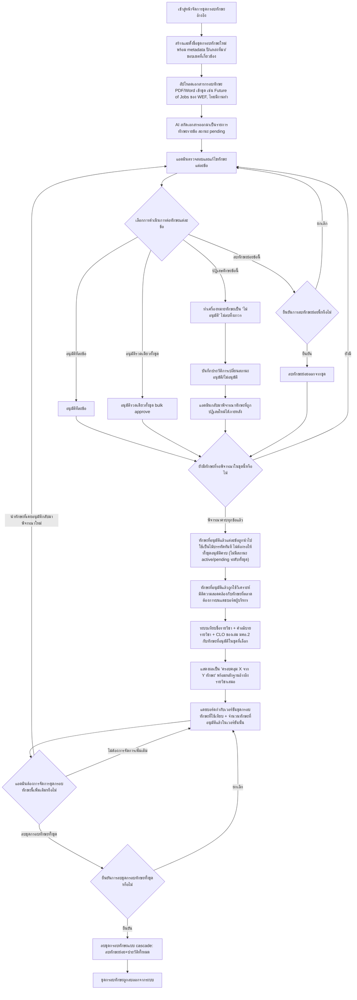
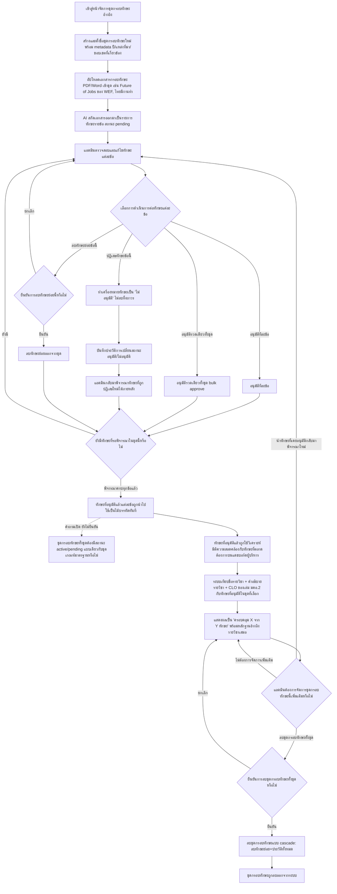

# User Journey: แอดมิน จัดการชุดกรอบทักษะอ้างอิง

## บริบท / Persona

Journey นี้เป็นของ **แอดมิน** — บทบาทเดียวกันเป๊ะกับที่จัดการฐานความรู้เกณฑ์มาตรฐานหลักสูตร ([[20260823-03-user-journey-admin-manage-criteria-knowledge-base|แอดมิน จัดการฐานความรู้เกณฑ์มาตรฐานหลักสูตร]]) และจัดการรายชื่อหลักสูตร/สำนักวิชาของแดชบอร์ดผู้บริหาร ([[20260904-04-user-journey-admin-manage-executive-courses|แอดมิน จัดการรายชื่อหลักสูตรและผูกเล่ม มคอ.2 ต่อสำนักวิชา]]) ไม่ใช่สิทธิ์ย่อยแยกต่างหาก ยืนยันแล้วตาม [[../../01-requirements/01-spec/20260912-05-authentication-user-roles|20260912-05-authentication-user-roles]]

Journey นี้เกี่ยวข้องกับฟีเจอร์ต่อไปนี้ใน [[../../01-requirements/02-plan/feature-list|feature-list]]:

- 14. แอดมิน จัดการชุดกรอบทักษะอ้างอิง (`Should have`)

และอ้างอิง requirement ต้นทางที่ FR ข้อ 9 ("มิติ 'ความสอดคล้องกับทักษะที่ตลาดต้องการ' — รายละเอียดเต็ม") ของ [[../../01-requirements/01-spec/20260904-04-executive-curriculum-dashboard|ระบบแดชบอร์ดวิเคราะห์ข้อมูลหลักสูตรสำหรับผู้บริหาร (Executive Curriculum Analytics Dashboard)]] ใน [[../../01-requirements/01-spec/index|01-spec]] เป็นหลัก ประกอบกับ FR ข้อ 8 (ง) ที่อธิบายว่ามิตินี้ถูกนำไปใช้วิเคราะห์บนแดชบอร์ดผู้บริหารอย่างไร

**จุดสำคัญที่ต้องเข้าใจก่อนอ่าน journey นี้**: "ชุดกรอบทักษะ" ใช้**กลไกจัดการเดียวกันกับ**"ชุดเกณฑ์มาตรฐาน" ตาม [[../../01-requirements/01-spec/20260823-02-criteria-knowledge-base|ระบบจัดการฐานความรู้เกณฑ์มาตรฐานหลักสูตร (Knowledge Base) สำหรับแอดมิน]] ทุกประการ (อัปโหลดเอกสาร → AI สกัด → แอดมินตรวจสอบ/แก้ไข/อนุมัติ/ปฏิเสธ ทั้งรายข้อและแบบ bulk) แต่เป็น**ไม้บรรทัดคนละอัน**: ชุดเกณฑ์มาตรฐานตอบว่า "หลักสูตรต้องมีอะไรตามกฎ" ส่วนชุดกรอบทักษะ (journey นี้) ตอบว่า "ตลาดต้องการทักษะอะไร" — ไม่ใช่ข้อมูลชุดเดียวกัน ไม่ปะปนกัน ผู้อ่านที่ต้องการเทียบเคียงโครงสร้าง flow ทั้งสองแบบ ดู [[20260823-03-user-journey-admin-manage-criteria-knowledge-base|แอดมิน จัดการฐานความรู้เกณฑ์มาตรฐานหลักสูตร]] ประกอบ

Journey นี้เป็นฝั่งแอดมินที่ทำให้เกิดทักษะสถานะ "อนุมัติแล้ว (approved)" ซึ่งเป็นไม้บรรทัดที่จำเป็นของขั้นตอนวิเคราะห์มิติ "ความสอดคล้องกับทักษะที่ตลาดต้องการ" ใน [[20260904-05-user-journey-executive-view-dashboard|ผู้บริหาร ดูแดชบอร์ดวิเคราะห์ข้อมูลหลักสูตร]] หากไม่มีทักษะที่อนุมัติแล้วในชุดใดเลย มิตินี้บนแดชบอร์ดผู้บริหารจะไม่มีไม้บรรทัดให้เทียบ

## Diagram

**เหตุผลที่ journey นี้ต่างจาก [[20260823-03-user-journey-admin-manage-criteria-knowledge-base|แอดมิน จัดการฐานความรู้เกณฑ์มาตรฐานหลักสูตร]] โดยเจตนา** (คำถามเปิดที่เคยฝากไว้ในไดอะแกรมได้รับคำตอบแล้วจาก FR ข้อ 9 ของ [[../../01-requirements/01-spec/20260904-04-executive-curriculum-dashboard|ระบบแดชบอร์ดวิเคราะห์ข้อมูลหลักสูตรสำหรับผู้บริหาร (Executive Curriculum Analytics Dashboard)]]): journey ชุดเกณฑ์มาตรฐานกำหนดให้ชุดเกณฑ์ทั้งชุดต้องมีสถานะ active/pending และต้องอนุมัติกฎเกณฑ์ครบทุกข้อก่อนชุดจึงใช้งานได้ ส่วน journey นี้ **ไม่มี** สถานะ active/pending ระดับทั้งชุด ทักษะข้อใดที่อนุมัติแล้วนำไปใช้เป็นไม้บรรทัดได้ทันทีทีละข้อ ด้วยเหตุผล 3 ข้อ:

1. ชุดเกณฑ์มาตรฐานต้องอนุมัติครบทั้งชุดก่อนใช้งาน เพราะถ้าขาดกฎเกณฑ์ไปข้อหนึ่งแล้วระบบรายงานว่า "ตรวจผ่าน" จะเป็นคำตอบที่ผิด ทำให้ผู้ใช้เข้าใจว่าหลักสูตรถูกต้องครบตามกฎทั้งที่ยังตรวจไม่ครบ
2. แต่กรอบทักษะรายงานผลเป็น "ครอบคลุม X จาก Y ทักษะ" ซึ่งโปร่งใสในตัวเองอยู่แล้ว ไม่ได้ตัดสินผ่าน/ไม่ผ่าน จึงไม่ทำให้ผู้ใช้เข้าใจผิดแม้ Y จะยังไม่ครบ
3. เหตุผลเชิงปฏิบัติ: กรอบทักษะจากแหล่งจริง (เช่น รายงาน Future of Jobs ของ World Economic Forum) มีทักษะหลายสิบข้อ การบังคับให้อนุมัติครบก่อนใช้งานได้จะบล็อกการใช้งานนานโดยไม่จำเป็น

**เงื่อนไขที่ต้องมีคู่กัน**: เพื่อไม่ให้ผู้บริหารเข้าใจผิดว่า "ครอบคลุม X จาก Y ทักษะ" อ้างอิงกรอบทักษะฉบับสมบูรณ์เสมอ แดชบอร์ดต้องแสดงกำกับว่าผลวิเคราะห์เทียบกับชุดกรอบทักษะ**เวอร์ชันใด** และ**มีทักษะที่อนุมัติแล้วกี่ข้อ** ในเวอร์ชันนั้น (ดูโหนด M1 ในไดอะแกรมด้านบน) สอดคล้อง/cross-reference กับกฎ provenance และการกำกับเวอร์ชันวิธีคำนวณใน FR ข้อ 12 ของ spec เดียวกัน

**หมายเหตุ**: คำถามเปิดอีกข้อที่ยังไม่ได้คำตอบ (ชุดกรอบทักษะจะใช้โครงสร้างข้อมูล/หน้าจอเดียวกับชุดเกณฑ์มาตรฐานโดยแยกด้วย type หรือแยกเป็นคนละส่วน) **ยังคงเปิดอยู่** ไม่ได้ถูกตอบในรอบนี้ — ดูหัวข้อ "สมมติฐาน / คำถามที่เปิดไว้" ด้านล่าง

### เวอร์ชันก่อนหน้า (คำถามเปิดยังไม่ได้คำตอบ — เลิกใช้แล้วตั้งแต่ 2026-09-13)

Diagram ด้านล่างนี้คือเวอร์ชันที่เคยเป็น "เวอร์ชันปัจจุบัน" ของไฟล์นี้ก่อนที่ผู้ใช้จะตอบคำถามเปิดเรื่องสถานะ active/pending ระดับทั้งชุดของกรอบทักษะ diagram นี้ยังมีโหนดคำถามเปิด (เส้นประ ยังไม่ยืนยัน) แยกออกจากเส้นทางหลักที่โหนด J เก็บไว้ที่นี่เพื่อรักษาประวัติการตัดสินใจตามธรรมเนียมของ vault — คำถามนี้ได้รับคำตอบแล้วและถูกแทนที่ด้วย diagram เวอร์ชันปัจจุบันด้านบน ดู [[../../01-requirements/01-spec/20260904-04-executive-curriculum-dashboard|ระบบแดชบอร์ดวิเคราะห์ข้อมูลหลักสูตรสำหรับผู้บริหาร (Executive Curriculum Analytics Dashboard)]] FR ข้อ 9 ส่วน "สถานะของชุดกรอบทักษะทั้งชุด" (เพิ่ม 2026-09-13):

## คำอธิบายขั้นตอน

เรียงลำดับตาม diagram เวอร์ชันปัจจุบันด้านบน:

1. **เข้าสู่หน้าจัดการชุดกรอบทักษะอ้างอิง** — แอดมินเข้าสู่หน้าจัดการชุดกรอบทักษะอ้างอิง ใช้กลไกจัดการเดียวกับหน้าจัดการฐานความรู้เกณฑ์มาตรฐาน แต่เป็นคนละส่วนข้อมูล (อ้างอิง: [[../../01-requirements/01-spec/20260904-04-executive-curriculum-dashboard|ระบบแดชบอร์ดวิเคราะห์ข้อมูลหลักสูตรสำหรับผู้บริหาร (Executive Curriculum Analytics Dashboard)]] FR ข้อ 9)
2. **สร้างและตั้งชื่อชุดกรอบทักษะใหม่ พร้อม metadata ปี/แหล่งที่มา/ขอบเขตที่เกี่ยวข้อง** — แอดมินสร้างและตั้งชื่อ "ชุดกรอบทักษะ" ได้เองอย่างยืดหยุ่น พร้อมกรอก metadata กำกับ ได้แก่ ปีที่เผยแพร่/บังคับใช้ แหล่งที่มาของเอกสาร และขอบเขต/สาขาที่เกี่ยวข้อง รองรับหลายชุดกรอบทักษะพร้อมกัน (อ้างอิง: [[../../01-requirements/01-spec/20260904-04-executive-curriculum-dashboard|ระบบแดชบอร์ดวิเคราะห์ข้อมูลหลักสูตรสำหรับผู้บริหาร (Executive Curriculum Analytics Dashboard)]] FR ข้อ 9)
3. **อัปโหลดเอกสารกรอบทักษะ PDF/Word เข้าชุด เช่น Future of Jobs ของ WEF, ไทยมีงานทำ** — แอดมินอัปโหลดเอกสารกรอบทักษะรูปแบบ PDF หรือ Word (.docx) เข้าชุด เช่น รายงาน Future of Jobs ของ World Economic Forum, กรอบสมรรถนะ/ทักษะอนาคตอื่นๆ หรือเอกสารข้อมูลทักษะที่ตลาดต้องการจากแหล่งอย่างไทยมีงานทำที่แอดมินนำมาเป็นเอกสารเอง **นี่คือเอกสารที่แอดมินอัปโหลดเอง ไม่ใช่การดึง/scrape ข้อมูลจากเว็บภายนอกโดยอัตโนมัติ ซึ่งอยู่นอกขอบเขต** (อ้างอิง: [[../../01-requirements/01-spec/20260904-04-executive-curriculum-dashboard|ระบบแดชบอร์ดวิเคราะห์ข้อมูลหลักสูตรสำหรับผู้บริหาร (Executive Curriculum Analytics Dashboard)]] FR ข้อ 9)
4. **AI สกัดเอกสารออกมาเป็นรายการทักษะรายข้อ สถานะ pending** — เมื่ออัปโหลดเอกสารสำเร็จ ระบบ (AI) สกัดเนื้อหาเอกสารออกมาเป็น "รายการทักษะ" รายข้อโดยอัตโนมัติ ทักษะที่สกัดได้เข้าสู่สถานะ "รอตรวจสอบ (pending)" รอให้แอดมินตรวจสอบก่อนนำไปใช้งานจริง (อ้างอิง: [[../../01-requirements/01-spec/20260904-04-executive-curriculum-dashboard|ระบบแดชบอร์ดวิเคราะห์ข้อมูลหลักสูตรสำหรับผู้บริหาร (Executive Curriculum Analytics Dashboard)]] FR ข้อ 9)
5. **แอดมินตรวจสอบและแก้ไขทักษะแต่ละข้อ** — แอดมินตรวจสอบและแก้ไขทักษะแต่ละข้อที่ AI สกัดมา เพื่อป้องกันความผิดพลาดจากการสกัดข้อมูลอัตโนมัติก่อนอนุมัติ (อ้างอิง: [[../../01-requirements/01-spec/20260904-04-executive-curriculum-dashboard|ระบบแดชบอร์ดวิเคราะห์ข้อมูลหลักสูตรสำหรับผู้บริหาร (Executive Curriculum Analytics Dashboard)]] FR ข้อ 9)
6. **เลือกการดำเนินการต่อทักษะแต่ละข้อ (เงื่อนไขแตกแขนง)** — แอดมินเลือกการดำเนินการต่อทักษะแต่ละข้อที่ตรวจสอบแล้ว (อ้างอิง: [[../../01-requirements/01-spec/20260904-04-executive-curriculum-dashboard|ระบบแดชบอร์ดวิเคราะห์ข้อมูลหลักสูตรสำหรับผู้บริหาร (Executive Curriculum Analytics Dashboard)]] FR ข้อ 9)
   - **อนุมัติทีละข้อ** → ไปขั้นตอน "อนุมัติทีละข้อ"
   - **อนุมัติรวดเดียวทั้งชุด** → ไปขั้นตอน "อนุมัติรวดเดียวทั้งชุด bulk approve"
   - **ปฏิเสธทักษะข้อนี้** → ไปขั้นตอน "ทำเครื่องหมายทักษะเป็น 'ไม่อนุมัติ' ไม่ลบทิ้งถาวร"
   - **ลบทักษะย่อยข้อนี้** → ไปขั้นตอน "ยืนยันการลบทักษะย่อยนี้หรือไม่"
7. **อนุมัติทีละข้อ** — แอดมินกดยืนยัน (Approve) ทักษะทีละรายการ (อ้างอิง: [[../../01-requirements/01-spec/20260904-04-executive-curriculum-dashboard|ระบบแดชบอร์ดวิเคราะห์ข้อมูลหลักสูตรสำหรับผู้บริหาร (Executive Curriculum Analytics Dashboard)]] FR ข้อ 9)
8. **อนุมัติรวดเดียวทั้งชุด bulk approve** — แอดมินกดอนุมัติทักษะทั้งหมดในชุดพร้อมกันในครั้งเดียว (อ้างอิง: [[../../01-requirements/01-spec/20260904-04-executive-curriculum-dashboard|ระบบแดชบอร์ดวิเคราะห์ข้อมูลหลักสูตรสำหรับผู้บริหาร (Executive Curriculum Analytics Dashboard)]] FR ข้อ 9)
9. **ทำเครื่องหมายทักษะเป็น "ไม่อนุมัติ" ไม่ลบทิ้งถาวร** — เมื่อแอดมินปฏิเสธทักษะข้อใดข้อหนึ่ง ระบบทำเครื่องหมายสถานะทักษะข้อนั้นเป็น "ไม่อนุมัติ" เท่านั้น ไม่ลบทิ้งถาวรทันที (อ้างอิง: [[../../01-requirements/01-spec/20260904-04-executive-curriculum-dashboard|ระบบแดชบอร์ดวิเคราะห์ข้อมูลหลักสูตรสำหรับผู้บริหาร (Executive Curriculum Analytics Dashboard)]] FR ข้อ 9)
10. **ยืนยันการลบทักษะย่อยนี้หรือไม่ (เงื่อนไขแตกแขนง)** — ก่อนลบทักษะย่อยรายข้อ ระบบให้แอดมินยืนยันก่อนดำเนินการเสมอ เพื่อป้องกันการลบผิดพลาด (อ้างอิง: [[../../01-requirements/01-spec/20260904-04-executive-curriculum-dashboard|ระบบแดชบอร์ดวิเคราะห์ข้อมูลหลักสูตรสำหรับผู้บริหาร (Executive Curriculum Analytics Dashboard)]] FR ข้อ 9)
    - **ยืนยัน** → ไปขั้นตอน "ลบทักษะย่อยออกจากชุด"
    - **ยกเลิก** → กลับไปขั้นตอน "แอดมินตรวจสอบและแก้ไขทักษะแต่ละข้อ" โดยทักษะย่อยยังคงอยู่ไม่ถูกลบ
11. **ลบทักษะย่อยออกจากชุด** — เมื่อแอดมินยืนยันแล้ว ระบบลบทักษะย่อยข้อนั้นออกจากชุดกรอบทักษะเป็นรายข้อ โดยไม่ต้องลบทั้งชุด (อ้างอิง: [[../../01-requirements/01-spec/20260904-04-executive-curriculum-dashboard|ระบบแดชบอร์ดวิเคราะห์ข้อมูลหลักสูตรสำหรับผู้บริหาร (Executive Curriculum Analytics Dashboard)]] FR ข้อ 9)
12. **บันทึกประวัติการเปลี่ยนสถานะอนุมัติ/ไม่อนุมัติ** — ทุกครั้งที่มีการเปลี่ยนสถานะการอนุมัติ (อนุมัติ/ไม่อนุมัติ) ของทักษะ ระบบบันทึกประวัติการตัดสินใจไว้เสมอ (อ้างอิง: [[../../01-requirements/01-spec/20260904-04-executive-curriculum-dashboard|ระบบแดชบอร์ดวิเคราะห์ข้อมูลหลักสูตรสำหรับผู้บริหาร (Executive Curriculum Analytics Dashboard)]] FR ข้อ 9)
13. **แอดมินกลับมาพิจารณาทักษะที่ถูกปฏิเสธใหม่ได้ภายหลัง** — แอดมินสามารถกลับมาพิจารณาทักษะที่เคยถูกปฏิเสธใหม่ในภายหลัง และเปลี่ยนการตัดสินใจเป็นอนุมัติได้ (อ้างอิง: [[../../01-requirements/01-spec/20260904-04-executive-curriculum-dashboard|ระบบแดชบอร์ดวิเคราะห์ข้อมูลหลักสูตรสำหรับผู้บริหาร (Executive Curriculum Analytics Dashboard)]] FR ข้อ 9)
14. **ยังมีทักษะที่รอพิจารณาในชุดนี้หรือไม่ (เงื่อนไขแตกแขนง)** — ทุกแขนงของการดำเนินการต่อทักษะ (อนุมัติทีละข้อ, bulk approve, พิจารณาทักษะที่ถูกปฏิเสธใหม่, ลบทักษะย่อยแล้ว) มาบรรจบกันที่จุดนี้ ระบบตรวจสอบว่ายังมีทักษะที่ยังไม่ได้พิจารณา (ยัง pending) ค้างอยู่ในชุดนี้หรือไม่ (อ้างอิง: [[../../01-requirements/01-spec/20260904-04-executive-curriculum-dashboard|ระบบแดชบอร์ดวิเคราะห์ข้อมูลหลักสูตรสำหรับผู้บริหาร (Executive Curriculum Analytics Dashboard)]] FR ข้อ 9)
    - **ยังมี** → วนกลับไปขั้นตอน "แอดมินตรวจสอบและแก้ไขทักษะแต่ละข้อ" เพื่อจัดการทักษะที่เหลือ
    - **พิจารณาครบทุกข้อแล้ว** → ไปขั้นตอน "ทักษะที่อนุมัติแล้วแต่ละข้อถูกนำไปใช้เป็นไม้บรรทัดทันที"
15. **ทักษะที่อนุมัติแล้วแต่ละข้อถูกนำไปใช้เป็นไม้บรรทัดทันที ไม่ต้องรอให้ทั้งชุดอนุมัติครบ (ไม่มีสถานะ active/pending ระดับทั้งชุด)** — ~~ตาม FR ข้อ 9 ระบุชัดว่า "เฉพาะทักษะที่อนุมัติแล้วเท่านั้นที่ถูกนำไปใช้เป็นไม้บรรทัด" กล่าวคือทักษะแต่ละข้อที่ผ่านการอนุมัติ (ไม่ว่าจะทีละข้อหรือ bulk) ถูกนำไปใช้งานได้ทันทีเป็นรายข้อ ไม่ต้องรอให้ทักษะทุกข้อในชุดผ่านการอนุมัติครบก่อน~~ **(อัปเดต 2026-09-13: ได้รับคำตอบแล้ว)** คำถามเปิดเดิมที่เคยฝากไว้ในไดอะแกรม (โหนด "ชุดกรอบทักษะทั้งชุดต้องมีสถานะ active/pending แบบเดียวกับชุดเกณฑ์มาตรฐานหรือไม่") ตอบแล้วว่า **ไม่มี** สถานะ active/pending ระดับทั้งชุด ทักษะที่อนุมัติแล้ว (ไม่ว่าจะทีละข้อหรือ bulk) ถูกนำไปใช้งานได้ทันทีเป็นรายข้อ ไม่ต้องรอให้ทักษะทุกข้อในชุดผ่านการอนุมัติครบก่อน — จุดนี้ต่างจาก journey [[20260823-03-user-journey-admin-manage-criteria-knowledge-base|แอดมิน จัดการฐานความรู้เกณฑ์มาตรฐานหลักสูตร]] โดยเจตนา ดูเหตุผล 3 ข้อและเงื่อนไขที่ต้องมีคู่กันในย่อหน้าใต้ diagram ด้านบน (อ้างอิง: [[../../01-requirements/01-spec/20260904-04-executive-curriculum-dashboard|ระบบแดชบอร์ดวิเคราะห์ข้อมูลหลักสูตรสำหรับผู้บริหาร (Executive Curriculum Analytics Dashboard)]] FR ข้อ 9 ส่วน "สถานะของชุดกรอบทักษะทั้งชุด")
16. **ทักษะที่อนุมัติแล้วถูกใช้วิเคราะห์มิติความสอดคล้องกับทักษะที่ตลาดต้องการบนแดชบอร์ดผู้บริหาร** — ทักษะที่อนุมัติแล้วในชุดกรอบทักษะที่ผู้บริหารเลือกใช้ ถูกนำไปเป็นไม้บรรทัดวิเคราะห์มิติ "ความสอดคล้องกับทักษะที่ตลาดต้องการ" ซึ่งเป็น 1 ใน 4 มิติของการวิเคราะห์สุขภาพหลักสูตรบนแดชบอร์ดผู้บริหาร (ดู [[20260904-05-user-journey-executive-view-dashboard|ผู้บริหาร ดูแดชบอร์ดวิเคราะห์ข้อมูลหลักสูตร]]) (อ้างอิง: [[../../01-requirements/01-spec/20260904-04-executive-curriculum-dashboard|ระบบแดชบอร์ดวิเคราะห์ข้อมูลหลักสูตรสำหรับผู้บริหาร (Executive Curriculum Analytics Dashboard)]] FR ข้อ 8 (ง), FR ข้อ 9)
17. **ระบบเทียบชื่อรายวิชา + คำอธิบายรายวิชา + CLO ของเล่ม มคอ.2 กับทักษะที่อนุมัติในชุดที่เลือก** — ระบบนำ**ชื่อรายวิชา + คำอธิบายรายวิชา (course description) + ผลลัพธ์การเรียนรู้ระดับรายวิชา (CLO)** จากเล่ม มคอ.2 ของหลักสูตรที่กำลังวิเคราะห์มาเทียบกับทักษะที่อนุมัติแล้วในชุดกรอบทักษะที่เลือก (อ้างอิง: [[../../01-requirements/01-spec/20260904-04-executive-curriculum-dashboard|ระบบแดชบอร์ดวิเคราะห์ข้อมูลหลักสูตรสำหรับผู้บริหาร (Executive Curriculum Analytics Dashboard)]] FR ข้อ 9)
18. **แสดงผลเป็น "ครอบคลุม X จาก Y ทักษะ" พร้อมหลักฐานอ้างอิงรายวิชาเสมอ** — ผลลัพธ์แสดงเป็น**จำนวนที่นับได้** ("ครอบคลุม X จาก Y ทักษะ") ไม่ใช่คะแนนตัวเลข 0–100 แต่ละทักษะแสดงระดับความครอบคลุมเป็นป้ายข้อความ (ครอบคลุมชัดเจน/ครอบคลุมบางส่วน/ไม่พบ) และทุกทักษะที่ระบบบอกว่า "ครอบคลุม" ต้องแสดงหลักฐานอ้างอิงกลับไปยังรายวิชาที่เป็นที่มาเสมอ (รหัส/ชื่อรายวิชา และจุดที่อ้างอิง คำอธิบายรายวิชาหรือ CLO ข้อใด) (อ้างอิง: [[../../01-requirements/01-spec/20260904-04-executive-curriculum-dashboard|ระบบแดชบอร์ดวิเคราะห์ข้อมูลหลักสูตรสำหรับผู้บริหาร (Executive Curriculum Analytics Dashboard)]] FR ข้อ 9)
19. **(ใหม่ 2026-09-13) แดชบอร์ดกำกับเวอร์ชันชุดกรอบทักษะที่ใช้เทียบ + จำนวนทักษะที่อนุมัติแล้วในเวอร์ชันนั้น** — เนื่องจากทักษะแต่ละข้อใช้งานได้ทันทีทีละข้อโดยไม่รอให้ทั้งชุดอนุมัติครบ (ดูขั้นตอนที่ 15) แดชบอร์ดจึงต้องแสดงกำกับเสมอว่าผลวิเคราะห์ "ครอบคลุม X จาก Y ทักษะ" เทียบกับชุดกรอบทักษะ**เวอร์ชันใด** และ**มีทักษะที่อนุมัติแล้วกี่ข้อ** ในเวอร์ชันนั้น เพื่อไม่ให้ผู้บริหารเข้าใจผิดว่า Y คือกรอบทักษะฉบับสมบูรณ์เสมอ (อ้างอิง: [[../../01-requirements/01-spec/20260904-04-executive-curriculum-dashboard|ระบบแดชบอร์ดวิเคราะห์ข้อมูลหลักสูตรสำหรับผู้บริหาร (Executive Curriculum Analytics Dashboard)]] FR ข้อ 9 ส่วน "เงื่อนไขที่ต้องมีคู่กัน", FR ข้อ 12 เรื่อง provenance และการกำกับเวอร์ชันวิธีคำนวณ)
20. **แอดมินต้องการจัดการชุดกรอบทักษะนี้เพิ่มเติมหรือไม่ (เงื่อนไขแตกแขนง)** — หลังทักษะในชุดถูกนำไปใช้วิเคราะห์แล้ว แอดมินสามารถกลับมาจัดการชุดกรอบทักษะนั้นเพิ่มเติมได้ทุกเมื่อ ใช้กลไกเดียวกับการจัดการชุดเกณฑ์มาตรฐาน (อ้างอิง: [[../../01-requirements/01-spec/20260904-04-executive-curriculum-dashboard|ระบบแดชบอร์ดวิเคราะห์ข้อมูลหลักสูตรสำหรับผู้บริหาร (Executive Curriculum Analytics Dashboard)]] FR ข้อ 9)
    - **นำทักษะที่เคยอนุมัติกลับมาพิจารณาใหม่** → วนกลับไปขั้นตอน "แอดมินตรวจสอบและแก้ไขทักษะแต่ละข้อ"
    - **ลบชุดกรอบทักษะทั้งชุด** → ไปขั้นตอน "ยืนยันการลบชุดกรอบทักษะทั้งชุดหรือไม่"
    - **ไม่ต้องการจัดการเพิ่มเติม** → กลับไปขั้นตอน "แดชบอร์ดกำกับเวอร์ชันชุดกรอบทักษะที่ใช้เทียบ + จำนวนทักษะที่อนุมัติแล้วในเวอร์ชันนั้น" (ชุดกรอบทักษะยังคงใช้งานได้ตามปกติ)
21. **ยืนยันการลบชุดกรอบทักษะทั้งชุดหรือไม่ (เงื่อนไขแตกแขนง)** — ก่อนลบชุดกรอบทักษะทั้งชุด ระบบให้แอดมินยืนยันก่อนดำเนินการเสมอ เพื่อป้องกันการลบผิดพลาด (อ้างอิง: [[../../01-requirements/01-spec/20260904-04-executive-curriculum-dashboard|ระบบแดชบอร์ดวิเคราะห์ข้อมูลหลักสูตรสำหรับผู้บริหาร (Executive Curriculum Analytics Dashboard)]] FR ข้อ 9)
    - **ยืนยัน** → ไปขั้นตอน "ลบชุดกรอบทักษะแบบ cascade: ลบทักษะย่อย+ประวัติทั้งหมด"
    - **ยกเลิก** → กลับไปขั้นตอน "แดชบอร์ดกำกับเวอร์ชันชุดกรอบทักษะที่ใช้เทียบ + จำนวนทักษะที่อนุมัติแล้วในเวอร์ชันนั้น" โดยชุดกรอบทักษะยังคงอยู่ไม่ถูกลบ
22. **ลบชุดกรอบทักษะแบบ cascade: ลบทักษะย่อย+ประวัติทั้งหมด** — เมื่อแอดมินยืนยันแล้ว ระบบลบชุดกรอบทักษะทั้งชุดแบบพ่วง (cascade) ลบทักษะย่อยทั้งหมดและประวัติการตรวจสอบ/อนุมัติของชุดนั้นไปด้วย เพื่อป้องกันข้อมูลค้างอ้างอิงถึงชุดกรอบทักษะที่ไม่มีอยู่จริง (อ้างอิง: [[../../01-requirements/01-spec/20260904-04-executive-curriculum-dashboard|ระบบแดชบอร์ดวิเคราะห์ข้อมูลหลักสูตรสำหรับผู้บริหาร (Executive Curriculum Analytics Dashboard)]] FR ข้อ 9)
23. **ชุดกรอบทักษะถูกลบออกจากระบบ** — เป็นจุดจบของแขนงการลบชุดกรอบทักษะทั้งชุด ชุดกรอบทักษะและข้อมูลที่พ่วงมาทั้งหมดไม่ปรากฏในระบบอีกต่อไป (อ้างอิง: [[../../01-requirements/01-spec/20260904-04-executive-curriculum-dashboard|ระบบแดชบอร์ดวิเคราะห์ข้อมูลหลักสูตรสำหรับผู้บริหาร (Executive Curriculum Analytics Dashboard)]] FR ข้อ 9)

## Mapping กลับไปยัง Requirement

| ขั้นตอนใน Diagram | Requirement อ้างอิง |
| --- | --- |
| เข้าสู่หน้าจัดการชุดกรอบทักษะอ้างอิง | [[../../01-requirements/01-spec/20260904-04-executive-curriculum-dashboard\|ระบบแดชบอร์ดวิเคราะห์ข้อมูลหลักสูตรสำหรับผู้บริหาร (Executive Curriculum Analytics Dashboard)]] (FR ข้อ 9) |
| สร้างและตั้งชื่อชุดกรอบทักษะใหม่ พร้อม metadata ปี/แหล่งที่มา/ขอบเขตที่เกี่ยวข้อง | [[../../01-requirements/01-spec/20260904-04-executive-curriculum-dashboard\|ระบบแดชบอร์ดวิเคราะห์ข้อมูลหลักสูตรสำหรับผู้บริหาร (Executive Curriculum Analytics Dashboard)]] (FR ข้อ 9) |
| อัปโหลดเอกสารกรอบทักษะ PDF/Word เข้าชุด เช่น Future of Jobs ของ WEF, ไทยมีงานทำ | [[../../01-requirements/01-spec/20260904-04-executive-curriculum-dashboard\|ระบบแดชบอร์ดวิเคราะห์ข้อมูลหลักสูตรสำหรับผู้บริหาร (Executive Curriculum Analytics Dashboard)]] (FR ข้อ 9) |
| AI สกัดเอกสารออกมาเป็นรายการทักษะรายข้อ สถานะ pending | [[../../01-requirements/01-spec/20260904-04-executive-curriculum-dashboard\|ระบบแดชบอร์ดวิเคราะห์ข้อมูลหลักสูตรสำหรับผู้บริหาร (Executive Curriculum Analytics Dashboard)]] (FR ข้อ 9) |
| แอดมินตรวจสอบและแก้ไขทักษะแต่ละข้อ | [[../../01-requirements/01-spec/20260904-04-executive-curriculum-dashboard\|ระบบแดชบอร์ดวิเคราะห์ข้อมูลหลักสูตรสำหรับผู้บริหาร (Executive Curriculum Analytics Dashboard)]] (FR ข้อ 9) |
| เลือกการดำเนินการต่อทักษะแต่ละข้อ | [[../../01-requirements/01-spec/20260904-04-executive-curriculum-dashboard\|ระบบแดชบอร์ดวิเคราะห์ข้อมูลหลักสูตรสำหรับผู้บริหาร (Executive Curriculum Analytics Dashboard)]] (FR ข้อ 9) |
| อนุมัติทีละข้อ | [[../../01-requirements/01-spec/20260904-04-executive-curriculum-dashboard\|ระบบแดชบอร์ดวิเคราะห์ข้อมูลหลักสูตรสำหรับผู้บริหาร (Executive Curriculum Analytics Dashboard)]] (FR ข้อ 9) |
| อนุมัติรวดเดียวทั้งชุด bulk approve | [[../../01-requirements/01-spec/20260904-04-executive-curriculum-dashboard\|ระบบแดชบอร์ดวิเคราะห์ข้อมูลหลักสูตรสำหรับผู้บริหาร (Executive Curriculum Analytics Dashboard)]] (FR ข้อ 9) |
| ทำเครื่องหมายทักษะเป็น "ไม่อนุมัติ" ไม่ลบทิ้งถาวร | [[../../01-requirements/01-spec/20260904-04-executive-curriculum-dashboard\|ระบบแดชบอร์ดวิเคราะห์ข้อมูลหลักสูตรสำหรับผู้บริหาร (Executive Curriculum Analytics Dashboard)]] (FR ข้อ 9) |
| ยืนยันการลบทักษะย่อยนี้หรือไม่ | [[../../01-requirements/01-spec/20260904-04-executive-curriculum-dashboard\|ระบบแดชบอร์ดวิเคราะห์ข้อมูลหลักสูตรสำหรับผู้บริหาร (Executive Curriculum Analytics Dashboard)]] (FR ข้อ 9) |
| ลบทักษะย่อยออกจากชุด | [[../../01-requirements/01-spec/20260904-04-executive-curriculum-dashboard\|ระบบแดชบอร์ดวิเคราะห์ข้อมูลหลักสูตรสำหรับผู้บริหาร (Executive Curriculum Analytics Dashboard)]] (FR ข้อ 9) |
| บันทึกประวัติการเปลี่ยนสถานะอนุมัติ/ไม่อนุมัติ | [[../../01-requirements/01-spec/20260904-04-executive-curriculum-dashboard\|ระบบแดชบอร์ดวิเคราะห์ข้อมูลหลักสูตรสำหรับผู้บริหาร (Executive Curriculum Analytics Dashboard)]] (FR ข้อ 9) |
| แอดมินกลับมาพิจารณาทักษะที่ถูกปฏิเสธใหม่ได้ภายหลัง | [[../../01-requirements/01-spec/20260904-04-executive-curriculum-dashboard\|ระบบแดชบอร์ดวิเคราะห์ข้อมูลหลักสูตรสำหรับผู้บริหาร (Executive Curriculum Analytics Dashboard)]] (FR ข้อ 9) |
| ยังมีทักษะที่รอพิจารณาในชุดนี้หรือไม่ | [[../../01-requirements/01-spec/20260904-04-executive-curriculum-dashboard\|ระบบแดชบอร์ดวิเคราะห์ข้อมูลหลักสูตรสำหรับผู้บริหาร (Executive Curriculum Analytics Dashboard)]] (FR ข้อ 9) |
| ทักษะที่อนุมัติแล้วแต่ละข้อถูกนำไปใช้เป็นไม้บรรทัดทันที ไม่ต้องรอให้ทั้งชุดอนุมัติครบ (ไม่มีสถานะ active/pending ระดับทั้งชุด) | [[../../01-requirements/01-spec/20260904-04-executive-curriculum-dashboard\|ระบบแดชบอร์ดวิเคราะห์ข้อมูลหลักสูตรสำหรับผู้บริหาร (Executive Curriculum Analytics Dashboard)]] (FR ข้อ 9 ส่วน "สถานะของชุดกรอบทักษะทั้งชุด" — ตอบคำถามเปิดเดิมแล้ว) |
| ทักษะที่อนุมัติแล้วถูกใช้วิเคราะห์มิติความสอดคล้องกับทักษะที่ตลาดต้องการบนแดชบอร์ดผู้บริหาร | [[../../01-requirements/01-spec/20260904-04-executive-curriculum-dashboard\|ระบบแดชบอร์ดวิเคราะห์ข้อมูลหลักสูตรสำหรับผู้บริหาร (Executive Curriculum Analytics Dashboard)]] (FR ข้อ 8 (ง), FR ข้อ 9) |
| ระบบเทียบชื่อรายวิชา + คำอธิบายรายวิชา + CLO ของเล่ม มคอ.2 กับทักษะที่อนุมัติในชุดที่เลือก | [[../../01-requirements/01-spec/20260904-04-executive-curriculum-dashboard\|ระบบแดชบอร์ดวิเคราะห์ข้อมูลหลักสูตรสำหรับผู้บริหาร (Executive Curriculum Analytics Dashboard)]] (FR ข้อ 9) |
| แสดงผลเป็น "ครอบคลุม X จาก Y ทักษะ" พร้อมหลักฐานอ้างอิงรายวิชาเสมอ | [[../../01-requirements/01-spec/20260904-04-executive-curriculum-dashboard\|ระบบแดชบอร์ดวิเคราะห์ข้อมูลหลักสูตรสำหรับผู้บริหาร (Executive Curriculum Analytics Dashboard)]] (FR ข้อ 9) |
| แดชบอร์ดกำกับเวอร์ชันชุดกรอบทักษะที่ใช้เทียบ + จำนวนทักษะที่อนุมัติแล้วในเวอร์ชันนั้น | [[../../01-requirements/01-spec/20260904-04-executive-curriculum-dashboard\|ระบบแดชบอร์ดวิเคราะห์ข้อมูลหลักสูตรสำหรับผู้บริหาร (Executive Curriculum Analytics Dashboard)]] (FR ข้อ 9 ส่วน "เงื่อนไขที่ต้องมีคู่กัน", FR ข้อ 12) |
| แอดมินต้องการจัดการชุดกรอบทักษะนี้เพิ่มเติมหรือไม่ | [[../../01-requirements/01-spec/20260904-04-executive-curriculum-dashboard\|ระบบแดชบอร์ดวิเคราะห์ข้อมูลหลักสูตรสำหรับผู้บริหาร (Executive Curriculum Analytics Dashboard)]] (FR ข้อ 9) |
| ยืนยันการลบชุดกรอบทักษะทั้งชุดหรือไม่ | [[../../01-requirements/01-spec/20260904-04-executive-curriculum-dashboard\|ระบบแดชบอร์ดวิเคราะห์ข้อมูลหลักสูตรสำหรับผู้บริหาร (Executive Curriculum Analytics Dashboard)]] (FR ข้อ 9) |
| ลบชุดกรอบทักษะแบบ cascade: ลบทักษะย่อย+ประวัติทั้งหมด | [[../../01-requirements/01-spec/20260904-04-executive-curriculum-dashboard\|ระบบแดชบอร์ดวิเคราะห์ข้อมูลหลักสูตรสำหรับผู้บริหาร (Executive Curriculum Analytics Dashboard)]] (FR ข้อ 9) |
| ชุดกรอบทักษะถูกลบออกจากระบบ | [[../../01-requirements/01-spec/20260904-04-executive-curriculum-dashboard\|ระบบแดชบอร์ดวิเคราะห์ข้อมูลหลักสูตรสำหรับผู้บริหาร (Executive Curriculum Analytics Dashboard)]] (FR ข้อ 9) |

## สมมติฐาน / คำถามที่เปิดไว้

- **ยังไม่ยืนยัน**: ชุดกรอบทักษะจะใช้โครงสร้างข้อมูล/หน้าจอเดียวกับชุดเกณฑ์มาตรฐาน (แยกด้วย type) หรือแยกเป็นคนละส่วนต่างหาก — spec ต้นทาง (FR ข้อ 9) เปิดคำถามนี้ไว้ ส่งต่อให้ [[../../02-design/02-technical/index|02-technical]] ตัดสินใจต่อ journey นี้ไม่เดาคำตอบแทนผู้ใช้
- ~~**ยังไม่ยืนยัน**: ชุดกรอบทักษะทั้งชุดมีสถานะ active/pending และเงื่อนไขการเปิดใช้งานแบบเดียวกับชุดเกณฑ์มาตรฐานหรือไม่ (เช่น ต้องอนุมัติทักษะครบทุกข้อก่อนทั้งชุดจึงจะ "ใช้งานได้") spec ต้นทาง (FR ข้อ 9) ระบุเพียงว่า "เฉพาะทักษะที่อนุมัติแล้วเท่านั้นที่ถูกนำไปใช้เป็นไม้บรรทัด" ซึ่ง journey นี้ตีความว่าเป็นการอนุมัติใช้งานได้ทันทีเป็นรายข้อ (ดูโหนด "ชุดกรอบทักษะทั้งชุดต้องมีสถานะ active/pending แบบเดียวกับชุดเกณฑ์มาตรฐานหรือไม่" ในไดอะแกรม) แต่ไม่ได้ตัดสินใจแทนผู้ใช้ว่าจำเป็นต้องมีเงื่อนไขระดับทั้งชุดเพิ่มเติมหรือไม่ — หากมีการตัดสินใจในอนาคตควรกลับมาปรับปรุง diagram นี้~~ **(อัปเดต 2026-09-13: ได้รับคำตอบแล้ว — ดู FR ข้อ 9)** ยืนยันแล้วว่า**ไม่มี**สถานะ active/pending ระดับทั้งชุด ทักษะที่อนุมัติแล้วใช้เป็นไม้บรรทัดได้ทันทีทีละข้อ พร้อมเหตุผล 3 ข้อและเงื่อนไขคู่กัน (แดชบอร์ดต้องแสดงเวอร์ชันชุดกรอบทักษะ + จำนวนทักษะที่อนุมัติแล้ว) — รายละเอียดเต็มดูย่อหน้า "เหตุผลที่ journey นี้ต่างจาก [[20260823-03-user-journey-admin-manage-criteria-knowledge-base|แอดมิน จัดการฐานความรู้เกณฑ์มาตรฐานหลักสูตร]] โดยเจตนา" ใต้ diagram และขั้นตอนที่ 15/19 ในหัวข้อคำอธิบายขั้นตอนด้านบน diagram เวอร์ชันเดิมที่มีโหนดคำถามเปิดนี้ถูกเก็บไว้ใต้หัวข้อ "เวอร์ชันก่อนหน้า (คำถามเปิดยังไม่ได้คำตอบ — เลิกใช้แล้วตั้งแต่ 2026-09-13)" แล้ว
- ยังไม่มีรายละเอียด UI/UX เชิงกราฟิกของหน้าจอสร้างชุดกรอบทักษะ หน้าจออัปโหลดเอกสาร และหน้าจอตรวจสอบ/อนุมัติทักษะ (เช่น รูปแบบการแสดงรายการทักษะทีละข้อ ปุ่ม bulk approve) — เป็นคำถามเปิดที่ส่งต่อให้การออกแบบ mockup โดยละเอียดใน [[index|01-prototypes]] ตัดสินใจต่อ
- Journey นี้ไม่ได้ลง flow โดยละเอียดของการเลือกใช้ชุดกรอบทักษะชุดใดตอนวิเคราะห์บนแดชบอร์ดผู้บริหาร (กรณีมีหลายชุดพร้อมกัน) เนื่องจาก spec ต้นทางยังไม่ได้ระบุกลไกเลือกชุดไว้โดยตรง หากมีการตัดสินใจในอนาคตควรกลับมาปรับปรุงทั้ง journey นี้และ [[20260904-05-user-journey-executive-view-dashboard|ผู้บริหาร ดูแดชบอร์ดวิเคราะห์ข้อมูลหลักสูตร]]

---
[[index|01-prototypes]] · [[../../01-requirements/02-plan/feature-list|feature-list]] · [[../../01-requirements/01-spec/index|01-spec]]
