# Detailed Design

> เอกสารนี้เป็น **conceptual detailed design** สื่อสารลำดับการโต้ตอบ (sequence flow) ระหว่าง actor, component และ entity เมื่อมีการเรียกใช้แต่ละ operation รวมถึงกฎ/ตรรกะทางธุรกิจเพิ่มเติมจาก pre/post-condition และ alternative/error flow เชิงแนวคิด **ไม่ผูกมัดกับ technical stack จริง** — ห้ามระบุชื่อเทคโนโลยี/framework/library/protocol/database engine เฉพาะเจาะจงในเอกสารนี้ รายละเอียดการ implement จริงให้ดูในเอกสารแยกอื่นใน [[index|02-technical]]

อ้างอิงจาก [[api-spec|api-spec]] (operation), [[database-schema|database-schema]] (entity) และ [[high-level-architecture|high-level-architecture]] (component)

## 1. ภาพรวม

เอกสารนี้ครอบคลุมทั้ง 7 กลุ่ม รวม 14 operation ตามหัวข้อ "2. รายการ Operation" ของ [[api-spec|api-spec]] ณ ตอนนี้ ได้แก่ 2.1 เอกสารหลักสูตร, 2.2 ข้อมูลรายวิชาที่สกัดได้, 2.3 ชุดเกณฑ์ (ฝั่งผู้ใช้งานทั่วไป), 2.4 การตรวจสอบความสอดคล้อง, 2.5 จัดการฐานความรู้เกณฑ์มาตรฐาน (แอดมิน), 2.6 ตรวจสอบและอนุมัติกฎเกณฑ์ (แอดมิน) และ 2.7 แชทบอทให้คำแนะนำ (Advisory Chatbot)

หลักการอ่าน sequence diagram ในเอกสารนี้:
- ชื่อ actor/participant ใช้ชื่อเชิงบทบาทตรงกับที่ระบุไว้ใน [[high-level-architecture|high-level-architecture]] หัวข้อ 3 เท่านั้น (เช่น `U` = ผู้จัดทำหลักสูตร, `A` = แอดมิน, `DI`/`DEV`/`CCE`/`CHAT`/`KBM`/`RE`/`RRA`/`RPT` = component ต่างๆ, `DS` = Data Store)
- `DS` (Data Store) เป็น participant กลางเชิงแนวคิดเพียงตัวเดียวแทนจุดเก็บข้อมูลทั้งหมด (ตามหลักการ "Data Store เป็นจุดกลางเชิงแนวคิด" ใน high-level-architecture) — entity ที่ถูกอ่าน/บันทึกจริงในแต่ละจุดจะระบุไว้เป็นข้อความบนลูกศรที่เข้า/ออกจาก `DS` แทนการแยก participant ต่อ entity
- ทุกกรณีข้อผิดพลาด/ทางเลือกที่ระบุไว้ใน "กรณีข้อผิดพลาด/Exception" ของ [[api-spec|api-spec]] แสดงเป็น block `alt/else` ภายใน sequence diagram เดียวกับ happy path เสมอ (ไม่แยกเป็นบรรทัด/หัวข้อต่างหาก) เพื่อให้เห็นจุดแตกทางในบริบทของลำดับขั้นตอนจริง — operation ที่ api-spec.md ระบุกรณีข้อผิดพลาดเป็น "-" จะไม่มี block `alt` เลย
- จุดที่ [[api-spec|api-spec]] เองระบุว่า "ยังไม่กำหนด — รอข้อมูลเพิ่มเติมจากผู้ใช้" เอกสารนี้คงข้อความเดิมไว้ในแขนง `alt` ที่เกี่ยวข้อง ไม่เดาพฤติกรรมเพิ่ม
- คำอธิบายลำดับขั้นตอนหลังไดอะแกรมเรียงตามลำดับที่ปรากฏในไดอะแกรมเสมอ

## 2. Sequence Design ต่อ Operation

### 2.1 เอกสารหลักสูตร

#### OP-01-01 อัปโหลดเอกสารหลักสูตร (มคอ.2)

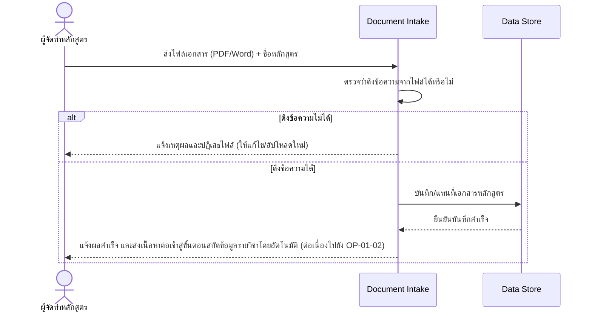

คำอธิบายลำดับขั้นตอน (เรียงตาม diagram ด้านบน):
1. **ส่งไฟล์** — ผู้จัดทำหลักสูตรส่งไฟล์เอกสาร มคอ.2 (PDF/Word) พร้อมชื่อหลักสูตรให้ Document Intake
2. **ตรวจสอบการดึงข้อความ** — Document Intake ตรวจว่าดึงข้อความจากไฟล์ได้หรือไม่
3. **แขนงดึงไม่ได้** — ถ้าดึงข้อความไม่ได้ (เช่น สแกนภาพล้วน) Document Intake ปฏิเสธไฟล์ทันทีพร้อมแจ้งเหตุผลกลับผู้ใช้ ไม่ผ่านเข้าสู่ขั้นตอนตรวจสอบ
4. **แขนงดึงได้** — ถ้าดึงข้อความได้ Document Intake บันทึก/แทนที่เอกสารหลักสูตรลง Data Store, ได้รับการยืนยันบันทึกสำเร็จ แล้วแจ้งผลสำเร็จกลับผู้ใช้พร้อมส่งเนื้อหาต่อเข้าสู่ขั้นตอนสกัดข้อมูลรายวิชาโดยอัตโนมัติ

กฎ/ตรรกะทางธุรกิจเชิงแนวคิดเพิ่มเติม:
- ถ้าหลักสูตรเดียวกันมีไฟล์เอกสารหลักสูตรอยู่แล้วใน Data Store ไฟล์เดิมถูกแทนที่ทันที ไม่เก็บ version history

อ้างอิง: [[api-spec|api-spec]] (OP-01-01) · Entity ที่เกี่ยวข้อง: เอกสารหลักสูตร

### 2.2 ข้อมูลรายวิชาที่สกัดได้

#### OP-01-02 ดึงข้อมูลรายวิชาที่สกัดได้เพื่อตรวจสอบ

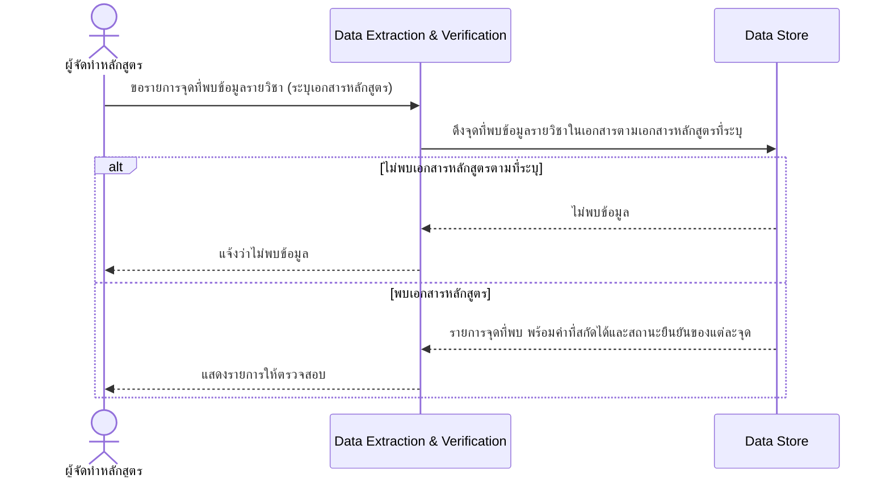

คำอธิบายลำดับขั้นตอน (เรียงตาม diagram ด้านบน):
1. **ขอรายการ** — ผู้จัดทำหลักสูตรขอรายการจุดที่พบข้อมูลรายวิชา โดยระบุเอกสารหลักสูตร ให้ Data Extraction & Verification
2. **ดึงข้อมูล** — Data Extraction & Verification ดึงจุดที่พบข้อมูลรายวิชาในเอกสารตามเอกสารหลักสูตรที่ระบุจาก Data Store
3. **แขนงไม่พบ** — ถ้าไม่พบเอกสารหลักสูตรตามที่ระบุ Data Extraction & Verification แจ้งผู้ใช้ว่าไม่พบข้อมูล
4. **แขนงพบ** — ถ้าพบ Data Store ส่งรายการจุดที่พบพร้อมค่าที่สกัดได้และสถานะยืนยันของแต่ละจุดกลับมา Data Extraction & Verification แสดงรายการนี้ให้ผู้ใช้ตรวจสอบ

กฎ/ตรรกะทางธุรกิจเชิงแนวคิดเพิ่มเติม:
- การกระทำนี้เป็นการอ่านข้อมูลอย่างเดียว ไม่มีการเปลี่ยนแปลงข้อมูลใดๆ ในระบบ

อ้างอิง: [[api-spec|api-spec]] (OP-01-02) · Entity ที่เกี่ยวข้อง: ข้อมูลรายวิชาที่สกัดได้, จุดที่พบข้อมูลรายวิชาในเอกสาร

#### OP-01-03 ยืนยัน/แก้ไขข้อมูลรายวิชาที่สกัดได้

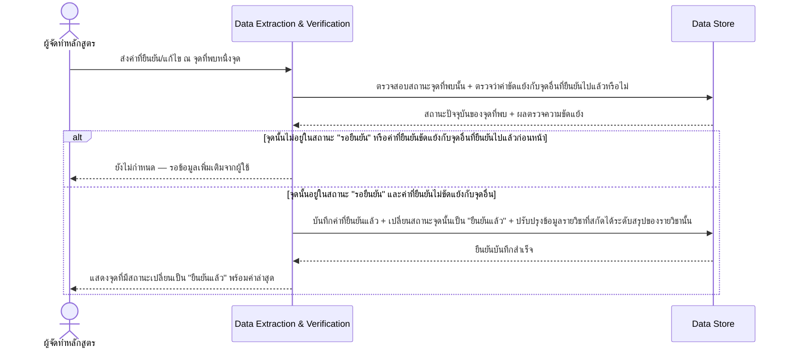

คำอธิบายลำดับขั้นตอน (เรียงตาม diagram ด้านบน):
1. **ส่งค่าที่ยืนยัน/แก้ไข** — ผู้จัดทำหลักสูตรส่งค่าที่ยืนยัน/แก้ไข ณ จุดที่พบหนึ่งจุด ให้ Data Extraction & Verification
2. **ตรวจสอบเงื่อนไข** — Data Extraction & Verification ตรวจสอบสถานะของจุดที่พบนั้นจาก Data Store ว่าอยู่ในสถานะ "รอยืนยัน" หรือไม่ พร้อมตรวจว่าค่าที่ยืนยันขัดแย้งกับจุดอื่นที่ยืนยันไปแล้วก่อนหน้าหรือไม่
3. **แขนงไม่ผ่านเงื่อนไข** — ถ้าจุดนั้นไม่อยู่ในสถานะ "รอยืนยัน" หรือค่าที่ยืนยันขัดแย้งกับจุดอื่นที่ยืนยันไปแล้วก่อนหน้า พฤติกรรมยังไม่กำหนด — รอข้อมูลเพิ่มเติมจากผู้ใช้
4. **แขนงผ่านเงื่อนไข** — ถ้าจุดนั้นอยู่ในสถานะ "รอยืนยัน" และค่าที่ยืนยันไม่ขัดแย้งกับจุดอื่น Data Extraction & Verification บันทึกค่าที่ยืนยันแล้วลง Data Store พร้อมเปลี่ยนสถานะจุดนั้นเป็น "ยืนยันแล้ว" และปรับปรุงข้อมูลรายวิชาที่สกัดได้ระดับสรุปของรายวิชานั้น จากนั้นแสดงจุดที่มีสถานะเปลี่ยนแปลงแล้วกลับผู้ใช้

กฎ/ตรรกะทางธุรกิจเชิงแนวคิดเพิ่มเติม:
- ค่าที่ยืนยันแล้วถูกนำไปปรับปรุงข้อมูลรายวิชาที่สกัดได้ระดับสรุปของรายวิชานั้นเสมอ (ไม่ใช่แค่บันทึกไว้ที่จุดที่พบเพียงจุดเดียว)

อ้างอิง: [[api-spec|api-spec]] (OP-01-03) · Entity ที่เกี่ยวข้อง: จุดที่พบข้อมูลรายวิชาในเอกสาร (และปรับปรุงข้อมูลรายวิชาที่สกัดได้ระดับสรุปโดยอ้อม)

### 2.3 ชุดเกณฑ์ (ฝั่งผู้ใช้งานทั่วไป)

#### OP-02-01 ดึงรายชื่อชุดเกณฑ์ที่เปิดใช้งาน (active)

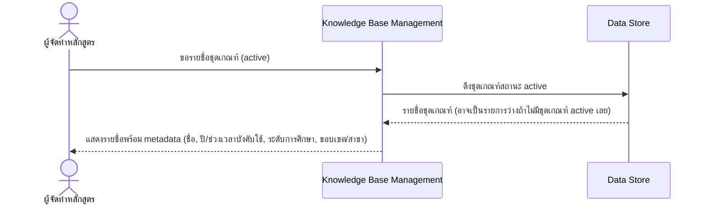

คำอธิบายลำดับขั้นตอน (เรียงตาม diagram ด้านบน):
1. **ขอรายชื่อ** — ผู้จัดทำหลักสูตรขอรายชื่อชุดเกณฑ์สถานะ active จาก Knowledge Base Management
2. **ดึงข้อมูล** — Knowledge Base Management ดึงชุดเกณฑ์สถานะ active จาก Data Store
3. **ส่งกลับ** — Data Store ส่งรายชื่อชุดเกณฑ์กลับมา (ถ้าไม่มีชุดเกณฑ์สถานะ active เลยในระบบ รายการที่ส่งกลับจะเป็นรายการว่าง ซึ่งไม่ใช่ข้อผิดพลาด)
4. **แสดงผล** — Knowledge Base Management แสดงรายชื่อพร้อม metadata (ชื่อ, ปี/ช่วงเวลาที่บังคับใช้, ระดับการศึกษา, ขอบเขต/สาขา) ให้ผู้ใช้

กฎ/ตรรกะทางธุรกิจเชิงแนวคิดเพิ่มเติม:
- operation นี้ไม่มีแขนงพฤติกรรมที่ต่างกัน — กรณีไม่มีชุดเกณฑ์ active เลยในระบบเป็นเพียงผลลัพธ์รายการว่างของ happy path เดียวกัน ไม่ใช่ error flow ที่ต้องแยกแขนง

อ้างอิง: [[api-spec|api-spec]] (OP-02-01) · Entity ที่เกี่ยวข้อง: ชุดเกณฑ์

### 2.4 การตรวจสอบความสอดคล้อง

#### OP-03-01 เริ่มตรวจสอบความสอดคล้อง

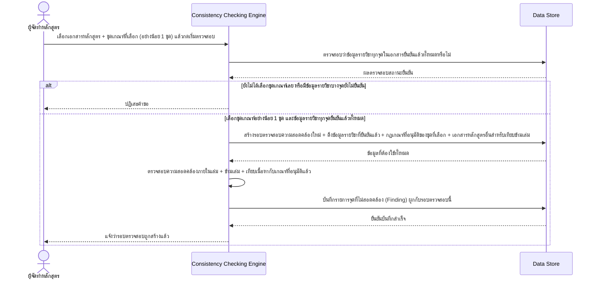

คำอธิบายลำดับขั้นตอน (เรียงตาม diagram ด้านบน):
1. **สั่งเริ่มตรวจสอบ** — ผู้จัดทำหลักสูตรเลือกเอกสารหลักสูตรและชุดเกณฑ์ที่เลือก (อย่างน้อย 1 ชุด) แล้วกดเริ่มตรวจสอบ ส่งให้ Consistency Checking Engine
2. **ตรวจ pre-condition** — Consistency Checking Engine ตรวจสอบจาก Data Store ว่าข้อมูลรายวิชาทุกจุดในเอกสารยืนยันแล้วทั้งหมดหรือไม่ (ประกอบกับเงื่อนไขว่าได้เลือกชุดเกณฑ์อย่างน้อย 1 ชุดหรือไม่)
3. **แขนง pre-condition ไม่ผ่าน** — ถ้ายังไม่ได้เลือกชุดเกณฑ์เลย หรือมีข้อมูลรายวิชาบางจุดยังไม่ยืนยัน Consistency Checking Engine ปฏิเสธคำขอกลับผู้ใช้ทันที ไม่สร้างรอบตรวจสอบ
4. **แขนง pre-condition ผ่าน** — ถ้าผ่านทั้งสองเงื่อนไข Consistency Checking Engine สร้างรอบตรวจสอบความสอดคล้องใหม่ พร้อมดึงข้อมูลรายวิชาที่ยืนยันแล้ว กฎเกณฑ์ที่อนุมัติของชุดที่เลือก และเอกสารหลักสูตรอื่นสำหรับเทียบข้ามเล่ม จาก Data Store
5. **ตรวจสอบความสอดคล้อง** — Consistency Checking Engine ตรวจสอบความสอดคล้องภายในเล่ม ข้ามเล่ม และเทียบเนื้อหากับเกณฑ์ที่อนุมัติแล้ว
6. **บันทึกผล** — Consistency Checking Engine บันทึกรายการจุดที่ไม่สอดคล้อง (Finding) ที่พบทั้งหมดผูกกับรอบตรวจสอบนี้ลง Data Store แล้วแจ้งผู้ใช้ว่ารอบตรวจสอบถูกสร้างแล้ว

กฎ/ตรรกะทางธุรกิจเชิงแนวคิดเพิ่มเติม:
- ไม่อนุญาตให้เริ่มตรวจสอบโดยไม่มีชุดเกณฑ์อ้างอิงเลย (ต้องเลือกอย่างน้อย 1 ชุดเสมอ)
- การตรวจสอบครอบคลุม 3 มิติเสมอในรอบเดียวกัน: ภายในเล่มเดียวกัน, ข้ามเล่มกับเอกสารหลักสูตรอื่นในระบบ, และเทียบเนื้อหาจริงกับกฎเกณฑ์ที่อนุมัติแล้วของชุดเกณฑ์ที่เลือก

อ้างอิง: [[api-spec|api-spec]] (OP-03-01) · Entity ที่เกี่ยวข้อง: รอบตรวจสอบความสอดคล้อง, เอกสารหลักสูตร, ชุดเกณฑ์

#### OP-03-02 ดึงรายงานผลตรวจสอบ

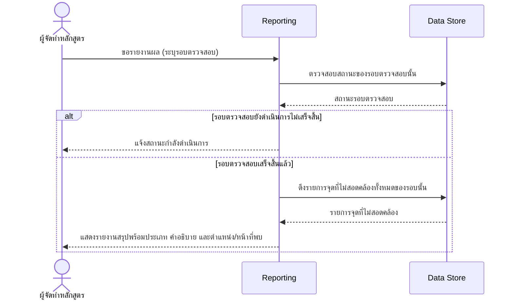

คำอธิบายลำดับขั้นตอน (เรียงตาม diagram ด้านบน):
1. **ขอรายงาน** — ผู้จัดทำหลักสูตรขอรายงานผล โดยระบุรอบตรวจสอบ ให้ Reporting
2. **ตรวจสถานะ** — Reporting ตรวจสอบสถานะของรอบตรวจสอบนั้นจาก Data Store
3. **แขนงยังไม่เสร็จ** — ถ้ารอบตรวจสอบยังดำเนินการไม่เสร็จสิ้น Reporting แจ้งสถานะกำลังดำเนินการกลับผู้ใช้
4. **แขนงเสร็จแล้ว** — ถ้าเสร็จสิ้นแล้ว Reporting ดึงรายการจุดที่ไม่สอดคล้องทั้งหมดของรอบนั้นจาก Data Store แล้วแสดงรายงานสรุปพร้อมประเภท คำอธิบาย และตำแหน่ง/หน้าที่พบ ให้ผู้ใช้

กฎ/ตรรกะทางธุรกิจเชิงแนวคิดเพิ่มเติม:
- (ไม่มีข้อมูลเพิ่มเติมนอกเหนือจาก pre/post-condition ที่ระบุใน [[api-spec|api-spec]])

อ้างอิง: [[api-spec|api-spec]] (OP-03-02) · Entity ที่เกี่ยวข้อง: รอบตรวจสอบความสอดคล้อง, รายการจุดที่ไม่สอดคล้อง

### 2.5 จัดการฐานความรู้เกณฑ์มาตรฐาน (แอดมิน)

#### OP-04-01 สร้างชุดเกณฑ์ใหม่

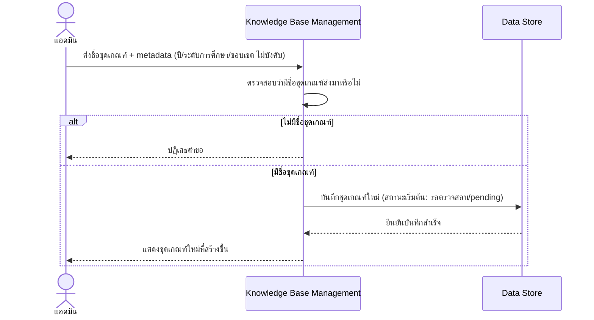

คำอธิบายลำดับขั้นตอน (เรียงตาม diagram ด้านบน):
1. **ส่งข้อมูล** — แอดมินส่งชื่อชุดเกณฑ์พร้อม metadata (ปี/ช่วงเวลาที่บังคับใช้, ระดับการศึกษา, ขอบเขต/สาขา — ทั้งหมดไม่บังคับ) ให้ Knowledge Base Management
2. **ตรวจสอบชื่อ** — Knowledge Base Management ตรวจสอบว่ามีชื่อชุดเกณฑ์ส่งมาหรือไม่
3. **แขนงไม่มีชื่อ** — ถ้าไม่มีชื่อชุดเกณฑ์ Knowledge Base Management ปฏิเสธคำขอกลับแอดมิน
4. **แขนงมีชื่อ** — ถ้ามีชื่อ Knowledge Base Management บันทึกชุดเกณฑ์ใหม่ลง Data Store ด้วยสถานะเริ่มต้น "รอตรวจสอบ (pending)" ได้รับการยืนยันบันทึกสำเร็จ แล้วแสดงชุดเกณฑ์ใหม่ที่สร้างขึ้นกลับแอดมิน

กฎ/ตรรกะทางธุรกิจเชิงแนวคิดเพิ่มเติม:
- ชุดเกณฑ์ใหม่ทุกชุดเริ่มต้นด้วยสถานะ "รอตรวจสอบ (pending)" เสมอ ไม่ปรากฏในรายการที่ผู้ใช้งานทั่วไปเลือกได้ (OP-02-01) จนกว่าจะเปิดใช้งานผ่าน OP-05-03

อ้างอิง: [[api-spec|api-spec]] (OP-04-01) · Entity ที่เกี่ยวข้อง: ชุดเกณฑ์

#### OP-04-02 อัปโหลดเอกสารเกณฑ์มาตรฐานเข้าชุดเกณฑ์

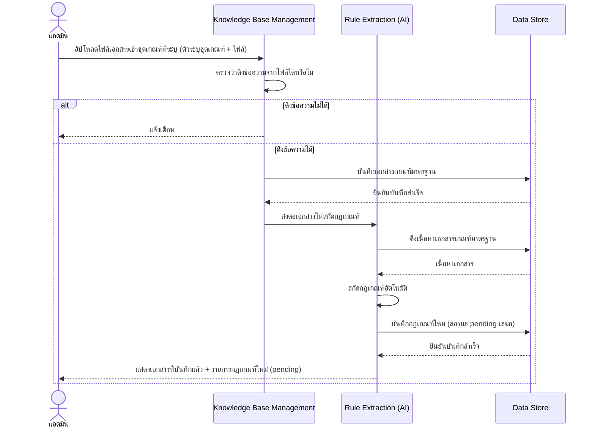

คำอธิบายลำดับขั้นตอน (เรียงตาม diagram ด้านบน):
1. **อัปโหลด** — แอดมินอัปโหลดไฟล์เอกสารเข้าชุดเกณฑ์ที่ระบุ (ตัวระบุชุดเกณฑ์ + ไฟล์) ให้ Knowledge Base Management
2. **ตรวจสอบการดึงข้อความ** — Knowledge Base Management ตรวจว่าดึงข้อความจากไฟล์ได้หรือไม่ (สมมติฐาน: ใช้กติกาเดียวกับ Document Intake ใน OP-01-01)
3. **แขนงดึงไม่ได้** — ถ้าดึงข้อความไม่ได้ Knowledge Base Management แจ้งเตือนแอดมิน
4. **แขนงดึงได้** — ถ้าดึงข้อความได้ Knowledge Base Management บันทึกเอกสารเกณฑ์มาตรฐานลง Data Store แล้วส่งต่อเอกสารให้ Rule Extraction (AI)
5. **ดึงเนื้อหา** — Rule Extraction (AI) ดึงเนื้อหาเอกสารเกณฑ์มาตรฐานจาก Data Store
6. **สกัดกฎเกณฑ์** — Rule Extraction (AI) สกัดกฎเกณฑ์จากเนื้อหาโดยอัตโนมัติ แล้วบันทึกกฎเกณฑ์ใหม่ลง Data Store ด้วยสถานะ pending เสมอ
7. **แสดงผล** — Rule Extraction (AI) แสดงเอกสารที่บันทึกแล้วพร้อมรายการกฎเกณฑ์ใหม่ (pending) กลับแอดมิน

กฎ/ตรรกะทางธุรกิจเชิงแนวคิดเพิ่มเติม:
- กฎเกณฑ์ใหม่ที่สกัดได้ถูกส่งเข้าสถานะ "รอตรวจสอบ (pending)" เสมอ ไม่กระทบกฎเกณฑ์เดิมของชุดเกณฑ์นั้นที่อนุมัติแล้ว แม้ชุดเกณฑ์จะมีสถานะ active อยู่ก่อนแล้วก็ตาม (ชุดเกณฑ์ไม่ถูกเปลี่ยนกลับเป็น pending จากการอัปโหลดเอกสารเพิ่ม)

อ้างอิง: [[api-spec|api-spec]] (OP-04-02) · Entity ที่เกี่ยวข้อง: เอกสารเกณฑ์มาตรฐาน, กฎเกณฑ์, ชุดเกณฑ์

### 2.6 ตรวจสอบและอนุมัติกฎเกณฑ์ (แอดมิน)

#### OP-05-01 ดึงรายการกฎเกณฑ์ที่รอตรวจสอบของชุดเกณฑ์

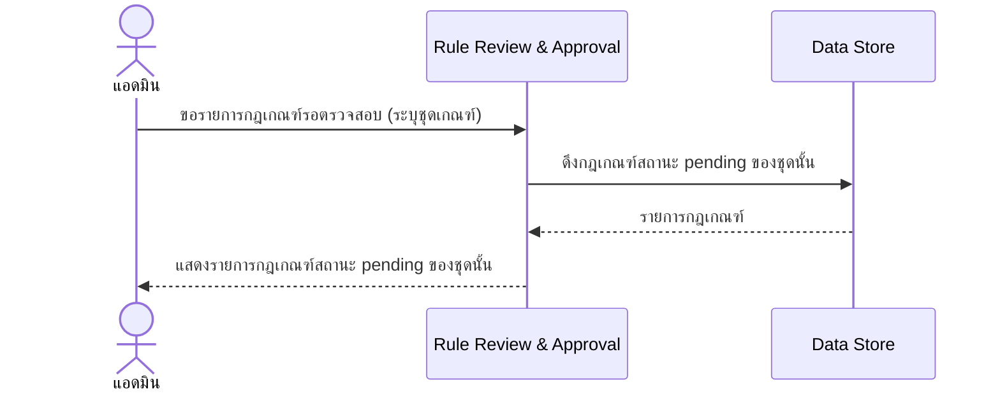

คำอธิบายลำดับขั้นตอน (เรียงตาม diagram ด้านบน):
1. **ขอรายการ** — แอดมินขอรายการกฎเกณฑ์รอตรวจสอบ โดยระบุชุดเกณฑ์ ให้ Rule Review & Approval
2. **ดึงข้อมูล** — Rule Review & Approval ดึงกฎเกณฑ์สถานะ pending ของชุดนั้นจาก Data Store
3. **แสดงผล** — Rule Review & Approval แสดงรายการกฎเกณฑ์สถานะ pending ของชุดนั้นกลับแอดมิน

กฎ/ตรรกะทางธุรกิจเชิงแนวคิดเพิ่มเติม:
- (ไม่มีข้อมูลเพิ่มเติมนอกเหนือจาก pre/post-condition ที่ระบุใน [[api-spec|api-spec]]; operation นี้ไม่มีกรณีข้อผิดพลาดระบุไว้)

อ้างอิง: [[api-spec|api-spec]] (OP-05-01) · Entity ที่เกี่ยวข้อง: กฎเกณฑ์, ชุดเกณฑ์

#### OP-05-02 แก้ไขเนื้อหากฎเกณฑ์ที่ AI สกัดมา

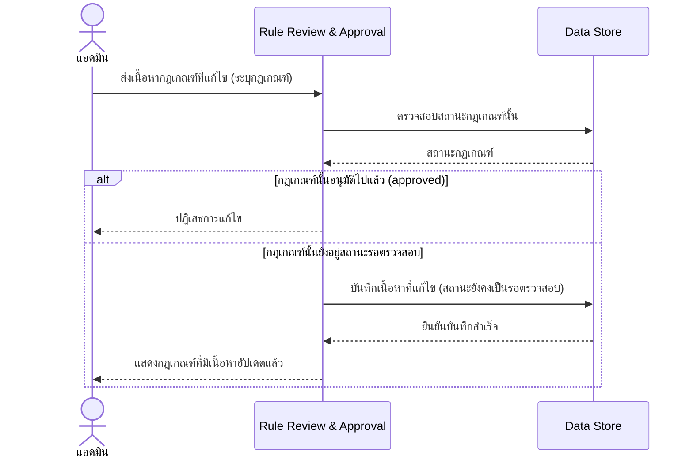

คำอธิบายลำดับขั้นตอน (เรียงตาม diagram ด้านบน):
1. **ส่งเนื้อหาที่แก้ไข** — แอดมินส่งเนื้อหากฎเกณฑ์ที่แก้ไข โดยระบุกฎเกณฑ์ ให้ Rule Review & Approval
2. **ตรวจสอบสถานะ** — Rule Review & Approval ตรวจสอบสถานะของกฎเกณฑ์นั้นจาก Data Store
3. **แขนงอนุมัติไปแล้ว** — ถ้ากฎเกณฑ์นั้นอนุมัติไปแล้ว (approved) Rule Review & Approval ปฏิเสธการแก้ไขกลับแอดมิน
4. **แขนงรอตรวจสอบ** — ถ้ากฎเกณฑ์นั้นยังอยู่สถานะรอตรวจสอบ Rule Review & Approval บันทึกเนื้อหาที่แก้ไขลง Data Store (สถานะยังคงเป็นรอตรวจสอบ) ได้รับยืนยันบันทึกสำเร็จ แล้วแสดงกฎเกณฑ์ที่มีเนื้อหาอัปเดตแล้วกลับแอดมิน

กฎ/ตรรกะทางธุรกิจเชิงแนวคิดเพิ่มเติม:
- การแก้ไขเนื้อหาไม่เปลี่ยนสถานะของกฎเกณฑ์ (ยังคงเป็นรอตรวจสอบเสมอหลังแก้ไข จนกว่าจะถูกอนุมัติผ่าน OP-05-03 แยกต่างหาก)

อ้างอิง: [[api-spec|api-spec]] (OP-05-02) · Entity ที่เกี่ยวข้อง: กฎเกณฑ์

#### OP-05-03 อนุมัติกฎเกณฑ์ (รายข้อหรือ bulk)

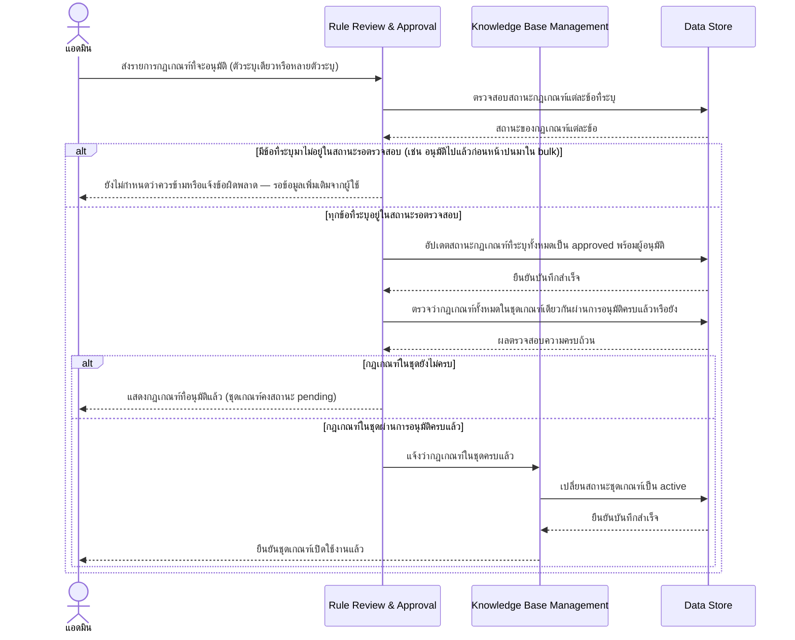

คำอธิบายลำดับขั้นตอน (เรียงตาม diagram ด้านบน):
1. **ส่งรายการที่จะอนุมัติ** — แอดมินส่งรายการกฎเกณฑ์ที่จะอนุมัติ (ตัวระบุเดียวหรือหลายตัวระบุ) ให้ Rule Review & Approval
2. **ตรวจสอบสถานะรายข้อ** — Rule Review & Approval ตรวจสอบสถานะของกฎเกณฑ์แต่ละข้อที่ระบุจาก Data Store (ชั้นที่ 1)
3. **แขนงมีข้อที่ไม่พร้อมอนุมัติ** — ถ้ามีข้อที่ระบุมาไม่อยู่ในสถานะรอตรวจสอบ (เช่น อนุมัติไปแล้วก่อนหน้าปนมาใน bulk) พฤติกรรมยังไม่กำหนดว่าควรข้ามหรือแจ้งข้อผิดพลาด — รอข้อมูลเพิ่มเติมจากผู้ใช้
4. **แขนงทุกข้อพร้อมอนุมัติ** — ถ้าทุกข้อที่ระบุอยู่ในสถานะรอตรวจสอบ Rule Review & Approval อัปเดตสถานะกฎเกณฑ์ที่ระบุทั้งหมดเป็น approved พร้อมบันทึกผู้อนุมัติลง Data Store
5. **ตรวจความครบถ้วนของชุด** — Rule Review & Approval ตรวจสอบต่อว่ากฎเกณฑ์ทั้งหมดในชุดเกณฑ์เดียวกันผ่านการอนุมัติครบแล้วหรือยัง (ชั้นที่ 2 ซ้อนอยู่ในแขนงที่ 4)
6. **แขนงยังไม่ครบ** — ถ้ากฎเกณฑ์ในชุดยังไม่ครบ Rule Review & Approval แสดงกฎเกณฑ์ที่อนุมัติแล้วกลับแอดมิน โดยชุดเกณฑ์ยังคงสถานะ pending
7. **แขนงครบแล้ว** — ถ้ากฎเกณฑ์ในชุดผ่านการอนุมัติครบแล้ว Rule Review & Approval แจ้ง Knowledge Base Management ซึ่งเปลี่ยนสถานะชุดเกณฑ์เป็น active ลง Data Store แล้วยืนยันกลับแอดมินว่าชุดเกณฑ์เปิดใช้งานแล้ว

กฎ/ตรรกะทางธุรกิจเชิงแนวคิดเพิ่มเติม:
- มีการตัดสินใจ 2 ชั้นซ้อนกันในลำดับเดียวกัน: ชั้นที่ 1 ตรวจความพร้อมของกฎเกณฑ์แต่ละข้อที่ระบุมาก่อนอนุมัติ, ชั้นที่ 2 (เกิดขึ้นเฉพาะเมื่อชั้นที่ 1 ผ่าน) ตรวจว่ากฎเกณฑ์ทั้งหมดในชุดเกณฑ์เดียวกันครบหรือยัง เพื่อตัดสินใจว่าจะเปิดใช้งานชุดเกณฑ์โดยอัตโนมัติหรือไม่
- การเปลี่ยนสถานะชุดเกณฑ์เป็น active เกิดขึ้นโดยอัตโนมัติ ไม่ต้องมีการกระทำเพิ่มเติมจากแอดมิน เมื่อกฎเกณฑ์ทั้งหมดในชุดผ่านการอนุมัติครบ

อ้างอิง: [[api-spec|api-spec]] (OP-05-03) · Entity ที่เกี่ยวข้อง: กฎเกณฑ์, ชุดเกณฑ์

### 2.7 แชทบอทให้คำแนะนำ (Advisory Chatbot)

#### OP-06-01 เริ่มสนทนากับแชทบอท (เลือกชุดเกณฑ์)

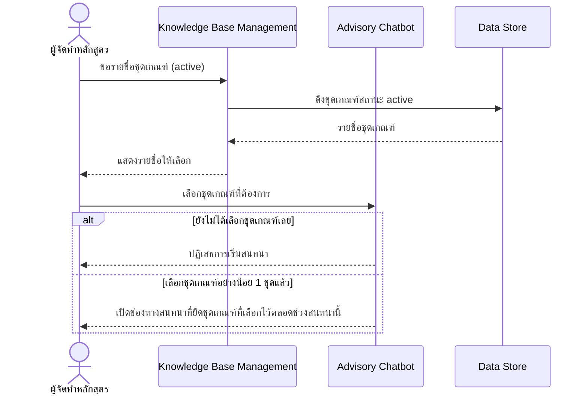

คำอธิบายลำดับขั้นตอน (เรียงตาม diagram ด้านบน):
1. **ขอรายชื่อชุดเกณฑ์** — ผู้จัดทำหลักสูตรขอรายชื่อชุดเกณฑ์สถานะ active จาก Knowledge Base Management
2. **ดึงและแสดงรายชื่อ** — Knowledge Base Management ดึงชุดเกณฑ์สถานะ active จาก Data Store แล้วแสดงรายชื่อให้ผู้ใช้เลือก
3. **เลือกชุดเกณฑ์** — ผู้ใช้เลือกชุดเกณฑ์ที่ต้องการ ส่งให้ Advisory Chatbot
4. **แขนงยังไม่เลือก** — ถ้ายังไม่ได้เลือกชุดเกณฑ์เลย Advisory Chatbot ปฏิเสธการเริ่มสนทนากลับผู้ใช้
5. **แขนงเลือกแล้ว** — ถ้าเลือกชุดเกณฑ์อย่างน้อย 1 ชุดแล้ว Advisory Chatbot เปิดช่องทางสนทนาที่ยึดชุดเกณฑ์ที่เลือกไว้ตลอดช่วงสนทนานี้กลับผู้ใช้

กฎ/ตรรกะทางธุรกิจเชิงแนวคิดเพิ่มเติม:
- ชุดเกณฑ์ที่เลือกไว้ ณ ขั้นตอนนี้ถูกยึดไว้ตลอดช่วงสนทนา ใช้เป็นขอบเขตฐานความรู้ให้ทั้ง OP-06-02 และ OP-06-03 ในสนทนาเดียวกันอ้างอิงต่อ
- ไม่มี entity การสนทนาในสคีมา เนื่องจากไม่มีการบันทึกเนื้อหาสนทนาถาวร (ดู [[database-schema|database-schema]])

อ้างอิง: [[api-spec|api-spec]] (OP-06-01) · Entity ที่เกี่ยวข้อง: ชุดเกณฑ์ (อ้างอิงอย่างเดียว — ไม่มี entity การสนทนาในสคีมา)

#### OP-06-02 ถามคำถามทั่วไปเกี่ยวกับเกณฑ์มาตรฐาน (Q&A)

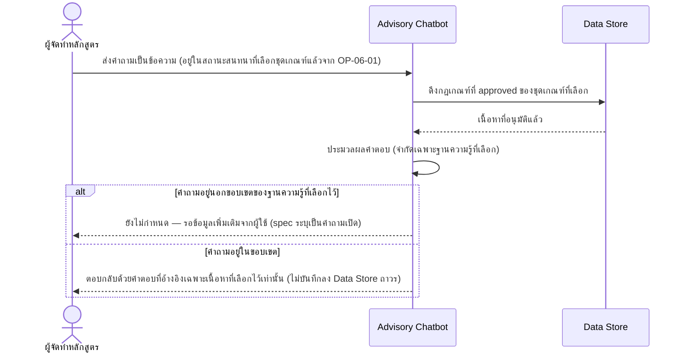

คำอธิบายลำดับขั้นตอน (เรียงตาม diagram ด้านบน):
1. **ส่งคำถาม** — ผู้จัดทำหลักสูตรส่งคำถามเป็นข้อความให้ Advisory Chatbot (ต้องอยู่ในสถานะสนทนาที่เลือกชุดเกณฑ์แล้วจาก OP-06-01)
2. **ดึงฐานความรู้** — Advisory Chatbot ดึงกฎเกณฑ์ที่สถานะ approved ของชุดเกณฑ์ที่เลือกจาก Data Store
3. **ประมวลผล** — Advisory Chatbot ประมวลผลคำตอบ โดยจำกัดเฉพาะฐานความรู้ที่เลือกไว้
4. **แขนงนอกขอบเขต** — ถ้าคำถามอยู่นอกขอบเขตของฐานความรู้ที่เลือกไว้ พฤติกรรมยังไม่กำหนด — รอข้อมูลเพิ่มเติมจากผู้ใช้ (spec ระบุเป็นคำถามเปิด)
5. **แขนงในขอบเขต** — ถ้าคำถามอยู่ในขอบเขต Advisory Chatbot ตอบกลับผู้ใช้ด้วยคำตอบที่อ้างอิงเฉพาะเนื้อหาที่เลือกไว้เท่านั้น

กฎ/ตรรกะทางธุรกิจเชิงแนวคิดเพิ่มเติม:
- เนื้อหาคำถาม/คำตอบของ operation นี้ไม่ถูกบันทึกลง Data Store แบบถาวร ไม่กลายเป็นส่วนหนึ่งของฐานความรู้

อ้างอิง: [[api-spec|api-spec]] (OP-06-02) · Entity ที่เกี่ยวข้อง: กฎเกณฑ์ (เฉพาะสถานะ approved ของชุดเกณฑ์ที่เลือกในสนทนานี้)

#### OP-06-03 ส่งเนื้อหาร่างบางส่วนเพื่อขอคำแนะนำแบบทันที

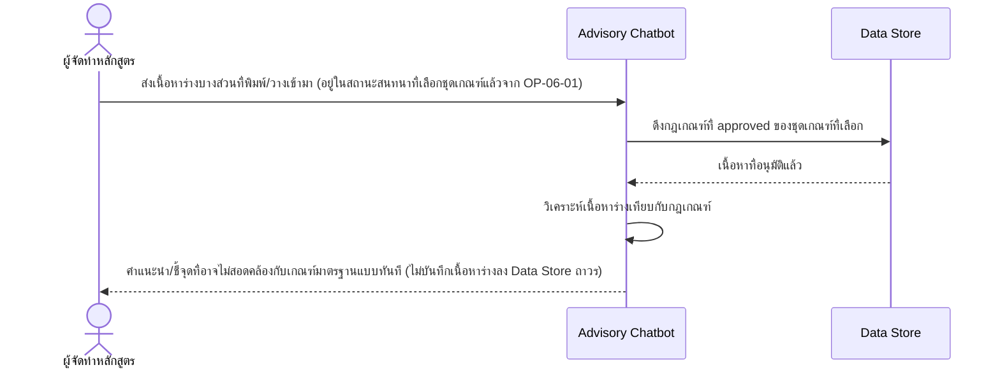

คำอธิบายลำดับขั้นตอน (เรียงตาม diagram ด้านบน):
1. **ส่งเนื้อหาร่าง** — ผู้จัดทำหลักสูตรส่งเนื้อหาร่างบางส่วนที่พิมพ์/วางเข้ามาให้ Advisory Chatbot (ต้องอยู่ในสถานะสนทนาที่เลือกชุดเกณฑ์แล้วจาก OP-06-01)
2. **ดึงฐานความรู้** — Advisory Chatbot ดึงกฎเกณฑ์ที่สถานะ approved ของชุดเกณฑ์ที่เลือกจาก Data Store
3. **วิเคราะห์** — Advisory Chatbot วิเคราะห์เนื้อหาร่างเทียบกับกฎเกณฑ์ที่ดึงมา
4. **ตอบกลับ** — Advisory Chatbot ให้คำแนะนำ/ชี้จุดที่อาจไม่สอดคล้องกับเกณฑ์มาตรฐานแบบทันทีกลับผู้ใช้

กฎ/ตรรกะทางธุรกิจเชิงแนวคิดเพิ่มเติม:
- ไม่บันทึกเนื้อหาร่างที่ส่งเข้ามาลง Data Store แบบถาวร และไม่นำไปอ้างอิงต่อในสนทนาของผู้ใช้คนอื่นหรือครั้งอื่น
- ผลลัพธ์นี้เป็นเพียงคำแนะนำเบื้องต้น ไม่ใช่ผลตรวจสอบอย่างเป็นทางการ และไม่ทดแทนการตรวจสอบผ่าน OP-03-01

อ้างอิง: [[api-spec|api-spec]] (OP-06-03) · Entity ที่เกี่ยวข้อง: กฎเกณฑ์ (เฉพาะสถานะ approved ของชุดเกณฑ์ที่เลือกในสนทนานี้)

## สมมติฐาน / คำถามที่เปิดไว้

- OP-01-03 (ยืนยัน/แก้ไขข้อมูลรายวิชาที่สกัดได้): พฤติกรรมเมื่อจุดที่พบไม่อยู่ในสถานะ "รอยืนยัน" หรือค่าที่ยืนยันขัดแย้งกับจุดอื่นที่ยืนยันไปแล้วก่อนหน้า ยังไม่กำหนด — รอข้อมูลเพิ่มเติมจากผู้ใช้ (สอดคล้องกับหัวข้อสมมติฐานของ [[api-spec|api-spec]])
- OP-04-02 (อัปโหลดเอกสารเกณฑ์มาตรฐานเข้าชุดเกณฑ์): กติกาการตรวจว่าดึงข้อความจากไฟล์ได้หรือไม่ ใช้สมมติฐานเดียวกับ Document Intake ใน OP-01-01 ตามที่ [[api-spec|api-spec]] ระบุไว้ตรงๆ ยังไม่มีการยืนยันแยกเฉพาะฝั่งเอกสารเกณฑ์มาตรฐาน
- OP-05-03 (อนุมัติกฎเกณฑ์): พฤติกรรมเมื่อ bulk approve มีบางข้อที่อนุมัติไปแล้วก่อนหน้าปนมา ยังไม่กำหนดว่าควรข้ามหรือแจ้งข้อผิดพลาด — รอข้อมูลเพิ่มเติมจากผู้ใช้ (สอดคล้องกับหัวข้อสมมติฐานของ [[api-spec|api-spec]])
- OP-06-02 (ถามคำถามทั่วไปเกี่ยวกับเกณฑ์มาตรฐาน): พฤติกรรมเมื่อคำถามอยู่นอกขอบเขตของฐานความรู้ที่เลือกไว้ ยังไม่กำหนด — spec ระบุเป็นคำถามเปิด (สอดคล้องกับหัวข้อสมมติฐานของ [[api-spec|api-spec]])
- รูปแบบผลลัพธ์ของ OP-06-03 (freeform หรือมีโครงสร้าง) ยังไม่ได้รับการยืนยัน ตามที่ระบุไว้ใน [[api-spec|api-spec]] — เอกสารนี้จึงแสดงเพียงเนื้อหาความหมาย ไม่ระบุรูปแบบผลลัพธ์ที่ชัดเจน

---
[[index|02-technical]] · [[api-spec|api-spec]] · [[database-schema|database-schema]] · [[high-level-architecture|high-level-architecture]]
