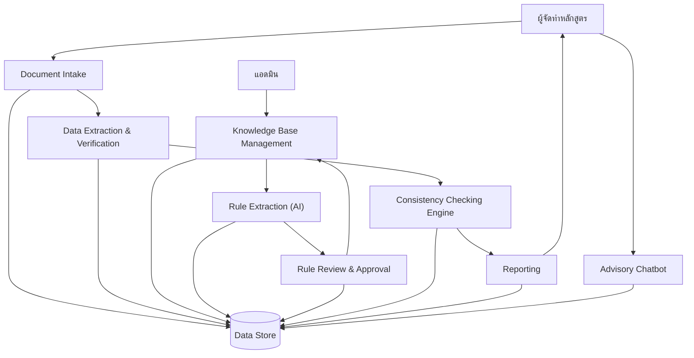
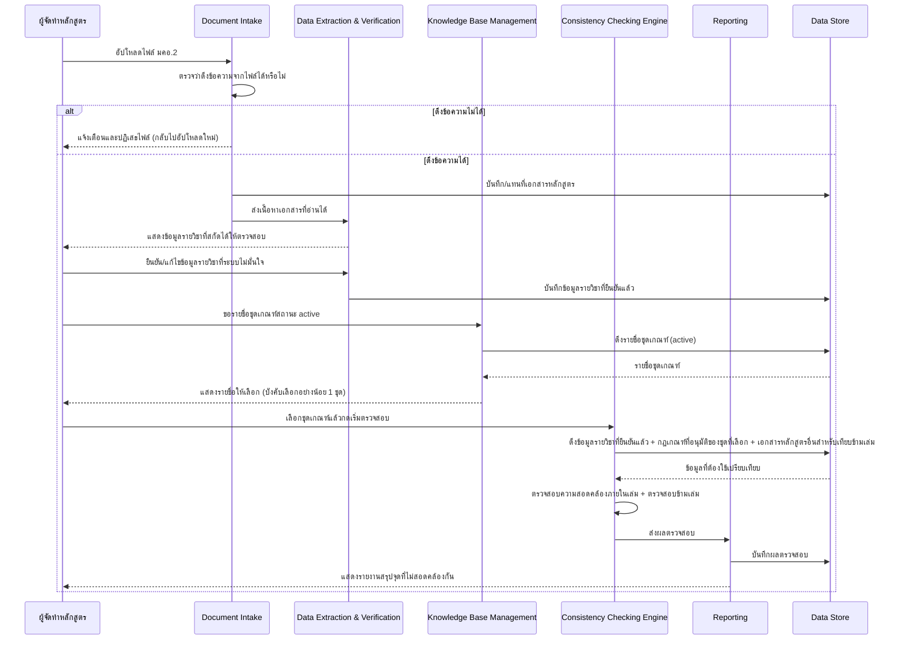
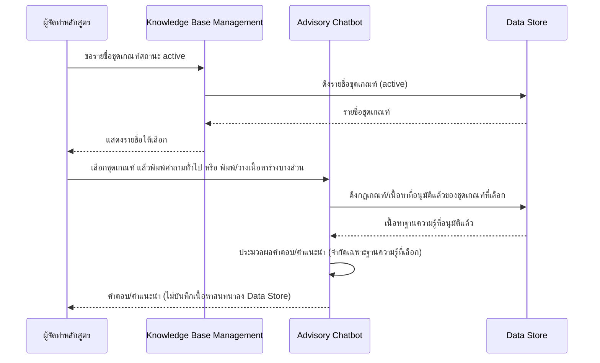
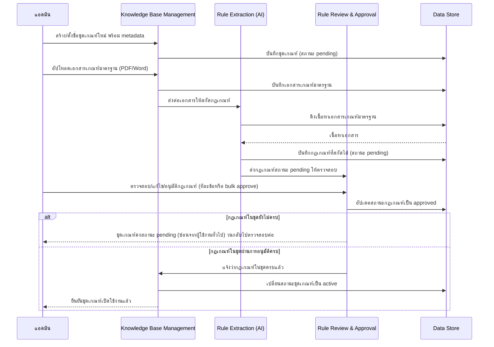

# High-Level Architecture

> เอกสารนี้เป็น **conceptual architecture** สื่อสารภาพรวมของระบบและการไหลของข้อมูล **ไม่ผูกมัดกับ technical stack** — ห้ามระบุชื่อเทคโนโลยี/framework/library/database product เฉพาะเจาะจงในเอกสารนี้ รายละเอียดเชิงเทคนิคจริง (database schema, API design, การเลือกเทคโนโลยี) ให้ดูในเอกสารแยกอื่นใน [[index|02-technical]]

อ้างอิงจาก [[../../01-requirements/01-spec/index|01-spec]] และ [[../../01-requirements/02-plan/feature-list|feature-list]] ส่วน user journey ต้นทางของ data flow แต่ละเส้นดูได้ที่ [[../01-prototypes/index|01-prototypes]]

## 1. ภาพรวมและหลักการออกแบบ

Curmate คือระบบที่ช่วยตรวจสอบความสอดคล้องของเอกสารรายละเอียดหลักสูตร (มคอ.2) กับเกณฑ์มาตรฐานที่กำหนด รวมถึงให้คำแนะนำระหว่างการจัดทำหลักสูตรผ่านแชทบอท โดยมีผู้ใช้งาน 2 กลุ่มหลัก คือ **ผู้จัดทำหลักสูตร** (เจ้าหน้าที่/อาจารย์) ซึ่งอัปโหลดและตรวจสอบเอกสาร และ **แอดมิน** ซึ่งดูแลฐานความรู้เกณฑ์มาตรฐานที่ใช้เป็นไม้บรรทัดในการตรวจสอบ

หลักการออกแบบเชิงแนวคิดที่ยึดถือ:

- **แยกส่วนรับผิดชอบตามขั้นตอนของกระบวนการ** — การรับไฟล์ (Document Intake) การสกัด/ยืนยันข้อมูล (Data Extraction & Verification) และการตรวจสอบความสอดคล้องจริง (Consistency Checking Engine) เป็นความรับผิดชอบที่แยกจากกัน เพื่อให้แต่ละขั้นตอนตรวจสอบและควบคุมคุณภาพข้อมูลก่อนส่งต่อขั้นถัดไปได้ชัดเจน
- **มนุษย์ยืนยันก่อน AI นำไปใช้จริงเสมอ** — ทั้งข้อมูลรายวิชาที่ AI สกัดจากเอกสาร มคอ.2 (ต้องผ่านการยืนยันของผู้จัดทำหลักสูตรก่อน) และกฎเกณฑ์ที่ AI สกัดจากเอกสารเกณฑ์มาตรฐาน (ต้องผ่านการอนุมัติของแอดมินก่อน) จะไม่ถูกนำไปใช้งานจริงในระบบจนกว่าจะผ่านการยืนยัน/อนุมัติจากมนุษย์
- **ขอบเขตสถานะข้อมูลชัดเจน** — ข้อมูล/กฎเกณฑ์ที่ยังอยู่สถานะ "รอตรวจสอบ (pending)" ต้องไม่ปรากฏหรือถูกใช้งานในส่วนที่ผู้ใช้งานทั่วไปเข้าถึง
- **Data Store เป็นจุดกลางเชิงแนวคิด** — ทุก component อ่าน/เขียนผ่านจุดเก็บข้อมูลกลางเดียวกัน โดยไม่ผูกมัดว่าจะใช้เทคโนโลยีจัดเก็บข้อมูลชนิดใด

## 2. Diagram ภาพรวมระบบ (System Context)

## 3. คำอธิบาย Component/Actor

เรียงลำดับตามโหนดใน diagram ข้อ 2:

1. **ผู้จัดทำหลักสูตร** — เจ้าหน้าที่/อาจารย์ผู้จัดทำหลักสูตร ผู้ใช้งานหลักที่อัปโหลดเอกสาร มคอ.2 ยืนยันข้อมูลที่สกัดได้ เลือกชุดเกณฑ์ กดเริ่มตรวจสอบ ดูรายงานผล และใช้แชทบอทขอคำแนะนำระหว่างร่างหลักสูตร
2. **Document Intake** — รับไฟล์เอกสารหลักสูตร มคอ.2 (PDF/Word) ทีละ 1 ไฟล์ ตรวจสอบว่าดึงข้อความจากไฟล์ได้หรือไม่ (ปฏิเสธไฟล์ตั้งแต่ขั้นนี้หากดึงไม่ได้) และแทนที่ไฟล์เดิมทันทีเมื่ออัปโหลดซ้ำ (ไม่เก็บ version history) ไม่ทำหน้าที่ตีความ/สกัดเนื้อหาเชิงความหมายใดๆ
3. **Data Extraction & Verification** — สกัดข้อมูลรายวิชา (รหัสวิชา ชื่อรายวิชา หน่วยกิต คำอธิบายรายวิชา) จากทุกจุดที่ปรากฏซ้ำในเล่มเดียวกัน แสดงให้ผู้จัดทำหลักสูตรตรวจสอบ ยืนยัน หรือแก้ไขจุดที่ระบบดึงข้อมูลมาไม่มั่นใจ ก่อนส่งต่อเข้าสู่ขั้นตอนตรวจสอบความสอดคล้องจริง เป็นกลไกที่ทำให้มนุษย์ยืนยันความถูกต้องของสิ่งที่ระบบตีความก่อนนำไปใช้งานจริง
4. **Consistency Checking Engine** — ตรวจสอบความสอดคล้องภายในเล่มเดียวกัน (ใช้ข้อมูลที่ยืนยันแล้วจาก Data Extraction & Verification เท่านั้น) ตรวจสอบความสอดคล้อง/ซ้ำซ้อนข้ามเล่มหลักสูตร และตรวจสอบเนื้อหาจริงของหลักสูตรเทียบกับกฎเกณฑ์ที่อนุมัติแล้ว
5. **Advisory Chatbot** — ตอบคำถามทั่วไปเกี่ยวกับเนื้อหาเกณฑ์มาตรฐาน (Q&A) และให้คำแนะนำแบบทันทีต่อเนื้อหาร่างบางส่วนที่ผู้ใช้พิมพ์/วางเข้ามา โดยจำกัดเฉพาะเนื้อหาในฐานความรู้ของชุดเกณฑ์ที่เลือกไว้เท่านั้น ไม่บันทึกเนื้อหาสนทนาเป็นความรู้ถาวร
6. **แอดมิน** — ผู้ดูแลฐานความรู้เกณฑ์มาตรฐาน สร้างชุดเกณฑ์ อัปโหลดเอกสารเกณฑ์ และตรวจสอบ/อนุมัติกฎเกณฑ์ที่ AI สกัดมา ก่อนเปิดให้ผู้จัดทำหลักสูตรใช้งานจริง
7. **Knowledge Base Management** — ให้แอดมินสร้าง/ตั้งชื่อ "ชุดเกณฑ์" (criteria set) พร้อม metadata (ปี พ.ศ./ช่วงเวลาบังคับใช้, ระดับการศึกษา, ขอบเขต/สาขา) รับเอกสารเกณฑ์มาตรฐาน (PDF/Word) หลายไฟล์สะสมเข้าชุดเกณฑ์ และควบคุมสถานะชุดเกณฑ์ (pending/active) รวมถึงเปิดเผยรายชื่อชุดเกณฑ์สถานะ active ให้ผู้จัดทำหลักสูตรเลือกใช้
8. **Rule Extraction (AI)** — สกัด "กฎเกณฑ์" จากเอกสารเกณฑ์มาตรฐานที่อัปโหลดเข้ามาโดยอัตโนมัติ ส่งเข้าสถานะ "รอตรวจสอบ (pending)" เสมอ ไม่มีสิทธิ์ทำให้กฎเกณฑ์มีผลใช้งานจริงได้เอง
9. **Rule Review & Approval** — ให้แอดมินตรวจสอบ/แก้ไข/อนุมัติกฎเกณฑ์ที่ AI สกัดมา (รองรับอนุมัติทีละข้อและ bulk approve) เป็นเกตเดียวที่ทำให้กฎเกณฑ์เปลี่ยนจากสถานะ pending เป็นใช้งานได้จริง
10. **Reporting** — สร้างรายงานสรุปจุดที่ไม่สอดคล้องกันเป็นรายการ (list) พร้อมตำแหน่ง/หน้าที่พบ จากผลลัพธ์ของ Consistency Checking Engine
11. **Data Store** — ที่เก็บข้อมูลกลางเชิงแนวคิด (ไม่ระบุเทคโนโลยี) เก็บเอกสารหลักสูตร ชุดเกณฑ์พร้อม metadata และสถานะ เอกสารเกณฑ์มาตรฐาน กฎเกณฑ์ (pending/approved) ข้อมูลรายวิชาที่สกัด/ยืนยันแล้ว และผลตรวจสอบ ทุก component อ่าน/เขียนผ่านจุดนี้เป็นศูนย์กลาง

## 4. Data Flow ตาม User Journey

### 4.1 ผู้จัดทำหลักสูตร อัปโหลดและตรวจสอบเอกสาร มคอ.2

อ้างอิงจาก [[../01-prototypes/20260823-01-user-journey-course-coordinator-upload|ผู้จัดทำหลักสูตร อัปโหลดและตรวจสอบเอกสาร มคอ.2]]

คำอธิบายลำดับการไหลของข้อมูล (เรียงตาม diagram ด้านบน):
1. **อัปโหลดไฟล์** — ผู้จัดทำหลักสูตรอัปโหลดไฟล์ มคอ.2 (PDF/Word) ทีละ 1 ไฟล์ให้ Document Intake
2. **ตรวจสอบการดึงข้อความ** — Document Intake ตรวจว่าดึงข้อความจากไฟล์ได้หรือไม่ ถ้าไม่ได้จะแจ้งเตือน/ปฏิเสธไฟล์และวนกลับให้อัปโหลดใหม่ ถ้าได้จะบันทึก/แทนที่เอกสารหลักสูตรใน Data Store แล้วส่งเนื้อหาต่อให้ Data Extraction & Verification
3. **สกัดและยืนยันข้อมูลรายวิชา** — Data Extraction & Verification สกัดข้อมูลรายวิชาจากทุกจุดในเล่ม แสดงให้ผู้จัดทำหลักสูตรตรวจสอบ ผู้ใช้ยืนยัน/แก้ไขจุดที่ระบบไม่มั่นใจ จากนั้นข้อมูลที่ยืนยันแล้วจึงถูกบันทึกลง Data Store
4. **เลือกชุดเกณฑ์** — ผู้ใช้ขอรายชื่อชุดเกณฑ์จาก Knowledge Base Management ซึ่งดึงเฉพาะชุดเกณฑ์สถานะ active จาก Data Store มาแสดง ผู้ใช้เลือกอย่างน้อย 1 ชุด
5. **เริ่มตรวจสอบ** — ผู้ใช้กดเริ่มตรวจสอบ ส่งคำสั่งเข้า Consistency Checking Engine ซึ่งดึงข้อมูลรายวิชาที่ยืนยันแล้ว กฎเกณฑ์ที่อนุมัติแล้วของชุดที่เลือก และเอกสารหลักสูตรอื่นสำหรับเทียบข้ามเล่ม จาก Data Store
6. **ตรวจสอบความสอดคล้อง** — Consistency Checking Engine ตรวจสอบภายในเล่มเดียวกันและตรวจสอบ/ซ้ำซ้อนข้ามเล่มหลักสูตร แล้วส่งผลลัพธ์ให้ Reporting
7. **แสดงรายงาน** — Reporting บันทึกผลตรวจสอบลง Data Store และแสดงรายงานสรุปจุดที่ไม่สอดคล้องกันกลับไปยังผู้จัดทำหลักสูตร

### 4.2 ผู้จัดทำหลักสูตร ขอคำแนะนำระหว่างร่างหลักสูตรผ่านแชทบอท

อ้างอิงจาก [[../01-prototypes/20260823-02-user-journey-course-coordinator-chatbot-advisory|ผู้จัดทำหลักสูตร ขอคำแนะนำระหว่างร่างหลักสูตรผ่านแชทบอท]]

คำอธิบายลำดับการไหลของข้อมูล (เรียงตาม diagram ด้านบน):
1. **เลือกชุดเกณฑ์ก่อนเริ่มสนทนา** — ผู้จัดทำหลักสูตรเปิดช่องทางสนทนา ขอรายชื่อชุดเกณฑ์จาก Knowledge Base Management ซึ่งดึงเฉพาะชุดเกณฑ์สถานะ active จาก Data Store มาแสดง แล้วเลือกชุดที่ต้องการอ้างอิง
2. **ส่งคำถาม/เนื้อหาร่าง** — ผู้ใช้ส่งคำถามทั่วไปเกี่ยวกับเกณฑ์ หรือพิมพ์/วางเนื้อหาร่างบางส่วนที่กำลังเขียนเข้าสู่ Advisory Chatbot ทั้งสองแขนงมาบรรจบที่ Advisory Chatbot
3. **ดึงฐานความรู้ที่อนุมัติแล้ว** — Advisory Chatbot ดึงเฉพาะกฎเกณฑ์/เนื้อหาที่อนุมัติแล้วของชุดเกณฑ์ที่เลือกจาก Data Store มาใช้ประมวลผล (ไม่ใช้เนื้อหาสถานะ pending และไม่ใช้เนื้อหาของชุดเกณฑ์อื่นที่ไม่ได้เลือก)
4. **ตอบกลับผู้ใช้** — Advisory Chatbot ส่งคำตอบ/คำแนะนำกลับไปยังผู้จัดทำหลักสูตร โดยไม่บันทึกเนื้อหาสนทนากลับเข้า Data Store แบบถาวร

### 4.3 แอดมิน จัดการฐานความรู้เกณฑ์มาตรฐานหลักสูตร

อ้างอิงจาก [[../01-prototypes/20260823-03-user-journey-admin-manage-criteria-knowledge-base|แอดมิน จัดการฐานความรู้เกณฑ์มาตรฐานหลักสูตร]]

คำอธิบายลำดับการไหลของข้อมูล (เรียงตาม diagram ด้านบน):
1. **สร้างชุดเกณฑ์** — แอดมินสร้าง/ตั้งชื่อชุดเกณฑ์ใหม่พร้อม metadata (ปี/ระดับการศึกษา/ขอบเขต) ผ่าน Knowledge Base Management ซึ่งบันทึกลง Data Store ด้วยสถานะ pending
2. **อัปโหลดเอกสารเกณฑ์** — แอดมินอัปโหลดเอกสารเกณฑ์มาตรฐาน (PDF/Word) เข้าชุดเกณฑ์ Knowledge Base Management บันทึกเอกสารลง Data Store และส่งต่อให้ Rule Extraction (AI)
3. **สกัดกฎเกณฑ์อัตโนมัติ** — Rule Extraction (AI) ดึงเนื้อหาเอกสารจาก Data Store สกัดกฎเกณฑ์โดยอัตโนมัติ แล้วบันทึกกฎเกณฑ์ด้วยสถานะ pending กลับลง Data Store และส่งต่อให้ Rule Review & Approval
4. **ตรวจสอบและอนุมัติ** — แอดมินตรวจสอบ/แก้ไข/อนุมัติกฎเกณฑ์ (ทีละข้อหรือ bulk approve) ผ่าน Rule Review & Approval ซึ่งอัปเดตสถานะกฎเกณฑ์เป็น approved ใน Data Store
5. **ตรวจครบหรือยัง** — ถ้ากฎเกณฑ์ในชุดยังอนุมัติไม่ครบ ชุดเกณฑ์คงสถานะ pending และถูกซ่อนจากผู้ใช้งานทั่วไป แล้ววนกลับไปให้แอดมินตรวจสอบกฎเกณฑ์ที่เหลือต่อ
6. **เปิดใช้งานชุดเกณฑ์** — เมื่อกฎเกณฑ์ทั้งหมดในชุดผ่านการอนุมัติครบ Rule Review & Approval แจ้ง Knowledge Base Management ให้เปลี่ยนสถานะชุดเกณฑ์เป็น active ใน Data Store ชุดเกณฑ์นี้จึงพร้อมให้ Journey 4.1 และ 4.2 เลือกใช้ และให้ Consistency Checking Engine นำไปใช้ตรวจสอบเนื้อหาจริงของหลักสูตรเทียบกับเกณฑ์

## 5. Conceptual Data Entities

| Entity | คำอธิบาย | Component ที่เป็นเจ้าของ |
| --- | --- | --- |
| เอกสารหลักสูตร (Course Document) | ไฟล์ มคอ.2 ล่าสุดของแต่ละหลักสูตร (ไม่เก็บ version history) | Document Intake |
| ข้อมูลรายวิชาที่สกัดได้ (Extracted Course Data) | รหัสวิชา/ชื่อ/หน่วยกิต/คำอธิบาย ที่สกัดจากเอกสาร พร้อมสถานะ "รอยืนยัน/ยืนยันแล้ว" ต่อจุดที่พบในเอกสาร | Data Extraction & Verification |
| ชุดเกณฑ์ (Criteria Set) | ชื่อ + metadata (ปี/ระดับการศึกษา/ขอบเขต) + สถานะ (pending/active) | Knowledge Base Management |
| เอกสารเกณฑ์มาตรฐาน (Criteria Source Document) | ไฟล์เกณฑ์ที่แอดมินอัปโหลดเข้าชุดเกณฑ์ (สะสมได้หลายไฟล์) | Knowledge Base Management |
| กฎเกณฑ์ (Extracted Rule) | กฎที่ AI สกัดจากเอกสารเกณฑ์ พร้อมสถานะ pending/approved ผูกกับชุดเกณฑ์ | Rule Extraction (AI) / Rule Review & Approval |
| ผลตรวจสอบ (Consistency Check Result) | รายการจุดที่ไม่สอดคล้องกัน พร้อมตำแหน่ง/หน้าที่พบ ผูกกับเอกสารหลักสูตรและชุดเกณฑ์ที่ใช้อ้างอิง | Consistency Checking Engine / Reporting |

## 6. Integration & Boundary

ยังไม่มีระบบภายนอกที่ยืนยันในเวอร์ชันแรก — เอกสาร spec ทั้ง 3 ฉบับ ([[../../01-requirements/01-spec/20260812-01-tqf2-consistency-check|20260812-01-tqf2-consistency-check]], [[../../01-requirements/01-spec/20260823-02-criteria-knowledge-base|20260823-02-criteria-knowledge-base]], [[../../01-requirements/01-spec/20260823-03-advisory-chatbot|20260823-03-advisory-chatbot]]) ระบุไว้ตรงกันว่า **out of scope** สำหรับเวอร์ชันแรก คือการเทียบความสอดคล้องกับเอกสารระดับอื่น (เช่น มคอ.3) และระบบทะเบียนของมหาวิทยาลัย

ทั้งสองรายการนี้ถือเป็นข้อสังเกต/สมมติฐานว่าอาจเป็นจุดเชื่อมต่อในอนาคต แต่ยังไม่อยู่ในสโคปปัจจุบัน และยังไม่มีข้อมูลว่าจะเชื่อมต่ออย่างไร

## 7. Quality Attributes เชิงแนวคิด

- ต้องมีขอบเขตชัดเจนว่ากฎเกณฑ์ที่ยังอยู่สถานะ pending (ยังไม่อนุมัติ) ต้องไม่ถูกใช้งานจริงในการตรวจสอบ/ตอบคำถาม และต้องถูกซ่อนจากรายการที่ผู้ใช้งานทั่วไปเลือกได้ (data-integrity/visibility boundary ระหว่างสถานะ)
- ต้องมีขอบเขตชัดเจนว่าข้อมูลที่ Data Extraction & Verification สกัดมาแต่ผู้ใช้ยังไม่ยืนยัน ต้องไม่ถูกส่งต่อเข้า Consistency Checking Engine
- Advisory Chatbot ต้องจำกัดคำตอบเฉพาะเนื้อหาในฐานความรู้ของชุดเกณฑ์ที่เลือกไว้เท่านั้น (ไม่ตอบนอกขอบเขต)
- ยังไม่กำหนด — รอข้อมูลเพิ่มเติมจากผู้ใช้: ปริมาณ/ความถี่การใช้งานที่คาดไว้ (จาก spec [[../../01-requirements/01-spec/20260812-01-tqf2-consistency-check|20260812-01-tqf2-consistency-check]] และ [[../../01-requirements/01-spec/20260823-02-criteria-knowledge-base|20260823-02-criteria-knowledge-base]])
- ยังไม่กำหนด — รอข้อมูลเพิ่มเติมจากผู้ใช้: ความเร็วในการตอบกลับที่คาดหวังของ Advisory Chatbot (จาก spec [[../../01-requirements/01-spec/20260823-03-advisory-chatbot|20260823-03-advisory-chatbot]])

## สมมติฐาน / คำถามที่เปิดไว้

- ไฟล์ user journey เดิม [[../01-prototypes/20260823-01-user-journey-course-coordinator-upload|ผู้จัดทำหลักสูตร อัปโหลดและตรวจสอบเอกสาร มคอ.2]] ยังไม่ได้แสดงขั้นตอน "Data Extraction & Verification" แยกไว้ชัดเจนใน diagram ของตัวเอง — เอกสาร High-Level Architecture นี้ทำให้ FR ข้อ 2 (การทำงานแบบกึ่งอัตโนมัติ) ของ spec [[../../01-requirements/01-spec/20260812-01-tqf2-consistency-check|20260812-01-tqf2-consistency-check]] ชัดเจนขึ้นในระดับ data flow แต่ไม่ได้แก้ไฟล์ journey เดิม — ถ้าต้องการให้ journey เดิมอัปเดตตรงกันควรรัน skill `feature-journey-sync` ต่อ
- ยังไม่ยืนยันรูปแบบผลลัพธ์ของ "จุดที่ระบบดึงข้อมูลมาไม่มั่นใจ" ว่าจะแสดงอย่างไร (เช่น highlight เฉพาะจุด หรือให้ผู้ใช้ตรวจทั้งหมด) — เป็นคำถามเปิดที่ส่งต่อให้ 02-technical ตัดสินใจต่อ
- ยังไม่กำหนดปริมาณ/ความถี่การใช้งานที่คาดไว้ของระบบโดยรวม และความเร็วในการตอบกลับที่คาดหวังของ Advisory Chatbot (ดูหัวข้อ 7)

---
[[index|02-technical]] · [[../../01-requirements/02-plan/feature-list|feature-list]] · [[../01-prototypes/index|01-prototypes]]
