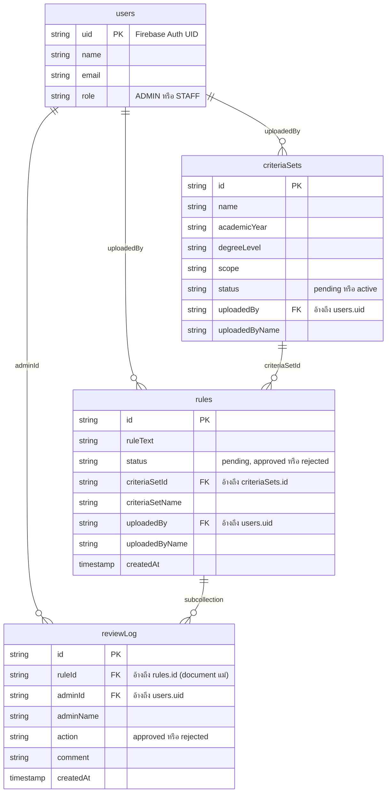

# ER Diagram — Curmate MVP v2

โครงสร้างข้อมูล Firestore ของการบ้านนี้ (4 collection: `users`, `criteriaSets`, `rules`, `rules/{id}/reviewLog`) วาดเป็น ER Diagram — GitHub เรนเดอร์ Mermaid block ด้านล่างเป็นแผนภาพอัตโนมัติเมื่อเปิดไฟล์นี้บนหน้าเว็บ

หมายเหตุ: Firestore เป็น NoSQL แบบ document-oriented ความสัมพันธ์ด้านล่างจึงหมายถึง "field ที่อ้างอิง id ของอีก document" (denormalized reference) ไม่ใช่ foreign key แบบ relational database จริง และ `reviewLog` เป็น subcollection อยู่ใต้ document ของ `rules` โดยตรง (ไม่ใช่ collection แยกระดับบนสุด)

ดูรายละเอียด field แบบเต็มและกฎการเข้าถึงข้อมูลแต่ละ collection ได้ที่ [../SCOPE.md](../SCOPE.md) และ [../ACL.md](../ACL.md)
